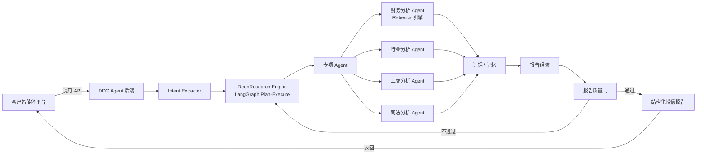

# 对公尽调智能体平台 (DDG Agent)

> 面向对公信贷场景的 **Agent 能力交付方案**。
>
> 客户（某银行）内部已建有智能体开发平台，核心诉求不是再引入一个智能体平台，而是将**财务分析、行业分析**等对公尽调能力以 **API / SDK** 形式集成进现有系统。百融基于 Dify 的 SaaS 智能体方案更偏向端到端应用交付，难以原子化输出核心能力模块。为此我基于 **LangGraph** 独立构建了这套 Agent 体系，把尽调能力拆分为可独立调用、可解释、可审计的服务接口。

---

## 项目背景

在某银行对公信贷智能化项目中，客户内部已有智能体开发平台，希望引入外部成熟的尽调能力而非再采购一套平台。交付过程中面临两个关键约束：

1. **交付形态必须是 API / SDK**：需要嵌入银行现有信贷系统，支持被内部平台编排调用。
2. **核心能力需要原子化**：财务分析、行业分析等模块要能独立调用、独立升级、独立审计。

百融内部的 Dify SaaS 智能体平台（含私有化版本）擅长快速构建对话式应用，但难以将财务/行业等能力模块以标准化服务形态输出。因此我基于 LangGraph 独立实现了这套后端 Agent 体系，与 Dify 方案形成互补：**Dify 负责前端对话入口与轻量编排，LangGraph Agent 负责重逻辑、重数据、重审计的核心尽调能力交付**。

---

## 核心价值

### 1. 原子化 API / SDK 交付

不交付平台，交付能力。每个专项 Agent 都可通过标准 REST API 调用，也支持以 SDK 形态集成到客户自有平台：

- `POST /api/v1/tasks` — 创建尽调任务
- `GET /api/v1/tasks/{id}/stream` — SSE 实时查看执行过程
- `GET /api/v1/tasks/{id}/report` — 获取结构化授信报告

### 2. 财务分析 Agent（核心交付模块）

- 上市公司：自动抓取 CNINFO、东方财富公开财报
- 非上市公司：上传 Excel / PDF 近三年财报，解析三大表
- 自研 **Rebecca 规则引擎**做财务指标计算与银行风格风险研判，不依赖 LLM 做数值推理

### 3. 行业分析 Agent（核心交付模块）

- 基于行业分类代码与本地 RAG 知识库，覆盖行业政策、法规、风控指引、授信审查模板
- 工业级 RAG 优化：核心高价值文档做 markdown 结构化解析并注入章节/时间/适用行业等元数据，长尾文档用规则切分兜底
- 向量检索 + BM25 关键词检索混合召回，RRF 倒数排名融合，RERANKER 精排，前置意图分类器控制算力消耗
- 短 query 宽进严出：原 query 与多个扩写变体并行多路召回，不重过滤、不重排序过早截断，避免漏召回关键政策
- 生成景气度、竞争格局、政策环境、授信审查重点，输出结构化行业研判结论，供授信报告直接引用

### 4. 多源权威数据融合

- 财报：CNINFO、东方财富
- 工商/司法：元典 Yuandian MCP、权威工商/司法通道，搜索兜底
- 行业知识：本地 ChromaDB 行业/风控/法规知识库

### 5. 可审计的证据链与质量门

- 每个论断附带来源、引用和可信度评级
- 报告生成前过质量门检查，证据不足时自动补充研究

### 6. HITL 人工在环

在主体确认、计划确认、财报上传、证据缺口等关键节点可中断执行，等待人工输入后恢复，适配真实信贷审批流程。

---

## 交付形态

本系统以**后端 API 集群**为主交付物，前端演示页面用于效果验证：

| 层级 | 形态 | 说明 |
|---|---|---|
| **核心交付** | REST API / SDK | 财务分析、行业分析、工商分析、司法分析、完整授信报告 |
| **过程可观测** | SSE 流式接口 | 实时返回 Agent 执行状态、工具调用、证据生成过程 |
| **演示界面** | React 3 页应用 | 入口页 / 执行页 / 报告页，用于客户 POC 与效果演示 |

前端 3 页流程：

| 页面 | 路由 | 说明 |
|---|---|---|
| **入口页** | `/` | 单一输入框，输入企业名称即开始尽调 |
| **执行页** | `/execution/:taskId` | 左侧计划 + 中央时间轴 + 右侧证据，SSE 流式展示 |
| **报告页** | `/report/:taskId` | 授信建议 + 风险评级 + 财务/司法/行业分析 + 附件证据链 |

---

## 系统架构



---

## 技术栈

| 层级 | 技术 |
|---|---|
| 前端演示 | React 19 + TypeScript + Vite 8 + TailwindCSS v4 |
| 后端框架 | FastAPI 0.110+ + uvicorn，SSE 流式响应 |
| Agent 编排 | LangGraph + LangChain |
| 主模型 | 阿里云百炼 Qwen3.7（OpenAI 兼容接口） |
| 财务引擎 | Rebecca（自研规则引擎）+ akshare + pdfplumber + PyMuPDF |
| RAG | ChromaDB + BGE / text-embedding-v4 + BM25 + RRF 倒数排名融合 + RERANKER 重排 |
| 记忆系统 | SQLite + FTS5 trigram |
| 外部数据 | CNINFO、东方财富、元典 Yuandian MCP、Tavily / Bocha / SearxNG |

---

## 核心 API 交付接口

### 任务接口

| 方法 | 路径 | 说明 |
|------|------|------|
| POST | `/api/v1/tasks` | 创建尽调或专项分析任务 |
| GET | `/api/v1/tasks/{task_id}/stream` | SSE 流式获取任务执行状态 |
| GET | `/api/v1/tasks/{task_id}` | 获取任务状态快照 |
| POST | `/api/v1/tasks/{task_id}/resume` | 上传财报解析后恢复等待中的财务任务 |
| GET | `/api/v1/tasks/{task_id}/report` | 获取结构化授信报告 |

### 财报上传接口

| 方法 | 路径 | 说明 |
|------|------|------|
| POST | `/api/v1/upload/financial` | 上传 Excel、CSV 或 PDF 财报文件 |
| GET | `/api/v1/upload/{task_id}/files` | 获取任务已上传文件列表 |
| POST | `/api/v1/upload/{task_id}/parse` | 解析已上传财报并返回标准化三大表数据 |

### 调用示例

```bash
# 创建尽调任务
curl -X POST "http://localhost:8000/api/v1/tasks" \
  -H "Content-Type: application/json" \
  -d '{"enterprise_name":"分析一下欣旺达的财务风险情况"}'

# 订阅 SSE 执行流
curl -N "http://localhost:8000/api/v1/tasks/{task_id}/stream"

# 获取最终授信报告
curl "http://localhost:8000/api/v1/tasks/{task_id}/report"
```

---

## 快速开始

### 前端演示

```bash
npm install
npm run dev
```

前端运行在 `http://localhost:5173`，API 请求通过 Vite proxy 代理到后端 `http://localhost:8000`。

### 后端服务

```bash
cd backend
python3 -m venv venv
source venv/bin/activate
pip install -r requirements.txt
python run.py
```

服务启动后访问：

- API 文档: http://localhost:8000/docs
- 健康检查: http://localhost:8000/health

---

## 项目结构

```text
src/                              # 前端演示
├── pages/
│   ├── AgentWorkbench/           # 首页入口 + 执行页
│   └── Report/                   # 尽调报告页
├── services/agentApi.ts          # 后端 API 对接
├── App.tsx                       # 路由定义
└── index.css                     # 全局样式 + Tailwind

backend/                          # 后端交付主体
├── app/
│   ├── api/                      # FastAPI 路由
│   ├── agents/
│   │   ├── research_engine/      # DeepResearch 核心引擎
│   │   ├── sub_agents/           # 财务/行业/工商/司法/汇总 Agent
│   │   └── tools/                # 外部数据工具
│   ├── engines/rebecca/          # 财务规则引擎
│   ├── memory/                   # 记忆系统
│   ├── rag/                      # 本地知识库检索
│   └── config/                   # 配置中心
├── knowledge_base/               # 行业、风控、法规知识文档
└── tests/                        # 单元测试与集成测试
```

---

## 与 Dify 的关系

本项目不是替代百融 Dify 智能体平台，而是与其互补：

| 能力 | Dify 方案 | DDG Agent（LangGraph） |
|---|---|---|
| 前端对话入口 | ✅ 擅长 | 仅演示用 |
| 轻量工作流编排 | ✅ 擅长 | 不依赖 |
| 重逻辑 Agent（财务/行业） | ❌ 难原子化 | ✅ 核心能力 |
| API / SDK 交付 | ❌ 受限 | ✅ 主交付形态 |
| 状态机与中断恢复 | ❌ 弱 | ✅ LangGraph 原生支持 |
| 证据链与可审计性 | ❌ 弱 | ✅ 内置 |

---

## 相关文档

- [`backend/README.md`](backend/README.md) — 后端架构、Agent 工作流、API 详情
- [`DESIGN.md`](DESIGN.md) — B2B SaaS 设计系统
- [`docs/sdd/tasks.md`](docs/sdd/tasks.md) — 迭代任务清单
- [`docs/dify-integration/`](docs/dify-integration/) — Dify 集成方案
