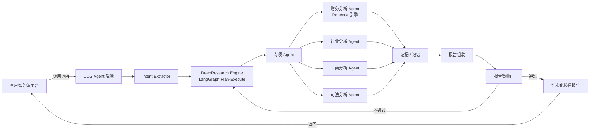

# 对公尽调智能体平台 (DDG Agent)

> 面向对公信贷场景的 **Agent 能力交付方案**。
>
> 客户（某银行）内部已建有智能体开发平台，核心诉求不是再引入一个智能体平台，而是将**财务分析、行业分析**等对公尽调能力以 **API / SDK** 形式集成进现有系统。百融基于 Dify 的 SaaS 智能体方案更偏向端到端应用交付，难以原子化输出核心能力模块。为此我基于 **LangGraph** 独立构建了这套 Agent 体系，把尽调能力拆分为可独立调用、可解释、可审计的服务接口。

---

## 项目背景

某银行对公信贷业务部门（客户经理、信贷审查、风控）在尽调环节长期受困:客户经理手写一份对公尽调报告要 2–5 天,产出的初稿"只堆数字、不做对比、缺归因",风控又因为 AI 报告是黑盒而不敢引用。这些问题不是缺一个智能体平台,而是缺能真正嵌入现有信贷流程、可被业务直接用起来的**尽调能力**。

客户内部已建有智能体开发平台,核心诉求是把**财务分析、行业分析**等能力以 API / SDK 形式集成进现有系统,而非再采购一套平台。由此带来两个交付约束:

1. **交付形态必须是 API / SDK**:需要嵌入银行现有信贷系统,支持被内部平台编排调用。
2. **核心能力需要原子化**:财务分析、行业分析等模块要能独立调用、独立升级、独立审计。

百融内部的 Dify SaaS 智能体平台(含私有化版本)擅长快速构建对话式应用,但难以将财务/行业等能力模块以标准化服务形态输出。因此我基于 LangGraph 独立实现了这套后端 Agent 体系,与 Dify 方案形成互补:**Dify 负责前端对话入口与轻量编排,LangGraph Agent 负责重逻辑、重数据、重审计的核心尽调能力交付**。

> 下面一节梳理了这套系统为业务部门解决的具体问题与实测效果。

---

## 解决了业务部门哪些问题

> 这套系统不是为了堆技术，而是针对银行对公信贷业务部门（客户经理、信贷审查、风控）在尽调环节的六个真实痛点。以下每条都有 **6 家上市公司、25 份真实尽调报告**的实测数据支撑（详见 [`docs/deliverables/business-value-assessment.md`](docs/deliverables/business-value-assessment.md)）。

### 问题 1｜尽调报告耗时长：客户经理手写 2–5 天

**业务痛点**：一份对公尽调报告，客户经理要手工抓财报、查工商司法、写行业分析，通常耗时 2–5 天，且是需要反复修改的初稿。

**解决效果**：输入企业名，**3–8 分钟**自动生成结构化报告 + 证据链 + 缺口清单。

| 公司 | 执行耗时 | 证据数 | 工具调用 |
|---|---|---|---|
| 三安光电 | 7.1 分钟 | 200 条 | 27 次 |
| 亿纬锂能 | 7.9 分钟 | 217 条 | 28 次 |
| 卓胜微 | 3.5 分钟 | 211 条 | 26 次 |
| 欣旺达 | 4.8 分钟 | 317 条 | 31 次 |
| 药明康德 | 4.9 分钟 | 124 条 | 19 次 |
| 蓝思科技 | 3.2 分钟 | 115 条 | 15 次 |

> 怎么做到的：DeepResearch Plan-Execute 研究引擎 + 4 个专项 Agent 并行执行。

### 问题 2｜AI 报告是黑盒，风控不敢引用

**业务痛点**：传统 LLM 生成的报告是"一坨文本"，风控审查员无法追溯结论来源，不敢作为审批依据。

**解决效果**：每条结论绑定证据 ID，报告正文带**正文级引用**，可跳转到原始财报页码、公告 URL 或知识库条目。

- 每份报告 5–7 条结构化结论声明（Claim），每条绑定 evidence_refs
- 高可信证据占比 **67–75%**，引用密度与证据深度评分均为满分
- 数值由 CodeAct 确定性工具计算，LLM 只做诊断表达，**不做数值推理**（杜绝算错）

> 怎么做到的：Evidence Store 证据库 + Claim-Evidence 绑定 + 报告前置质量门。

### 问题 3｜客户经理报告"太粗浅"（信贷岗副总原话）

**业务痛点**：一线产出的初版尽调报告"只堆数字、不做对比、缺归因"，深度达不到信贷/风控部门的专业水准。

**解决效果**：

| 粗浅表现 | 解决方式 | 效果 |
|---|---|---|
| 只堆数字，不做同业对比 | 按申万行业取同行业 A 股中位数对标 | 财务深度 80 分 |
| 缺趋势归因 | 多期真实趋势 + 杜邦式数据驱动归因 | 每个异常含"现象—归因—风险—核查" |
| 缺盈利质量分析 | 扣非 vs 归母、非经常性损益、政府补助依赖度 | 显式输出盈利质量维度 |
| 行业分析缺失或泛化 | 行业分类代码 + LLM 裁判 + RAG 知识库 | 行业深度 80 分，6 家全部正确识别细分行业 |

> 怎么做到的：自研 **Rebecca 规则引擎**做银行风格研判 + 真实行业中位数对标。

### 问题 4｜行业识别错误导致风险判断整体跑偏

**业务痛点**：企业经营范围里的噪声（如"货物进出口"）会让规则匹配误判行业——士兰微曾被识别成"贸易/进出口"，导致整份行业风险分析失效。

**解决效果**：规则召回候选 + 上市公司映射 + LLM 语义裁判 + 主营构成校验，**6 家公司 0 错分**。

| 公司 | 正确识别行业 |
|---|---|
| 三安光电 | 半导体与光电子器件 |
| 卓胜微 | 集成电路制造 |
| 亿纬锂能 / 欣旺达 | 锂离子电池制造 |
| 药明康德 | CXO / CRDMO |
| 蓝思科技 | 电子元器件制造 |

### 问题 5｜多源数据矛盾，人工逐项对不出来

**业务痛点**：巨潮、东方财富等不同数据源的同一财务指标可能不一致，人工逐项核对不现实，错误数据会污染授信判断。

**解决效果**：跨源证据一致性校验自动发现超阈值差异，触发**二轮补证**定向核查原始年报。

> **真实案例**：欣旺达报告自动发现"公开结构化财报数据源之间存在 3 项超阈值差异"，系统自动生成财务补证任务，回查巨潮/交易所原始年报 PDF——无需人工排查。

### 问题 6｜银行已有智能体平台，但核心能力无法原子化交付

**业务痛点**：客户内部已有 Dify SaaS 智能体平台，擅长端到端对话应用，但难以把财务/行业分析拆成可独立调用、可审计、可升级的服务模块。

**解决效果**：基于 **LangGraph** 独立实现，财务/行业/工商/司法能力通过标准 REST API 交付，支持被银行内部平台编排调用。

- `POST /api/v1/tasks` — 创建尽调任务
- `GET /api/v1/tasks/{id}/stream` — SSE 实时查看执行过程
- `GET /api/v1/tasks/{id}/report` — 获取结构化授信报告

---

## 实测质量（6 家公司 / 25 份报告）

| 指标 | 结果 |
|---|---|
| 总分范围 | **90–92 分**（全部 A 级） |
| 质量门通过率 | **100%**（25/25） |
| P0 阻塞问题 | **0** |
| 单份证据规模 | 115–317 条，高可信占比 67–75% |
| 行业识别准确率 | **6 家 0 错分** |
| 执行耗时 | 3–8 分钟（传统手写 2–5 天） |

> 评测器是确定性、可解释的，检查报告结构、证据绑定、财务深度、行业深度、语言质量和授信逻辑一致性。完整数据与端到端案例见 [`docs/deliverables/business-value-assessment.md`](docs/deliverables/business-value-assessment.md)。

---

## 关键能力（技术视角）

上述业务问题背后的核心技术能力，供技术评估参考：

- **原子化 API / SDK 交付**：每个专项 Agent 可独立调用、独立升级、独立审计。
- **财务分析 Agent**：上市公司自动抓取 CNINFO / 东方财富财报；非上市公司上传 Excel / PDF 解析三大表；Rebecca 规则引擎做指标计算与风险研判，不依赖 LLM 做数值推理。
- **行业分析 Agent**：行业分类代码 + 本地 RAG 知识库（政策/法规/风控指引/授信模板）；向量 + BM25 混合召回 + RRF 融合 + RERANKER 精排；短 query 多变体并行召回，避免漏召回关键政策。
- **多源权威数据融合**：财报（CNINFO / 东方财富）+ 工商司法（元典 Yuandian MCP + 权威通道）+ 本地 ChromaDB 知识库。
- **可审计证据链与质量门**：每个论断附来源、引用、可信度评级；报告前过质量门，证据不足自动二轮补证。
- **HITL 人工在环**：主体确认、计划确认、财报上传、证据缺口等节点可中断恢复，适配真实信贷审批流程。

---

## 交付形态

本系统以**后端 API 集群**为主交付物，前端演示页面用于效果验证：

| 层级 | 形态 | 说明 |
|---|---|---|
| **核心交付** | REST API / SDK | 财务分析、行业分析、工商分析、司法分析、完整授信报告 |
| **过程可观测** | SSE 流式接口 | 实时返回 Agent 执行状态、工具调用、证据生成过程 |
| **演示界面** | React 3 页应用 | 入口页 / 执行页 / 报告页，用于客户 POC 与效果演示 |

前端 3 页流程：

| 页面 | 路由 | 说明 |
|---|---|---|
| **入口页** | `/` | 单一输入框，输入企业名称即开始尽调 |
| **执行页** | `/execution/:taskId` | 左侧计划 + 中央时间轴 + 右侧证据，SSE 流式展示 |
| **报告页** | `/report/:taskId` | 授信建议 + 风险评级 + 财务/司法/行业分析 + 附件证据链 |

---

## 系统架构



---

## 技术栈

| 层级 | 技术 |
|---|---|
| 前端演示 | React 19 + TypeScript + Vite 8 + TailwindCSS v4 |
| 后端框架 | FastAPI 0.110+ + uvicorn，SSE 流式响应 |
| Agent 编排 | LangGraph + LangChain |
| 主模型 | 阿里云百炼 Qwen3.7（OpenAI 兼容接口） |
| 财务引擎 | Rebecca（自研规则引擎）+ akshare + pdfplumber + PyMuPDF |
| RAG | ChromaDB + BGE / text-embedding-v4 + BM25 + RRF 倒数排名融合 + RERANKER 重排 |
| 记忆系统 | SQLite + FTS5 trigram |
| 外部数据 | CNINFO、东方财富、元典 Yuandian MCP、Tavily / Bocha / SearxNG |

---

## 核心 API 交付接口

### 任务接口

| 方法 | 路径 | 说明 |
|------|------|------|
| POST | `/api/v1/tasks` | 创建尽调或专项分析任务 |
| GET | `/api/v1/tasks/{task_id}/stream` | SSE 流式获取任务执行状态 |
| GET | `/api/v1/tasks/{task_id}` | 获取任务状态快照 |
| POST | `/api/v1/tasks/{task_id}/resume` | 上传财报解析后恢复等待中的财务任务 |
| GET | `/api/v1/tasks/{task_id}/report` | 获取结构化授信报告 |

### 财报上传接口

| 方法 | 路径 | 说明 |
|------|------|------|
| POST | `/api/v1/upload/financial` | 上传 Excel、CSV 或 PDF 财报文件 |
| GET | `/api/v1/upload/{task_id}/files` | 获取任务已上传文件列表 |
| POST | `/api/v1/upload/{task_id}/parse` | 解析已上传财报并返回标准化三大表数据 |

### 调用示例

```bash
# 创建尽调任务
curl -X POST "http://localhost:8000/api/v1/tasks" \
  -H "Content-Type: application/json" \
  -d '{"enterprise_name":"分析一下欣旺达的财务风险情况"}'

# 订阅 SSE 执行流
curl -N "http://localhost:8000/api/v1/tasks/{task_id}/stream"

# 获取最终授信报告
curl "http://localhost:8000/api/v1/tasks/{task_id}/report"
```

---

## 快速开始

### 前端演示

```bash
cd frontend
npm install
npm run dev
```

前端运行在 `http://localhost:5173`，API 请求通过 Vite proxy 代理到后端 `http://localhost:8000`。

### 后端服务

```bash
cd backend
python3 -m venv venv
source venv/bin/activate
pip install -r requirements.txt
python run.py
```

服务启动后访问：

- API 文档: http://localhost:8000/docs
- 健康检查: http://localhost:8000/health

---

## 项目结构

```text
ddg-agent/
├── frontend/                       # 前端演示
│   ├── src/
│   │   ├── pages/
│   │   │   ├── AgentWorkbench/   # 首页入口 + 执行页
│   │   │   ├── QualityEvaluator/ # 报告质量评估
│   │   │   └── Report/           # 尽调报告页
│   │   ├── services/agentApi.ts  # 后端 API 对接
│   │   ├── App.tsx               # 路由定义
│   │   └── index.css             # 全局样式 + Tailwind
│   └── public/                   # 静态资源
├── backend/                        # 后端交付主体
│   ├── app/
│   │   ├── api/                  # FastAPI 路由
│   │   ├── agents/               # DeepResearch 引擎与专项 Agent
│   │   ├── engines/rebecca/      # 财务规则引擎
│   │   ├── memory/               # 记忆系统
│   │   ├── rag/                  # 本地知识库检索
│   │   └── config/               # 配置中心
│   ├── data/
│   │   ├── knowledge_base/       # 行业、风控、法规知识文档
│   │   └── regression_samples/   # 回归测试样本
│   └── tests/                    # 单元测试与集成测试
├── integrations/                   # 外部集成
│   └── dify/                     # Dify 嵌入、工作流、工具定义
├── infra/                          # 基础设施
│   ├── searxng/                  # SearXNG 搜索服务
│   └── sequential-thinking/      # Sequential Thinking MCP 服务
├── docs/                           # 文档
│   ├── product/                  # 产品设计
│   ├── architecture/             # 技术架构与决策
│   ├── design-system/            # UI/UX 设计系统
│   ├── specs/                    # 需求规格与 SDD
│   ├── integration/              # 集成文档
│   ├── guides/                   # 指南与清单
│   └── deliverables/             # 交付物
├── plans/                          # 规划文件
└── .config/                        # 项目管理配置
    ├── serena/
    └── spec-workflow/
```

---

## 与 Dify 的关系

本项目不是替代百融 Dify 智能体平台，而是与其互补：

| 能力 | Dify 方案 | DDG Agent（LangGraph） |
|---|---|---|
| 前端对话入口 | ✅ 擅长 | 仅演示用 |
| 轻量工作流编排 | ✅ 擅长 | 不依赖 |
| 重逻辑 Agent（财务/行业） | ❌ 难原子化 | ✅ 核心能力 |
| API / SDK 交付 | ❌ 受限 | ✅ 主交付形态 |
| 状态机与中断恢复 | ❌ 弱 | ✅ LangGraph 原生支持 |
| 证据链与可审计性 | ❌ 弱 | ✅ 内置 |

---

## 相关文档

- [`backend/README.md`](backend/README.md) — 后端架构、Agent 工作流、API 详情
- [`DESIGN.md`](DESIGN.md) — B2B SaaS 设计系统
- [`docs/specs/tasks.md`](docs/specs/tasks.md) — 迭代任务清单
- [`docs/integration/dify/`](docs/integration/dify/) — Dify 集成方案
