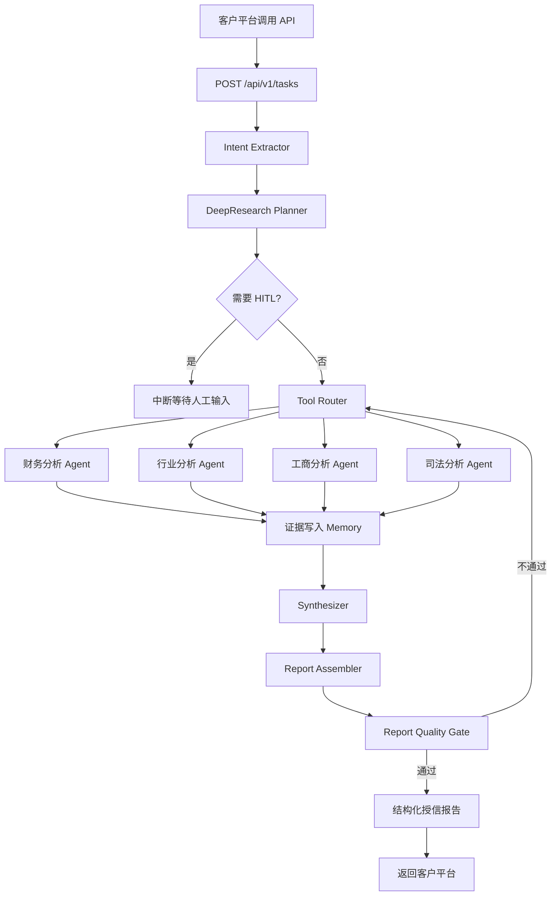

# DDG Agent Backend — 对公尽调 Agent 能力交付后端

面向对公信贷场景的 Agent 能力后端，基于 **FastAPI + LangGraph** 构建，核心目标是把**财务分析、行业分析**等对公尽调能力以 **API / SDK** 形态交付给客户自有智能体平台。

---

## 为什么用 LangGraph 而不是 Dify？

在百融 Dify SaaS 智能体平台的私有化交付实践中，Dify 更擅长：

- 快速搭建对话式智能体应用
- 可视化 Prompt 编排与工作流
- 面向业务人员的低门槛配置

但客户（某银行）内部已有智能体开发平台，需要的是**可原子化调用、可嵌入、可审计的尽调能力接口**，而非一个新的平台。私有化 Dify 在这类场景下存在明显短板：

| 需求 | Dify 私有化方案 | LangGraph 方案 |
|---|---|---|
| 封装为 REST API / SDK | 受限 | 原生支持 |
| 财务/行业能力原子化输出 | 困难 | 每个 Agent 独立接口 |
| 复杂状态机与中断恢复 | 弱 | LangGraph 原生 |
| 证据链与可审计性 | 弱 | 内置设计 |
| 长流程任务调度 | 弱 | 原生支持 |

因此本后端采用 LangGraph 独立实现，与 Dify 形成互补：**Dify 做前端对话入口，LangGraph 后端做核心尽调能力交付**。

---

## 核心架构

### 1. DeepResearch Plan-Execute 引擎

`app/agents/research_engine/` 实现 DeepResearch 风格的研究流程：

- **Planner**：将尽调问题拆解为研究步骤
- **Tool Router**：按步骤 category 路由到对应数据工具
- **Synthesizer**：综合多源结果生成论断
- **Claim Builder**：构建带来源的标准化论断
- **Report Assembler / Quality Gate**：组装报告并做质量检查

### 2. 专项 Agent（重点：财务 + 行业）

| Agent | 入口 | 核心交付能力 |
|---|---|---|
| **财务分析 Agent** ⭐ | `sub_agents/financial_agent.py` | 三大表解析、银行风格财务指标、偿债/盈利/营运/现金流风险 |
| **行业分析 Agent** ⭐ | `sub_agents/industry_agent.py` | 行业分类、景气度、竞争格局、政策环境、授信审查重点；基于工业级 RAG（分层数据处理 + 混合检索 + RRF 融合 + RERANKER + 意图路由） |
| 工商分析 Agent | `sub_agents/business_agent.py` | 企业主体、股权结构、经营异常、关联风险 |
| 司法分析 Agent | `sub_agents/legal_agent.py` | 裁判文书、执行信息、司法风险 |
| 汇总报告 Agent | `sub_agents/full_report_builder.py` | 汇总四大专项生成统一授信审查意见 |

### 3. 自研 Rebecca 财务规则引擎

`app/engines/rebecca/` 负责：

- 三大财务报表标准化解析（PDF / Excel / CSV）
- 财务指标计算
- 银行风格风险研判

不依赖 LLM 做数值推理，降低幻觉，保证可审计。

### 4. 多源数据工具层

`app/agents/tools/` 封装了：

- **财报数据**：CNINFO 公告、东方财富结构化数据
- **上市公司识别**：`listed_company_tool.py`
- **工商/司法权威通道**：元典 Yuandian MCP、权威工商/司法接口
- **搜索兜底**：Tavily / Bocha / SearxNG
- **年报解析**：PDF 提取引擎、年报章节抽取
- **RAG 检索**：本地行业/风控/法规知识库

### 5. 记忆系统

`app/memory/` 提供两层记忆：

- **短期记忆**：会话级上下文，支持长流程中断恢复
- **长期记忆**：企业级画像，跨任务沉淀工商、财务、司法、行业信息

底层基于 SQLite + FTS5，通过 `tool_middleware.py` 接入工具调用链路。

### 6. 报告质量门与 HITL

- **报告质量门**：检查章节完整性、证据充分性、结论一致性，未达标时自动补充研究
- **HITL 人工在环**：在主体确认、计划确认、财报上传、证据缺口等节点可中断，等待人工输入后恢复

---

## 系统架构



---

## Agent 状态机

SSE 流会实时推送以下状态：

```
creating_task
    ↓
planning
    ↓
waiting_confirm  ← HITL 中断节点
    ↓
calling_tools
    ↓
analyzing
    ↓
forming_conclusion
    ↓
generating_report
    ↓
completed / failed
```

---

## 技术栈

- **Web 框架**: FastAPI 0.110+、uvicorn
- **Agent 编排**: LangGraph + LangChain
- **主模型**: 阿里云百炼 Qwen3.7（OpenAI 兼容接口）
- **财务引擎**: Rebecca（自研规则引擎）
- **RAG**: ChromaDB + BGE / text-embedding-v4 + BM25 + RRF 倒数排名融合 + RERANKER 重排
- **记忆**: SQLite + FTS5
- **数据处理**: Pandas、NumPy、openpyxl、pdfplumber、PyMuPDF
- **外部数据**: CNINFO、东方财富、元典 Yuandian MCP、Tavily / Bocha / SearxNG

---

## 快速开始

```bash
cd backend
python3 -m venv venv
source venv/bin/activate
pip install -r requirements.txt
python run.py
```

服务启动后访问：

- API 文档: http://localhost:8000/docs
- ReDoc 文档: http://localhost:8000/redoc
- 健康检查: http://localhost:8000/health

---

## API 接口

### 系统接口

| 方法 | 路径 | 说明 |
|------|------|------|
| GET | `/` | 根路径 |
| GET | `/health` | 健康检查 |

### 任务接口

| 方法 | 路径 | 说明 |
|------|------|------|
| POST | `/api/v1/tasks` | 创建尽调或专项分析任务 |
| GET | `/api/v1/tasks/{task_id}/stream` | SSE 流式获取任务执行状态 |
| GET | `/api/v1/tasks/{task_id}` | 获取任务状态快照 |
| POST | `/api/v1/tasks/{task_id}/resume` | 上传财报解析后恢复等待中的财务任务 |
| GET | `/api/v1/tasks/{task_id}/report` | 获取结构化授信报告 |

### 财报上传接口

| 方法 | 路径 | 说明 |
|------|------|------|
| POST | `/api/v1/upload/financial` | 上传 Excel、CSV 或 PDF 财报文件 |
| GET | `/api/v1/upload/{task_id}/files` | 获取任务已上传文件列表 |
| POST | `/api/v1/upload/{task_id}/parse` | 解析已上传财报并返回标准化三大表数据 |

### 请求示例

#### 创建任务

```bash
curl -X POST "http://localhost:8000/api/v1/tasks" \
  -H "Content-Type: application/json" \
  -d '{"enterprise_name":"分析一下欣旺达的财务风险情况"}'
```

#### 订阅执行流

```bash
curl -N "http://localhost:8000/api/v1/tasks/{task_id}/stream"
```

#### 上传并解析非上市公司财报

```bash
curl -X POST "http://localhost:8000/api/v1/upload/financial" \
  -F "task_id={task_id}" \
  -F "document_type=auto" \
  -F "file=@/path/to/三年财务报表.xlsx"

curl -X POST "http://localhost:8000/api/v1/upload/{task_id}/parse"
```

---

## 目录结构

```text
backend/
├── app/
│   ├── api/                    # FastAPI 路由
│   │   ├── tasks.py            # 任务创建、SSE 流、恢复执行、报告读取
│   │   ├── upload.py           # 非上市企业财报上传与解析
│   │   ├── tools.py            # 通用搜索 / 工商 / 法律工具接口
│   │   ├── report_quality.py   # 报告质量评估
│   │   └── dify_adapter.py     # Dify 编排适配层
│   ├── agents/
│   │   ├── research_engine/    # DeepResearch 核心引擎
│   │   ├── sub_agents/         # 财务/行业/工商/司法/汇总 Agent
│   │   ├── tools/              # 外部数据工具与 RAG
│   │   ├── orchestrator_v2.py  # 任务编排器
│   │   └── state.py            # Agent 状态定义
│   ├── engines/rebecca/        # 财务报表解析和指标分析
│   ├── memory/                 # 短期 / 长期记忆
│   ├── rag/                    # 本地知识库检索
│   └── config/                 # 配置管理
├── knowledge_base/             # 行业、风控、法规、模板知识文档
├── tests/                      # 单元测试与集成测试
├── output/                     # 上传文件、生成结果等运行时输出
├── db/                         # 本地运行时数据
├── requirements.txt
└── run.py
```

---

## 当前 Agent 能力

- **财务分析**：上市公司自动获取公开财报；非上市公司强制上传近三年财报，解析三大表并生成银行风格财务报告。
- **行业分析**：使用行业分类代码库，结合本地行业知识库生成景气度、竞争格局、政策环境、授信审查重点等内容；RAG 采用分层数据处理、混合检索、RRF 融合、RERANKER 精排和意图路由控制算力。
- **工商分析**：优先接入权威工商通道，失败后使用 Tavily 搜索聚合工商基础信息和风险信号。
- **司法分析**：探测裁判文书网、执行信息公开网等权威来源，并用 Tavily 搜索做公开司法风险兜底。

---

## 测试

```bash
cd backend
source venv/bin/activate
pip install pytest
pytest
```

测试覆盖：PDF 解析、行业 Agent、财务叙事、RAG、工具路由、记忆系统等模块。

---

## 与 Dify 的协作关系

```text
┌─────────────────────────────────────────┐
│           客户智能体平台                 │
│  （已有平台，负责前端对话与整体编排）      │
└─────────────────┬───────────────────────┘
                  │ 调用 API / SDK
┌─────────────────▼───────────────────────┐
│           DDG Agent Backend             │
│  （LangGraph，负责核心尽调能力）          │
│  - 财务分析 Agent                        │
│  - 行业分析 Agent                        │
│  - 工商分析 Agent                        │
│  - 司法分析 Agent                        │
└─────────────────────────────────────────┘
                  │ 补充轻量对话入口
┌─────────────────▼───────────────────────┐
│         百融 Dify 平台（可选）            │
│  （负责快速构建对话式应用 / POC 演示）     │
└─────────────────────────────────────────┘
```

---

## 相关文档

- [`../README.md`](../README.md) — 项目整体定位与交付价值
- [`../DESIGN.md`](../DESIGN.md) — B2B SaaS 设计系统
- [`../docs/sdd/tasks.md`](../docs/sdd/tasks.md) — 迭代任务清单
- [`../docs/dify-integration/`](../docs/dify-integration/) — Dify 集成方案
