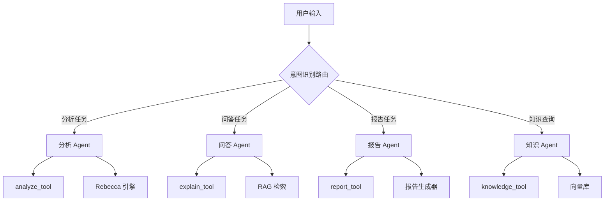
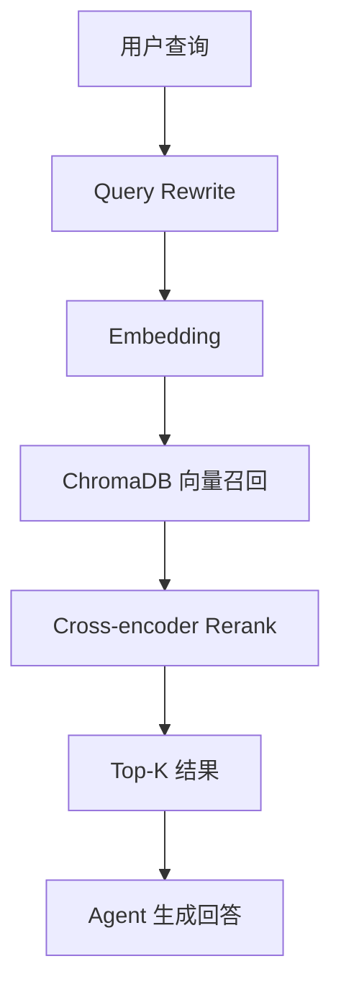

# 尽调智能体平台 - 技术开发方案（LangGraph Agent + Rebecca 引擎）

> **文档版本**：v2.1
> **创建日期**：2026-06-05
> **更新日期**：2026-06-07
> **状态**：草案
> **关联 Spec**：[spec.md](./sdd/spec.md) / [plan.md](./sdd/plan.md)

### 更新日志

| 版本 | 日期 | 更新内容 |
|------|------|----------|
| v2.1 | 2026-06-07 | Agent 框架从 LangChain 切换为 LangGraph，新增选型分析 |
| v2.0 | 2026-06-05 | 新增 LLM Agent + RAG 设计 |
| v1.0 | 2026-06-05 | 初始版本，Rebecca 引擎集成 |

---

## 目录

1. [项目背景与目标](#1-项目背景与目标)
2. [整体架构设计](#2-整体架构设计)
3. [LLM Agent 层设计](#3-llm-agent-层设计)
4. [Rebecca 引擎集成](#4-rebecca-引擎集成)
5. [RAG 知识库设计](#5-rag-知识库设计)
6. [数据流设计](#6-数据流设计)
7. [API 接口规范](#7-api-接口规范)
8. [前端交互设计](#8-前端交互设计)
9. [开发计划与里程碑](#9-开发计划与里程碑)
10. [风险评估与对策](#10-风险评估与对策)
11. [附录](#11-附录)

---

## 1. 项目背景与目标

### 1.1 背景

当前尽调智能体平台（DDG）是一个纯前端应用，采用 Mock 数据驱动，存在以下不足：

| 问题 | 影响 |
|------|------|
| 无真实分析能力 | 无法处理实际财报数据 |
| 表单驱动交互 | 用户体验生硬，学习成本高 |
| 缺乏智能问答 | 无法针对分析结果进行深度探讨 |
| 无知识沉淀 | 分析经验无法复用 |

**参考项目**：
- **Rebecca**（https://gitee.com/zts19951217/rebecca）：规则引擎，10 维度分析
- **智旅云图**（https://github.com/tutu-zzz/zhilv-yuntu）：LLM Agent 交互模式

### 1.2 目标

打造一个 **"规则引擎 + LLM Agent"双引擎驱动**的智能尽调平台：

| 目标类型 | 具体目标 | 验收标准 |
|----------|----------|----------|
| **核心目标** | LLM Agent 对话式交互 | 用户可通过自然语言发起尽调任务 |
| **核心目标** | Rebecca 规则引擎分析 | 自动完成 10 维度、31 张表格分析 |
| **核心目标** | Agent 智能问答 | 基于分析结果进行深度解读和建议 |
| **核心目标** | RAG 知识增强 | 引用法规、案例支撑分析结论 |
| **扩展目标** | 多 Agent 协作 | 数据采集、分析、报告生成分工协作 |

### 1.3 核心价值

```
传统尽调                          智能体尽调
───────                          ─────────
人工翻阅财报        ──→          对话式上传，自动解析
手动计算指标        ──→          规则引擎自动分析
人工撰写报告        ──→          LLM 生成专业解读
经验依赖个人        ──→          RAG 沉淀行业知识
```

---

## 2. 整体架构设计

### 2.1 系统架构图

```
┌─────────────────────────────────────────────────────────────────────────────┐
│                              用户层（Browser）                               │
│  ┌───────────────────────────────────────────────────────────────────────┐  │
│  │                      React 前端应用                                    │  │
│  │  ┌─────────────┐ ┌─────────────┐ ┌─────────────┐ ┌─────────────┐    │  │
│  │  │  对话界面    │ │  分析看板    │ │  报告预览    │ │  知识库      │    │  │
│  │  │  (Chat UI)  │ │  (Dashboard)│ │  (Preview)  │ │  (Knowledge)│    │  │
│  │  └─────────────┘ └─────────────┘ └─────────────┘ └─────────────┘    │  │
│  │                              │                                        │  │
│  │                    AG-UI / A2UI 协议层（已有）                          │  │
│  └───────────────────────────────────────────────────────────────────────┘  │
└─────────────────────────────────────────────────────────────────────────────┘
                                            │
                                            ▼
┌─────────────────────────────────────────────────────────────────────────────┐
│                              网关层（FastAPI）                               │
│  ┌───────────────────────────────────────────────────────────────────────┐  │
│  │  /api/chat  /api/agent  /api/analysis  /api/report  /api/knowledge   │  │
│  └───────────────────────────────────────────────────────────────────────┘  │
└─────────────────────────────────────────────────────────────────────────────┘
                                            │
                    ┌───────────────────────┼───────────────────────┐
                    ▼                       ▼                       ▼
┌──────────────────────────┐  ┌──────────────────────────┐  ┌──────────────────────────┐
│    LLM Agent 层           │  │    规则引擎层             │  │    RAG 知识层             │
│  ┌────────────────────┐  │  │  ┌────────────────────┐  │  │  ┌────────────────────┐  │
│  │  Intent Router     │  │  │  │  Rebecca Engine    │  │  │  │  Vector Store      │  │
│  │  (意图识别路由)     │  │  │  │  ┌──────────────┐  │  │  │  │  (ChromaDB)        │  │
│  └────────────────────┘  │  │  │  │ 10维分析      │  │  │  │  └────────────────────┘  │
│  ┌────────────────────┐  │  │  │  │ 风险识别      │  │  │  │  ┌────────────────────┐  │
│  │  Due Diligence     │  │  │  │  │ 情景预测      │  │  │  │  │  Retriever         │  │
│  │  Agent (尽调主Agent) │  │  │  │  └──────────────┘  │  │  │  │  (检索 + Rerank)   │  │
│  └────────────────────┘  │  │  └────────────────────┘  │  │  └────────────────────┘  │
│  ┌────────────────────┐  │  │  ┌────────────────────┐  │  │  ┌────────────────────┐  │
│  │  Tools             │  │  │  │  Report Generator  │  │  │  │  Knowledge Base    │  │
│  │  ├─ analyze_tool   │  │  │  │  (Word/PDF 生成)    │  │  │  │  ├─ 法规文档        │  │
│  │  ├─ report_tool    │  │  │  └────────────────────┘  │  │  │  ├─ 行业案例        │  │
│  │  ├─ knowledge_tool │  │  │                          │  │  │  ├─ 分析模板        │  │
│  │  └─ explain_tool   │  │  │                          │  │  │  └─ 风险案例        │  │
│  └────────────────────┘  │  │                          │  │  └────────────────────┘  │
└──────────────────────────┘  └──────────────────────────┘  └──────────────────────────┘
```

### 2.2 技术栈选型

| 层级 | 技术选型 | 版本 | 说明 |
|------|----------|------|------|
| **前端框架** | React + TypeScript | 19 / 6.0 | 现有技术栈 |
| **对话组件** | Vercel AI SDK | 4.0+ | 流式对话 UI 组件 |
| **后端框架** | FastAPI | 0.110+ | 异步高性能 |
| **LLM 框架** | **LangGraph** | 0.2+ | Agent 编排（推荐） |
| **LLM 服务** | DashScope (qwen-max) | - | 国内模型，低延迟 |
| **向量库** | ChromaDB | 0.5+ | 轻量级向量存储 |
| **Embedding** | text-embedding-v4 | - | DashScope 嵌入模型 |
| **规则引擎** | Rebecca | - | 10 维度财务分析 |
| **状态管理** | Zustand | v5 | 前端状态 |

### 2.3 Agent 框架选型：LangChain vs LangGraph

#### 对比分析

| 维度 | LangChain | LangGraph | 本项目需求 |
|------|-----------|-----------|------------|
| **定位** | 通用 LLM 应用框架 | 专注 Agent 工作流 | 需要复杂工作流 |
| **Agent 实现** | 简单 Agent，线性流程 | 复杂状态机，支持循环/分支 | 需要多步骤编排 |
| **状态管理** | 无内置状态管理 | 内置状态图（StateGraph） | 需要对话状态持久化 |
| **工具调用** | 基础工具调用 | 支持并行/顺序工具调用 | 需要调用多个工具 |
| **可视化** | 无 | 内置 LangSmith 可视化 | 需要调试和监控 |
| **学习曲线** | 低 | 中等 | 团队熟悉度 |
| **生态成熟度** | 高 | 中等 | 生产稳定性 |
| **复杂流程支持** | 弱（需手动实现） | 强（原生支持） | 核心需求 |

#### 本项目需求分析

尽调智能体需要处理的复杂流程：

```
用户输入
    │
    ▼
┌─────────────────┐
│ 意图识别         │ ← 需要条件分支
└────────┬────────┘
         │
    ┌────┴────┬────────┬────────┐
    ▼         ▼        ▼        ▼
┌───────┐ ┌───────┐ ┌───────┐ ┌───────┐
│ 分析   │ │ 解读   │ │ 报告   │ │ 知识   │ ← 4 条独立路径
└───┬───┘ └───┬───┘ └───┬───┘ └───┬───┘
    │         │         │         │
    ▼         ▼         ▼         ▼
┌─────────────────────────────────────┐
│ 工具调用（Rebecca/RAG/Report）       │ ← 需要并行/顺序调用
└─────────────────┬───────────────────┘
                  │
                  ▼
┌─────────────────────────────────────┐
│ 结果整合 + LLM 解读                  │ ← 需要状态传递
└─────────────────┬───────────────────┘
                  │
                  ▼
┌─────────────────────────────────────┐
│ 流式输出给用户                        │ ← 需要 SSE 流式响应
└─────────────────────────────────────┘
```

#### 推荐方案：LangGraph

**选择理由**：

1. **原生支持复杂工作流**：LangGraph 的 StateGraph 天然支持条件分支、循环、并行执行
2. **内置状态管理**：对话历史、分析结果、工具调用结果等状态自动管理
3. **可视化调试**：配合 LangSmith 可视化 Agent 执行过程
4. **生产就绪**：LangGraph 是 LangChain 团队专门为生产环境设计的
5. **未来扩展**：支持多 Agent 协作，便于后续扩展

**LangChain 保留使用**：

- LangGraph 底层依赖 LangChain Core
- 继续使用 LangChain 的 LLM 封装、Prompt 模板、Output Parser 等基础组件
- 工具定义使用 LangChain 的 `@tool` 装饰器

#### LangGraph 核心概念

```python
from langgraph.graph import StateGraph, END
from typing import TypedDict, Annotated

# 1. 定义状态
class AgentState(TypedDict):
    messages: list
    current_enterprise: str
    analysis_result: dict
    risks: dict

# 2. 定义节点
def intent_router(state: AgentState):
    """意图识别节点"""
    # 调用 LLM 识别意图
    return {"intent": "analyze"}

def analyze_node(state: AgentState):
    """分析节点"""
    # 调用 Rebecca 引擎
    return {"analysis_result": {...}}

# 3. 构建图
workflow = StateGraph(AgentState)

# 添加节点
workflow.add_node("router", intent_router)
workflow.add_node("analyze", analyze_node)

# 添加边（条件分支）
workflow.add_conditional_edges(
    "router",
    lambda state: state["intent"],
    {
        "analyze": "analyze",
        "explain": "explain",
        "report": "report",
    }
)

# 编译并运行
app = workflow.compile()
result = await app.ainvoke({"messages": [...]})
```

---

## 3. LLM Agent 层设计

### 3.1 Agent 架构



### 3.2 Intent Router（意图识别路由）

```python
# backend/app/agents/intent_router.py
from langchain_core.prompts import ChatPromptTemplate
from langchain_core.output_parsers import JsonOutputParser
from pydantic import BaseModel, Field
from typing import Literal

class IntentResult(BaseModel):
    """意图识别结果"""
    intent: Literal["analyze", "explain", "report", "knowledge", "chat"] = Field(
        description="用户意图类型"
    )
    confidence: float = Field(description="置信度", ge=0, le=1)
    entities: dict = Field(description="提取的实体", default_factory=dict)
    reasoning: str = Field(description="推理过程")

INTENT_PROMPT = """你是一个尽调智能体的意图识别模块。根据用户输入，判断用户想要执行的操作。

用户输入：{user_input}

上下文：
- 当前分析的企业：{current_enterprise}
- 是否已有分析结果：{has_analysis_result}

请判断用户意图并返回 JSON：
{{
    "intent": "analyze|explain|report|knowledge|chat",
    "confidence": 0.95,
    "entities": {{"enterprise_name": "xxx", ...}},
    "reasoning": "判断理由"
}}

意图说明：
- analyze: 用户想要对某企业进行财务分析（如"帮我分析腾讯的财报"）
- explain: 用户想要解释分析结果中的某个指标或风险（如"为什么毛利率下降了"）
- report: 用户想要生成尽调报告（如"生成报告"、"导出PDF"）
- knowledge: 用户想要查询法规、案例等知识（如"应收账款周转天数的行业标准是多少"）
- chat: 一般性对话（如"你好"、"你能做什么"）
"""
```

### 3.3 Due Diligence Agent（尽调主 Agent - LangGraph 实现）

```python
# backend/app/agents/due_diligence_agent.py
from langgraph.graph import StateGraph, END
from langgraph.prebuilt import ToolNode
from langchain_core.messages import HumanMessage, AIMessage, SystemMessage
from langchain_openai import ChatOpenAI
from typing import TypedDict, Annotated, Literal
import operator

from .tools import analyze_tool, report_tool, knowledge_tool, explain_tool

# 1. 定义 Agent 状态
class DueDiligenceState(TypedDict):
    """尽调 Agent 状态"""
    messages: Annotated[list, operator.add]  # 对话历史（追加模式）
    current_enterprise: str                   # 当前企业
    analysis_result: dict | None              # 分析结果
    risks: dict | None                        # 风险识别结果
    intent: str | None                        # 当前意图
    report_path: str | None                   # 报告路径

# 2. 系统提示词
SYSTEM_PROMPT = """你是一个专业的财务尽调智能体助手。你的职责是：

1. **分析财报数据**：使用 analyze_tool 对企业财报进行 10 维度分析
2. **解读分析结果**：使用 explain_tool 对分析指标进行专业解读
3. **生成尽调报告**：使用 report_tool 生成专业的 Word/PDF 报告
4. **查询行业知识**：使用 knowledge_tool 检索法规、案例、行业标准

工作原则：
- 先分析，后解读：先用工具获取分析结果，再给出专业建议
- 数据驱动：所有结论必须基于数据，引用具体指标
- 风险导向：重点关注高风险项，给出明确的风险提示
- 知识支撑：引用法规条文、行业案例增强说服力
"""

# 3. 定义工具
tools = [analyze_tool, report_tool, knowledge_tool, explain_tool]
tool_node = ToolNode(tools)

# 4. 定义 LLM
llm = ChatOpenAI(model="qwen-max", temperature=0.3)
llm_with_tools = llm.bind_tools(tools)

# 5. 定义节点函数
def intent_router(state: DueDiligenceState) -> dict:
    """意图识别节点"""
    messages = state["messages"]
    last_message = messages[-1].content if messages else ""
    
    # 简单的意图识别逻辑
    if any(kw in last_message for kw in ["分析", "财报", "财务数据"]):
        intent = "analyze"
    elif any(kw in last_message for kw in ["为什么", "解释", "含义", "原因"]):
        intent = "explain"
    elif any(kw in last_message for kw in ["报告", "导出", "生成"]):
        intent = "report"
    elif any(kw in last_message for kw in ["法规", "标准", "案例", "知识"]):
        intent = "knowledge"
    else:
        intent = "chat"
    
    return {"intent": intent}

def agent_node(state: DueDiligenceState) -> dict:
    """Agent 主节点 - 调用 LLM 决定下一步动作"""
    messages = state["messages"]
    
    # 添加系统提示
    system_message = SystemMessage(content=SYSTEM_PROMPT)
    all_messages = [system_message] + messages
    
    # 调用 LLM
    response = llm_with_tools.invoke(all_messages)
    
    return {"messages": [response]}

def should_continue(state: DueDiligenceState) -> Literal["tools", "end"]:
    """判断是否需要继续调用工具"""
    last_message = state["messages"][-1]
    
    # 如果 LLM 返回了工具调用，则继续
    if last_message.tool_calls:
        return "tools"
    # 否则结束
    return "end"

# 6. 构建 LangGraph 工作流
workflow = StateGraph(DueDiligenceState)

# 添加节点
workflow.add_node("agent", agent_node)
workflow.add_node("tools", tool_node)

# 设置入口
workflow.set_entry_point("agent")

# 添加条件边
workflow.add_conditional_edges(
    "agent",
    should_continue,
    {
        "tools": "tools",
        "end": END,
    }
)

# 工具执行后回到 Agent
workflow.add_edge("tools", "agent")

# 编译图
due_diligence_agent = workflow.compile()

# 7. 运行 Agent 的辅助函数
async def run_agent(user_input: str, enterprise: str = None, history: list = None):
    """运行尽调 Agent"""
    initial_state = {
        "messages": [HumanMessage(content=user_input)],
        "current_enterprise": enterprise or "",
        "analysis_result": None,
        "risks": None,
        "intent": None,
        "report_path": None,
    }
    
    # 如果有历史记录，添加到状态
    if history:
        initial_state["messages"] = history + initial_state["messages"]
    
    # 运行 Agent
    result = await due_diligence_agent.ainvoke(initial_state)
    
    return result

# 8. 流式运行 Agent
async def stream_agent(user_input: str, enterprise: str = None):
    """流式运行尽调 Agent（用于 SSE 响应）"""
    initial_state = {
        "messages": [HumanMessage(content=user_input)],
        "current_enterprise": enterprise or "",
        "analysis_result": None,
        "risks": None,
        "intent": None,
        "report_path": None,
    }
    
    # 流式执行
    async for event in due_diligence_agent.astream_events(initial_state, version="v2"):
        kind = event["event"]
        
        if kind == "on_chat_model_stream":
            # LLM 输出流
            content = event["data"]["chunk"].content
            if content:
                yield {"type": "token", "content": content}
        
        elif kind == "on_tool_start":
            # 工具开始执行
            yield {"type": "tool_start", "tool": event["name"]}
        
        elif kind == "on_tool_end":
            # 工具执行完成
            yield {"type": "tool_end", "tool": event["name"], "result": event["data"]}
```

### 3.4 Agent Tools 定义

#### 3.4.1 analyze_tool（分析工具）

```python
# backend/app/agents/tools/analyze_tool.py
from langchain_core.tools import tool
from typing import Dict, Optional
import json

@tool
def analyze_financial_data(
    financial_data_json: str,
    supplementary_data_json: Optional[str] = None
) -> str:
    """对企业财务数据进行 10 维度全面分析。
    
    当用户要求分析某企业财报时调用此工具。
    返回 31 张分析表格和风险识别结果。
    
    Args:
        financial_data_json: 财务数据 JSON 字符串，包含 income_statement、balance_sheet、cash_flow
        supplementary_data_json: 补充数据 JSON 字符串（可选）
    """
    from app.engines.rebecca.analyzers import FinancialDDAnalyzer
    from app.engines.rebecca.adapter import AnalyzerAdapter
    
    financial_data = json.loads(financial_data_json)
    supplementary_data = json.loads(supplementary_data_json) if supplementary_data_json else None
    
    # 调用 Rebecca 引擎
    analyzer = FinancialDDAnalyzer(financial_data, supplementary_data)
    analysis = analyzer.generate_full_analysis()
    risks = analyzer.identify_risks()
    
    # 转换为 JSON
    result = {
        "analysis": AnalyzerAdapter.analysis_to_json(analysis),
        "risks": risks
    }
    
    return json.dumps(result, ensure_ascii=False)
```

#### 3.4.2 explain_tool（解读工具）

```python
# backend/app/agents/tools/explain_tool.py
from langchain_core.tools import tool

@tool
def explain_analysis_result(
    indicator_name: str,
    indicator_value: float,
    industry_average: float,
    trend: str
) -> str:
    """对财务分析指标进行专业解读。
    
    当用户询问某个指标含义、为什么变化时调用此工具。
    
    Args:
        indicator_name: 指标名称（如"毛利率"、"流动比率"）
        indicator_value: 当前指标值
        industry_average: 行业平均值
        trend: 趋势描述（如"上升"、"下降"、"稳定"）
    """
    # 此工具实际上是让 LLM 基于知识库进行解读
    # 返回提示词，让 Agent 结合 RAG 检索结果生成解读
    return f"""请基于以下信息对 {indicator_name} 进行专业解读：
- 当前值：{indicator_value}
- 行业平均：{industry_average}
- 趋势：{trend}

请从以下角度分析：
1. 该指标的含义和计算方法
2. 当前值与行业水平的对比
3. 趋势变化的可能原因
4. 对企业经营的影响
5. 风险提示或建议"""
```

#### 3.4.3 knowledge_tool（知识检索工具）

```python
# backend/app/agents/tools/knowledge_tool.py
from langchain_core.tools import tool

@tool
def search_knowledge_base(
    query: str,
    knowledge_type: str = "all"
) -> str:
    """检索尽调知识库，包括法规、案例、行业标准等。
    
    当用户询问法规条款、行业标准、历史案例时调用此工具。
    
    Args:
        query: 检索关键词
        knowledge_type: 知识类型（"regulation" | "case" | "standard" | "all"）
    """
    from app.rag.retriever import KnowledgeRetriever
    
    retriever = KnowledgeRetriever()
    results = retriever.search(query, knowledge_type=knowledge_type, top_k=5)
    
    formatted = []
    for i, doc in enumerate(results, 1):
        formatted.append(f"[{i}] {doc.metadata.get('source', '未知来源')}\n{doc.page_content}")
    
    return "\n\n---\n\n".join(formatted)
```

#### 3.4.4 report_tool（报告生成工具）

```python
# backend/app/agents/tools/report_tool.py
from langchain_core.tools import tool
import json

@tool
def generate_due_diligence_report(
    company_name: str,
    analysis_result_json: str,
    report_format: str = "docx"
) -> str:
    """生成专业的尽调报告。
    
    当用户要求生成报告、导出报告时调用此工具。
    
    Args:
        company_name: 公司名称
        analysis_result_json: 分析结果 JSON 字符串
        report_format: 报告格式（"docx" 或 "pdf"）
    """
    from app.engines.rebecca.report_generator import ReportGenerator
    
    analysis_result = json.loads(analysis_result_json)
    generator = ReportGenerator()
    
    output_path = generator.generate(
        company_name=company_name,
        analysis_result=analysis_result,
        format=report_format
    )
    
    return f"报告已生成：{output_path}"
```

### 3.5 LLM 配置

```python
# backend/app/config/llm_config.py
from langchain_openai import ChatOpenAI
from functools import lru_cache

@lru_cache()
def get_llm() -> ChatOpenAI:
    """获取 LLM 实例"""
    from app.config import settings
    
    return ChatOpenAI(
        model=settings.LLM_MODEL,  # qwen-max
        api_key=settings.LLM_API_KEY,
        base_url=settings.LLM_BASE_URL,
        temperature=0.3,
        max_tokens=4096,
        timeout=settings.LLM_TIMEOUT_SECONDS,
    )

@lru_cache()
def get_embedding_model():
    """获取 Embedding 模型"""
    from app.config import settings
    
    return DashScopeEmbeddings(
        model=settings.EMBEDDING_MODEL,  # text-embedding-v4
        dashscope_api_key=settings.LLM_API_KEY,
    )
```

---

## 4. Rebecca 引擎集成

### 4.1 核心能力复用

| 能力模块 | 实现文件 | 核心方法 | 与 Agent 的关系 |
|----------|----------|----------|-----------------|
| **财报解析** | `parsers.py` | `parse()` | Agent 调用 analyze_tool 触发 |
| **10 维度分析** | `analyzers.py` | `generate_full_analysis()` | 作为 analyze_tool 的核心逻辑 |
| **风险识别** | `analyzers.py` | `identify_risks()` | 分析结果的一部分，Agent 据此解读 |
| **三情景预测** | `analyzers.py` | `table_scenario_forecast()` | Agent 用于生成投资建议 |
| **报告生成** | `report_generator.py` | `generate()` | Agent 调用 report_tool 触发 |

### 4.2 引擎适配层

```python
# backend/app/engines/rebecca/adapter.py
"""将 Rebecca 的 DataFrame 输出转换为 JSON 可序列化格式"""
import pandas as pd
from typing import Dict, Any, List

class AnalyzerAdapter:
    """Rebecca 数据适配器"""
    
    @staticmethod
    def dataframe_to_dict(df: pd.DataFrame) -> Dict[str, Any]:
        """DataFrame → 嵌套字典"""
        return {
            "columns": [str(c) for c in df.columns],
            "index": [str(i) for i in df.index],
            "data": df.values.tolist()
        }
    
    @staticmethod
    def analysis_to_json(analysis: Dict[str, Dict[str, pd.DataFrame]]) -> Dict:
        """完整分析结果 → JSON"""
        result = {}
        for dimension, tables in analysis.items():
            result[dimension] = {}
            for table_name, df in tables.items():
                result[dimension][table_name] = AnalyzerAdapter.dataframe_to_dict(df)
        return result
    
    @staticmethod
    def risks_to_summary(risks: Dict[str, List[str]]) -> str:
        """风险结果 → 文本摘要（供 LLM 使用）"""
        lines = []
        for level, items in risks.items():
            if items:
                lines.append(f"\n【{level}】")
                for item in items:
                    lines.append(f"  - {item}")
        return "\n".join(lines)
```

### 4.3 与 Agent 的集成方式

```python
# 后端服务中调用 Agent
async def process_with_agent(user_input: str, context: dict):
    """使用 Agent 处理用户输入"""
    
    # 1. 意图识别
    intent_result = await intent_router.ainvoke({
        "user_input": user_input,
        "current_enterprise": context.get("enterprise_name", ""),
        "has_analysis_result": context.get("has_analysis", False)
    })
    
    # 2. 根据意图分发
    if intent_result.intent == "analyze":
        # 调用 Rebecca 引擎分析
        analysis_result = rebecca_analyzer.analyze(context["financial_data"])
        
        # Agent 基于分析结果生成解读
        response = await dd_agent.ainvoke({
            "input": f"请对以下分析结果进行专业解读：\n{analysis_result}"
        })
        
    elif intent_result.intent == "explain":
        # Agent 结合 RAG 知识进行解读
        response = await dd_agent.ainvoke({
            "input": f"请解释：{user_input}"
        })
    
    return response
```

---

## 5. RAG 知识库设计

### 5.1 知识库结构

```
knowledge_base/
├── regulations/              # 法规文档
│   ├── company_law.md        # 公司法
│   ├── securities_law.md     # 证券法
│   ├── credit_regulation.md  # 信贷管理办法
│   └── accounting_standards/ # 会计准则
│
├── industry_guides/          # 行业指南
│   ├── manufacturing.md      # 制造业尽调要点
│   ├── technology.md         # 科技行业尽调要点
│   ├── real_estate.md        # 房地产尽调要点
│   └── retail.md             # 零售行业尽调要点
│
├── analysis_templates/       # 分析模板
│   ├── financial_analysis.md # 财务分析框架
│   ├── risk_assessment.md    # 风险评估框架
│   └── valuation_methods.md  # 估值方法
│
├── case_studies/             # 历史案例
│   ├── high_risk_cases.md    # 高风险案例集
│   ├── fraud_detection.md    # 财务造假识别
│   └── success_stories.md    # 成功投资案例
│
└── risk_frameworks/          # 风险框架
    ├── indicator_thresholds.md  # 指标阈值标准
    └── risk_scoring.md         # 风险评分模型
```

### 5.2 RAG 检索流程



### 5.3 知识库实现

```python
# backend/app/rag/knowledge_base.py
from langchain_community.vectorstores import Chroma
from langchain.text_splitter import MarkdownHeaderTextSplitter
from langchain_core.documents import Document
from pathlib import Path
from typing import List

class KnowledgeBase:
    """尽调知识库"""
    
    def __init__(self, embedding_model, persist_dir: str = "./db/chroma"):
        self.embedding = embedding_model
        self.persist_dir = persist_dir
        self.vectorstore = None
    
    def initialize(self):
        """初始化向量库"""
        self.vectorstore = Chroma(
            persist_directory=self.persist_dir,
            embedding_function=self.embedding
        )
    
    def ingest_markdown(self, file_path: str, category: str):
        """导入 Markdown 文档"""
        content = Path(file_path).read_text()
        
        # 按标题分块
        splitter = MarkdownHeaderTextSplitter(
            headers_to_split_on=[
                ("#", "header1"),
                ("##", "header2"),
                ("###", "header3"),
            ]
        )
        splits = splitter.split_text(content)
        
        # 添加元数据
        docs = []
        for split in splits:
            doc = Document(
                page_content=split.page_content,
                metadata={
                    **split.metadata,
                    "source": file_path,
                    "category": category,
                }
            )
            docs.append(doc)
        
        # 写入向量库
        self.vectorstore.add_documents(docs)
    
    def search(self, query: str, category: str = None, top_k: int = 5) -> List[Document]:
        """检索知识库"""
        filter_dict = {"category": category} if category else None
        
        results = self.vectorstore.similarity_search(
            query=query,
            k=top_k,
            filter=filter_dict
        )
        
        return results
```

---

## 6. 数据流设计

### 6.1 对话式尽调流程

```
┌─────────────────────────────────────────────────────────────────────────────┐
│ 用户：帮我分析一下腾讯 2024 年的财报，上传文件：tencent_2024.xlsx            │
└─────────────────────────────────────────────────────────────────────────────┘
                                            │
                                            ▼
┌─────────────────────────────────────────────────────────────────────────────┐
│ Intent Router：识别为 "analyze" 意图，提取实体 {enterprise: "腾讯"}           │
└─────────────────────────────────────────────────────────────────────────────┘
                                            │
                                            ▼
┌─────────────────────────────────────────────────────────────────────────────┐
│ Agent 调用 analyze_tool                                                      │
│   → Rebecca 引擎解析财报                                                      │
│   → Rebecca 引擎执行 10 维度分析                                               │
│   → 返回分析结果 + 风险识别                                                    │
└─────────────────────────────────────────────────────────────────────────────┘
                                            │
                                            ▼
┌─────────────────────────────────────────────────────────────────────────────┐
│ Agent 调用 knowledge_tool                                                    │
│   → RAG 检索相关法规和行业标准                                                  │
│   → 返回参考知识                                                              │
└─────────────────────────────────────────────────────────────────────────────┘
                                            │
                                            ▼
┌─────────────────────────────────────────────────────────────────────────────┐
│ Agent 综合生成回答：                                                           │
│                                                                               │
│ "腾讯 2024 年财报分析完成，主要发现如下：                                       │
│                                                                               │
│ 📊 核心指标：                                                                  │
│ - 营业收入：6,602 亿元，同比增长 8%                                            │
│ - 净利润：1,577 亿元，同比增长 36%                                             │
│ - 毛利率：52.3%，处于行业领先水平                                               │
│                                                                               │
│ ⚠️ 风险提示：                                                                  │
│ - 应收账款周转天数 45 天，较上年增加 8 天，需关注回款风险                         │
│ - 前五大客户收入占比 35%，客户集中度适中                                        │
│                                                                               │
│ 📋 建议：                                                                      │
│ - 综合来看，腾讯财务状况健康，盈利能力强劲                                       │
│ - 建议关注应收账款管理和客户集中度风险                                           │
│                                                                               │
│ 需要我生成详细的尽调报告吗？"                                                   │
└─────────────────────────────────────────────────────────────────────────────┘
```

### 6.2 深度问答流程

```
┌─────────────────────────────────────────────────────────────────────────────┐
│ 用户：为什么毛利率从 55% 下降到 52%？这正常吗？                                 │
└─────────────────────────────────────────────────────────────────────────────┘
                                            │
                                            ▼
┌─────────────────────────────────────────────────────────────────────────────┐
│ Intent Router：识别为 "explain" 意图                                           │
└─────────────────────────────────────────────────────────────────────────────┘
                                            │
                                            ▼
┌─────────────────────────────────────────────────────────────────────────────┐
│ Agent 调用 knowledge_tool                                                    │
│   → RAG 检索毛利率分析相关知识                                                  │
│   → 检索互联网行业毛利率标准                                                    │
└─────────────────────────────────────────────────────────────────────────────┘
                                            │
                                            ▼
┌─────────────────────────────────────────────────────────────────────────────┐
│ Agent 结合分析结果和知识库生成回答：                                             │
│                                                                               │
│ "毛利率从 55% 下降到 52%，下降 3 个百分点，主要原因分析：                        │
│                                                                               │
│ 1️⃣ 成本结构变化：                                                             │
│    - 营业成本增长 12%，高于收入增速 8%                                          │
│    - 主要系服务器成本和带宽成本增加                                              │
│                                                                               │
│ 2️⃣ 行业对比：                                                                 │
│    - 互联网行业平均毛利率约 45-55%                                              │
│    - 腾讯 52% 仍处于行业中上水平                                                │
│                                                                               │
│ 3️⃣ 参考依据：                                                                 │
│    - 根据《企业会计准则第 14 号——收入》，毛利率是衡量核心业务盈利能力的关键指标    │
│    - 行业研究报告显示，头部互联网企业毛利率普遍呈下降趋势                         │
│                                                                               │
│ 结论：毛利率小幅下降属于正常波动，但仍需关注成本控制。"                          │
└─────────────────────────────────────────────────────────────────────────────┘
```

### 6.3 Agent 状态管理

```python
# backend/app/agents/state.py
from typing import TypedDict, List, Optional, Dict
from langchain_core.messages import BaseMessage

class AgentState(TypedDict):
    """Agent 状态"""
    # 对话历史
    messages: List[BaseMessage]
    
    # 当前企业信息
    current_enterprise: Optional[str]
    
    # 财务数据
    financial_data: Optional[Dict]
    
    # 分析结果
    analysis_result: Optional[Dict]
    
    # 风险识别结果
    risks: Optional[Dict[str, List[str]]]
    
    # 报告路径
    report_path: Optional[str]
    
    # 会话 ID
    session_id: str
```

---

## 7. API 接口规范

### 7.1 接口清单

| 方法 | 路径 | 说明 | 类型 |
|------|------|------|------|
| POST | `/api/v1/chat` | Agent 对话接口 | SSE 流式 |
| POST | `/api/v1/analysis/parse` | 解析财报文件 | JSON |
| POST | `/api/v1/analysis/analyze` | 执行财务分析 | JSON |
| POST | `/api/v1/analysis/report` | 生成尽调报告 | File |
| GET | `/api/v1/knowledge/search` | 知识库检索 | JSON |
| GET | `/api/v1/agent/session/{id}` | 获取会话状态 | JSON |

### 7.2 Agent 对话接口（SSE 流式）

```
POST /api/v1/chat
Content-Type: application/json
Accept: text/event-stream
```

**请求体**：

```json
{
    "message": "帮我分析一下腾讯的财报",
    "session_id": "sess_123456",
    "context": {
        "financial_data": { ... },
        "enterprise_name": "腾讯"
    }
}
```

**响应**（SSE 流）：

```
data: {"type": "thinking", "content": "正在识别用户意图..."}

data: {"type": "tool_call", "tool": "analyze_tool", "args": {...}}

data: {"type": "tool_result", "tool": "analyze_tool", "result": {...}}

data: {"type": "thinking", "content": "正在生成分析解读..."}

data: {"type": "answer", "content": "腾讯 2024 年财报分析完成..."}

data: {"type": "suggestion", "content": "需要我生成详细的尽调报告吗？"}

data: [DONE]
```

### 7.3 前端 SSE 处理

```typescript
// src/services/agentApi.ts
export async function* streamChat(message: string, sessionId: string, context?: any) {
    const response = await fetch('/api/v1/chat', {
        method: 'POST',
        headers: { 'Content-Type': 'application/json' },
        body: JSON.stringify({ message, session_id: sessionId, context })
    });

    const reader = response.body.getReader();
    const decoder = new TextDecoder();

    while (true) {
        const { done, value } = await reader.read();
        if (done) break;

        const text = decoder.decode(value);
        const lines = text.split('\n');

        for (const line of lines) {
            if (line.startsWith('data: ')) {
                const data = line.slice(6);
                if (data === '[DONE]') return;
                yield JSON.parse(data);
            }
        }
    }
}
```

---

## 8. 前端交互设计

### 8.1 对话界面布局

```
┌─────────────────────────────────────────────────────────────────────────────┐
│ 尽调智能体                                              [设置] [历史] [帮助] │
├─────────────────────────────────────────────────────────────────────────────┤
│                                                                             │
│  ┌─────────────────────────────────────────────────────────────────────┐   │
│  │                         对话历史区域                                  │   │
│  │                                                                     │   │
│  │  ┌─────────────────────────────────────────────────────────────┐   │   │
│  │  │ 🤖 尽调智能体                                                │   │   │
│  │  │ 你好！我是尽调智能体助手，可以帮你：                          │   │   │
│  │  │  • 📊 分析企业财报（上传 Excel/PDF）                         │   │   │
│  │  │  • 🔍 解读财务指标和风险                                     │   │   │
│  │  │  • 📋 生成专业尽调报告                                       │   │   │
│  │  │  • 📚 查询法规和行业知识                                     │   │   │
│  │  └─────────────────────────────────────────────────────────────┘   │   │
│  │                                                                     │   │
│  │  ┌─────────────────────────────────────────────────────────────┐   │   │
│  │  │ 👤 用户                                                      │   │   │
│  │  │ 帮我分析一下腾讯 2024 年的财报                                │   │   │
│  │  │ 📎 tencent_2024.xlsx                                        │   │   │
│  │  └─────────────────────────────────────────────────────────────┘   │   │
│  │                                                                     │   │
│  │  ┌─────────────────────────────────────────────────────────────┐   │   │
│  │  │ 🤖 尽调智能体                                                │   │   │
│  │  │ 正在分析腾讯 2024 年财报...                                   │   │   │
│  │  │                                                             │   │   │
│  │  │ ┌─────────────────────────────────────────────────────┐    │   │   │
│  │  │ │ ✅ 分析完成                                           │    │   │   │
│  │  │ │                                                     │    │   │   │
│  │  │ │ 📊 核心指标                                          │    │   │   │
│  │  │ │ ┌──────────────┬──────────────┬──────────────┐     │    │   │   │
│  │  │ │ │ 营业收入      │ 净利润       │ 毛利率        │     │    │   │   │
│  │  │ │ │ 6,602 亿     │ 1,577 亿     │ 52.3%        │     │    │   │   │
│  │  │ │ │ ↑ 8%        │ ↑ 36%       │ ↓ 3%         │     │    │   │   │
│  │  │ │ └──────────────┴──────────────┴──────────────┘     │    │   │   │
│  │  │ │                                                     │    │   │   │
│  │  │ │ ⚠️ 风险提示                                          │    │   │   │
│  │  │ │ • 应收账款周转天数增加 8 天                           │    │   │   │
│  │  │ │ • 前五大客户收入占比 35%                             │    │   │   │
│  │  │ └─────────────────────────────────────────────────────┘    │   │   │
│  │  │                                                             │   │   │
│  │  │ [查看详细分析] [生成报告] [深入探讨]                         │   │   │
│  │  └─────────────────────────────────────────────────────────────┘   │   │
│  │                                                                     │   │
│  └─────────────────────────────────────────────────────────────────────┘   │
│                                                                             │
│  ┌─────────────────────────────────────────────────────────────────────┐   │
│  │ [📎 上传文件] [输入消息...]                              [发送 ➤]   │   │
│  └─────────────────────────────────────────────────────────────────────┘   │
│                                                                             │
├─────────────────────────────────────────────────────────────────────────────┤
│ 快捷操作：[分析财报] [查看报告] [知识库] [历史记录]                           │
└─────────────────────────────────────────────────────────────────────────────┘
```

### 8.2 核心组件

| 组件 | 职责 | 实现方式 |
|------|------|----------|
| `ChatContainer` | 对话容器 | Vercel AI SDK useChat |
| `MessageBubble` | 消息气泡 | 支持 Markdown 渲染 |
| `AnalysisCard` | 分析结果卡片 | ECharts 可视化 |
| `RiskAlert` | 风险提示组件 | 颜色编码 + 图标 |
| `FileUploader` | 文件上传 | 拖拽上传 + 进度条 |
| `SuggestionBar` | 建议操作栏 | 快捷按钮 |

### 8.3 状态管理

```typescript
// src/stores/useAgentStore.ts
import { create } from 'zustand';

interface AgentState {
    // 会话 ID
    sessionId: string;
    
    // 消息历史
    messages: Message[];
    
    // 当前企业
    currentEnterprise: string | null;
    
    // 分析结果
    analysisResult: AnalysisResult | null;
    
    // 是否正在思考
    isThinking: boolean;
    
    // Actions
    sendMessage: (content: string, files?: File[]) => Promise<void>;
    clearSession: () => void;
    setCurrentEnterprise: (name: string) => void;
}

export const useAgentStore = create<AgentState>((set, get) => ({
    sessionId: crypto.randomUUID(),
    messages: [],
    currentEnterprise: null,
    analysisResult: null,
    isThinking: false,
    
    sendMessage: async (content, files) => {
        // 1. 添加用户消息
        set(state => ({
            messages: [...state.messages, { role: 'user', content, files }]
        }));
        
        // 2. 流式接收 Agent 响应
        set({ isThinking: true });
        let assistantMessage = '';
        
        for await (const chunk of streamChat(content, get().sessionId)) {
            if (chunk.type === 'answer') {
                assistantMessage += chunk.content;
                set(state => ({
                    messages: [
                        ...state.messages.slice(0, -1),
                        { role: 'assistant', content: assistantMessage }
                    ]
                }));
            } else if (chunk.type === 'tool_result' && chunk.tool === 'analyze_tool') {
                set({ analysisResult: chunk.result });
            }
        }
        
        set({ isThinking: false });
    },
    
    clearSession: () => set({
        sessionId: crypto.randomUUID(),
        messages: [],
        analysisResult: null,
    }),
}));
```

---

## 9. 开发计划与里程碑

### 9.1 里程碑规划

| 里程碑 | 目标 | 交付物 | 预计时间 |
|--------|------|--------|----------|
| **M1** | 后端基础 + Rebecca 集成 | FastAPI + Rebecca 引擎 | 第 1-2 周 |
| **M2** | LLM Agent 集成 | Agent 框架 + Tools | 第 3-4 周 |
| **M3** | RAG 知识库 | ChromaDB + 知识导入 | 第 5 周 |
| **M4** | 前端对话界面 | Chat UI + 流式响应 | 第 6-7 周 |
| **M5** | 联调优化 | 端到端测试 + 性能优化 | 第 8 周 |

### 9.2 详细任务分解

#### M1：后端基础 + Rebecca 集成（第 1-2 周）

| 任务 | 工作量 | 优先级 |
|------|--------|--------|
| FastAPI 项目结构搭建 | 1 天 | P0 |
| Rebecca 引擎代码集成 | 1 天 | P0 |
| 数据适配器开发 | 1 天 | P0 |
| 解析/分析/报告 API | 2 天 | P0 |
| 单元测试 | 1 天 | P1 |
| API 文档生成 | 0.5 天 | P1 |

#### M2：LLM Agent 集成（第 3-4 周）

| 任务 | 工作量 | 优先级 |
|------|--------|--------|
| LangChain 环境搭建 | 0.5 天 | P0 |
| Intent Router 实现 | 1 天 | P0 |
| Due Diligence Agent 实现 | 1 天 | P0 |
| analyze_tool 开发 | 0.5 天 | P0 |
| explain_tool 开发 | 0.5 天 | P0 |
| knowledge_tool 开发 | 0.5 天 | P0 |
| report_tool 开发 | 0.5 天 | P0 |
| SSE 流式响应实现 | 1 天 | P0 |
| Agent 测试 | 1 天 | P1 |

#### M3：RAG 知识库（第 5 周）

| 任务 | 工作量 | 优先级 |
|------|--------|--------|
| ChromaDB 集成 | 0.5 天 | P0 |
| 知识库结构设计 | 0.5 天 | P0 |
| 法规文档导入 | 1 天 | P1 |
| 行业案例导入 | 1 天 | P1 |
| 检索测试与调优 | 1 天 | P1 |

#### M4：前端对话界面（第 6-7 周）

| 任务 | 工作量 | 优先级 |
|------|--------|--------|
| ChatContainer 组件 | 1 天 | P0 |
| MessageBubble 组件 | 1 天 | P0 |
| AnalysisCard 组件 | 1 天 | P0 |
| RiskAlert 组件 | 0.5 天 | P0 |
| FileUploader 组件 | 0.5 天 | P0 |
| useAgentStore 状态管理 | 1 天 | P0 |
| 流式响应前端处理 | 1 天 | P0 |
| UI 样式优化 | 1 天 | P1 |

#### M5：联调优化（第 8 周）

| 任务 | 工作量 | 优先级 |
|------|--------|--------|
| 前后端联调 | 2 天 | P0 |
| 端到端测试 | 1 天 | P0 |
| 性能优化 | 1 天 | P1 |
| 文档完善 | 0.5 天 | P2 |
| 代码审查 | 0.5 天 | P1 |

### 9.3 甘特图

```
Week 1    Week 2    Week 3    Week 4    Week 5    Week 6    Week 7    Week 8
  │         │         │         │         │         │         │         │
  ▼         ▼         ▼         ▼         ▼         ▼         ▼         ▼
┌─────────────────┐
│ M1 后端+Rebecca │
└─────────────────┘
                  ┌─────────────────┐
                  │ M2 LLM Agent    │
                  └─────────────────┘
                                    ┌─────────┐
                                    │ M3 RAG  │
                                    └─────────┘
                                              ┌─────────────────┐
                                              │ M4 前端对话界面   │
                                              └─────────────────┘
                                                                ┌─────────┐
                                                                │ M5 联调 │
                                                                └─────────┘
```

---

## 10. 风险评估与对策

### 10.1 技术风险

| 风险项 | 风险等级 | 影响 | 对策 |
|--------|----------|------|------|
| LLM 响应延迟 | 中 | 用户体验差 | 流式响应 + 思考状态提示 |
| Agent 幻觉 | 高 | 输出错误结论 | RAG 知识约束 + 引用来源 |
| Rebecca 代码兼容 | 中 | 需要修改代码 | 提前验证，预留缓冲 |
| Token 消耗成本 | 中 | 运营成本高 | 缓存 + 摘要压缩 |

### 10.2 业务风险

| 风险项 | 风险等级 | 影响 | 对策 |
|--------|----------|------|------|
| 分析结果不准确 | 中 | 用户信任下降 | 规则引擎保底 + 人工审核 |
| 知识库不完整 | 中 | 回答质量低 | 持续补充 + 用户反馈 |
| 意图识别错误 | 中 | 流程错误 | 置信度阈值 + 确认机制 |

---

## 11. 附录

### 11.1 依赖清单

```txt
# backend/requirements.txt
# Web 框架
fastapi>=0.110.0
uvicorn>=0.27.0
python-multipart>=0.0.6
sse-starlette>=2.0.0  # SSE 流式响应

# LLM 相关（LangGraph + LangChain）
langgraph>=0.2.0      # Agent 工作流编排（推荐）
langchain>=0.2.0      # LangChain 核心
langchain-openai>=0.1.0  # OpenAI 兼容接口
langchain-community>=0.2.0  # 社区集成
langchain-text-splitters>=0.0.1  # 文本分割

# 向量库
chromadb>=0.5.0

# 数据处理（Rebecca 依赖）
pandas>=2.0.0
numpy>=1.24.0
pdfplumber>=0.10.0
openpyxl>=3.1.0
xlrd>=2.0.0
python-docx>=1.0.0

# 工具
pydantic>=2.0.0
python-dotenv>=1.0.0
httpx>=0.27.0  # HTTP 客户端
```

### 11.2 环境变量

```bash
# backend/.env
# 应用配置
APP_NAME=DDG-Agent-Backend
APP_VERSION=2.1.0
DEBUG=true

# 服务配置
HOST=0.0.0.0
PORT=8000

# LLM 配置
LLM_PROVIDER=openai_compatible
LLM_API_KEY=your_dashscope_api_key
LLM_MODEL=qwen-max
LLM_BASE_URL=https://dashscope.aliyuncs.com/compatible-mode/v1
LLM_TIMEOUT_SECONDS=60
LLM_MAX_RETRIES=3

# LangGraph 配置
LANGGRAPH_RECURSION_LIMIT=25  # Agent 最大递归次数
LANGGRAPH_CHECKPOINT_DIR=./checkpoints  # 状态检查点目录

# RAG 配置
CHROMA_DB_DIR=./db/chroma
EMBEDDING_MODEL=text-embedding-v4

# Rebecca 配置
REBECCA_OUTPUT_DIR=./output

# LangSmith 可选配置（用于调试和监控）
LANGCHAIN_TRACING_V2=false
LANGCHAIN_API_KEY=your_langsmith_api_key
LANGCHAIN_PROJECT=ddg-agent
```

### 11.3 参考文档

- [Rebecca 项目](https://gitee.com/zts19951217/rebecca)
- [智旅云图项目](https://github.com/tutu-zzz/zhilv-yuntu)
- [LangChain 文档](https://python.langchain.com/)
- [FastAPI 文档](https://fastapi.tiangolo.com/)
- [Vercel AI SDK](https://sdk.vercel.ai/)

---

> **文档维护说明**：本文档随项目迭代更新，重大变更需经技术评审。
