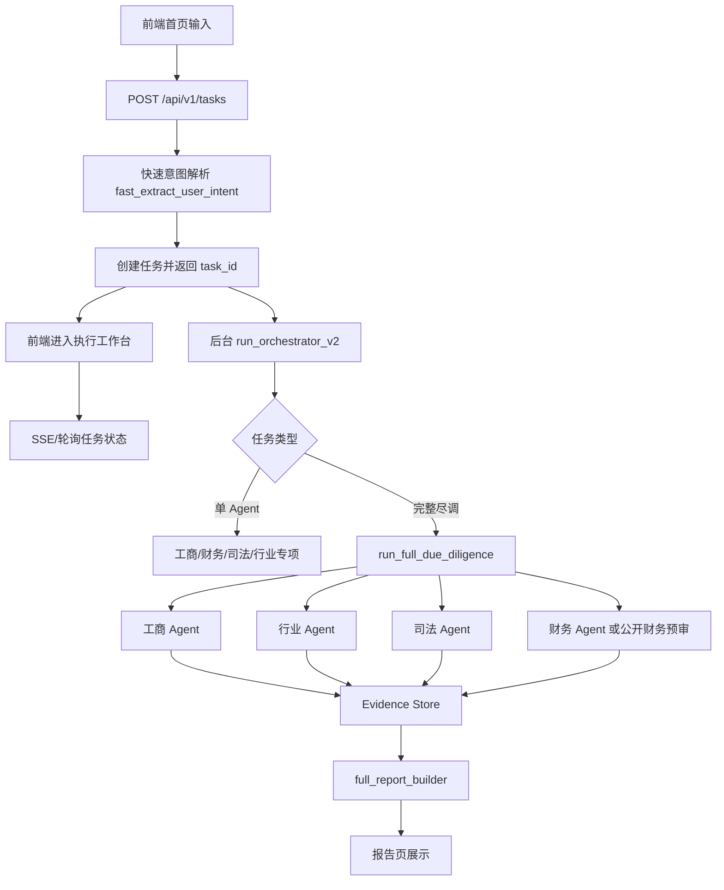
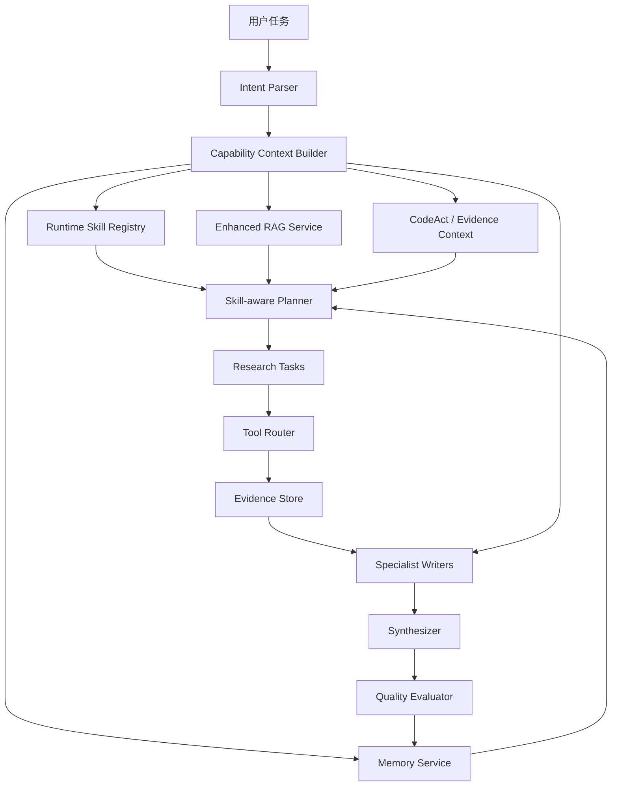
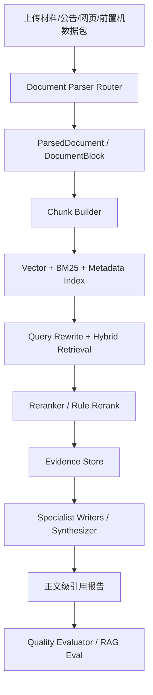
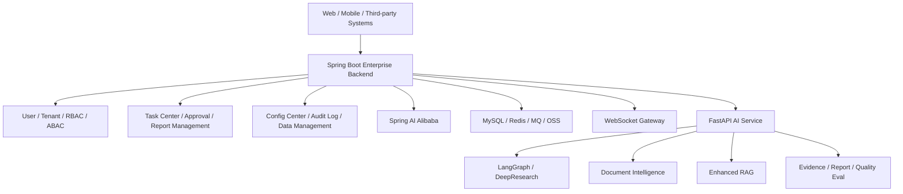
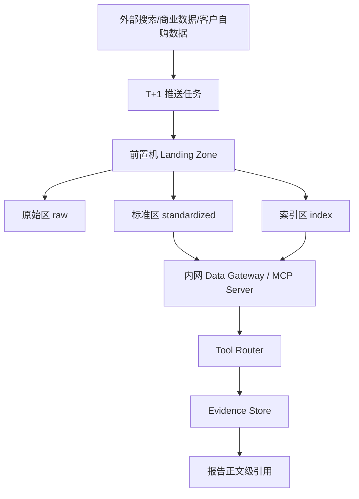

# 02 技术架构与链路方案

## 总体架构

项目采用 React/Vite 前端 + FastAPI 后端 + LangGraph/CrewAI/单 Agent 混合编排。

需要特别说明：当前选择 LangGraph 作为核心编排底座，主要是为了适配私有化项目客户的部署约束，而不是因为 SaaS 形态一定要采用 LangGraph。私有化环境通常不能直接访问外网搜索，但客户往往已自购或可采购工商、司法、行政处罚、征信、发票、流水等内网/专线数据源。更现实的交付形态是客户侧通过 T+1 任务将外部搜索、自购 API、公告、司法、工商、行业资讯等结果推送到前置机，Agent 在内网通过 MCP/Tools 从前置机拉取标准化数据包。LangGraph/FastAPI 自研后端更便于做数据源适配、成本控制、权限隔离、审计留痕和本地化运维。

如果未来项目以 SaaS 服务形态交付，则更可能采用 Dify 这类平台实现 Agent 编排、知识库、工具调用和工作流运营，以降低研发和运维成本。也就是说，本项目当前架构优先服务私有化交付；SaaS 版本应另行评估 Dify 化或平台化重构。

从长期演进看，当前系统应先保持 FastAPI 模块化单体，待报告质量、任务状态、Evidence、Tool Router、AI Writing 等边界稳定后，再通过 Docker Compose 固化私有化交付环境。若项目进一步演进为重后台、强权限、多租户、审批流、运营配置和第三方集成的企业级 AI 写作平台，推荐采用 Spring Boot 企业后台 + FastAPI AI 能力服务的双后端分工，而不是把 FastAPI 迁移到 Django 或让单一 Python 服务承载全部后台能力。详细 Roadmap 见 [06 后续路线图与开放风险](./06-roadmap-and-open-risks.md) 中的“企业级平台化：Spring Boot + FastAPI 双后端分工”。

最新架构判断：在完整 LangGraph 原生迁移和全服务容器化之前，应优先补齐 Agent Capability Layer，以及其上游的 Document Intelligence Pipeline。LangGraph 解决任务状态机、checkpoint、interrupt 和 resume；Docker 解决部署交付；Runtime Skill、Memory 和 Enhanced RAG 决定 Agent 是否真正具备专业方法论、长期经验和检索增强能力；Document Intelligence 决定上传资料、公告、网页、扫描件和前置机数据包能否被正确解析、入库、召回和引用。因此下一阶段建议先稳定资料入口、能力层接口和 RAG 评估体系，再映射到 LangGraph nodes，最后容器化交付。



## Agent Capability Layer

Agent Capability Layer 是 DeepResearch Engine 之上的能力增强层，用于把“领域方法论、历史经验、知识检索和确定性工具结果”统一注入 Planner、Tool Router、专项分析节点和报告装配器。

目标架构：



### Runtime Skill Registry

职责：

- 读取 `backend/data/knowledge_base/skills/*/SKILL.md`。
- 读取 skill 下 `references/*.json`，例如贷前尽调 evidence blueprint。
- 根据任务类型、报告模式、行业分类选择 Skill。
- 为 Planner 和专项节点输出 `skill_context`、`evidence_blueprint`、`quality_rules` 和 `output_contract`。

当前已具备雏形：

- `deep_research`
- `loan_due_diligence`
- `financial_analysis`

后续建议新增：

- `industry_analysis`
- `legal_compliance`
- `credit_policy`

### Memory Service

职责：

- 沉淀用户偏好、报告 bad case、公司历史分析、人工复核结论和质量评测反馈。
- Planner 生成计划前读取相关记忆。
- 专项 writer 生成正文前读取相关经验。
- Quality Evaluator 发现问题后写回 bad case。

建议先定义抽象接口，不直接绑定 mem0：

```text
MemoryService.write(memory_type, subject, content, metadata)
MemoryService.search(query, scope, filters)
MemoryService.summarize(subject, memory_type)
```

实现策略：

- PoC/SaaS 可评估 mem0。
- 私有化可替换为 PostgreSQL、向量库或客户内网记忆服务。
- 记忆必须带 `tenant_id`、`user_id`、`subject_id`、`confidence`、`source_task_id` 和 `expires_at`。

### Enhanced RAG Service

职责：

- 在基础向量检索之上增加 Query Rewrite、Hybrid Retrieval、Rule Rerank 和 Evidence-aware 引用。
- 按 `financial`、`industry`、`credit_policy`、`case_study`、`legal`、`user_memory`、`company_history` 做知识域隔离。
- 将低置信知识降级为“核查方向”，不直接支撑强结论。

与 Dify 的关系：

- SaaS 版本可使用 Dify workflow 和基础知识库承接轻量场景。
- 金融尽调中的复杂检索、重排、证据绑定、知识域隔离和质量评估仍建议由 Enhanced RAG Service 承接。
- 私有化版本可本地部署 Enhanced RAG，并接客户内部制度、案例库和数据前置机。

### Capability Context Builder

职责：

- 将 Skill、Memory、RAG、CodeAct 和 Evidence 统一组装为节点上下文。
- 对上下文做去重、摘要、优先级排序和 token 预算裁剪。
- 为不同节点提供不同上下文切片。

示例：

| 节点 | 注入上下文 |
| --- | --- |
| Planner | deep_research、loan_due_diligence、用户偏好、历史计划、资料完整度 blueprint |
| 财务节点 | financial_analysis、CPA 规则、财务 bad case、CodeAct 指标、跨源财报差异 |
| 行业节点 | industry_analysis、主营构成、行业 KPI、政策知识和行业案例 |
| 司法节点 | legal_compliance、权威源优先级、处罚/诉讼/执行 checklist |
| Synthesizer | 报告模板、证据质量规则、用户展示偏好、章节输出契约 |
| Quality Evaluator | Rubric、历史 bad case、同类公司回归样例和人工修改记录 |

详细 Roadmap 见 [20 Agent Capability Layer v1 产品迭代方案](./20-agent-capability-layer-v1-roadmap.md)。

## Document Intelligence Pipeline 与生产级 RAG

Document Intelligence Pipeline 是 Agent Capability Layer 的上游资料入口，负责把异构资料转换为统一、可追溯、可复核的 `ParsedDocument` / `DocumentBlock`。生产级 RAG 则负责把这些 block 进行语义切片、混合索引、查询改写、重排序和正文级引用。

目标链路：



关键设计：

- 文档解析不再是财务节点或 RAG 入库脚本里的临时逻辑，而是独立基础设施。
- PDF、Word、Excel、HTML、图片、扫描件和前置机 JSON/CSV 走不同 parser，再统一转换为中间 Schema。
- 表格整切保留表头，图片独立切分并绑定图注，财务表识别合并/母公司口径、单位和年份列。
- 解析质量低、字段冲突、跨源数据差异超过阈值时，不直接进入强结论，而是进入 Evidence Gap 或人工复核队列。
- RAG 不只用向量检索，应采用 Query Rewrite、向量 + BM25 混合检索、重排序、知识域隔离和 evidence-aware 引用。
- RAG 优化必须建设评估集，至少覆盖 Context Recall、Context Precision、Faithfulness 和 Answer Relevance。

详细设计见 [21 文档智能解析与生产级 RAG 设计](./21-document-intelligence-and-rag-design.md)。

## 企业级平台化：Spring Boot + FastAPI 双后端分工

当前 FastAPI 后端适合继续承载 Agent、RAG、文档解析、Evidence、报告生成和质量评测等 AI 能力。但如果产品演进为企业级 AI 写作平台，后续会出现更重的后台诉求：多租户权限、组织架构、审批流、任务中心、报告管理、配置中心、审计日志、移动端/第三方系统接入。这类能力更适合由 Spring Boot / Spring Cloud Alibaba 承接。

推荐目标架构：



服务边界：

| 层 | 职责 |
| --- | --- |
| Spring Boot 企业后台 | 用户、租户、权限、任务中心、报告管理、审批流、配置、审计、WebSocket、第三方系统集成 |
| Spring AI Alibaba | Java 侧模型 provider、Prompt、Embedding、向量库、轻量 RAG、Tool Calling 统一接入 |
| FastAPI AI Service | LangGraph Agent、Sequential Thinking、文档解析、Enhanced RAG、Evidence、报告生成、质量评测、CodeAct |

通信方式：

- REST / OpenFeign / WebClient：任务创建、文档解析、RAG 检索、报告生成、质量评测等同步接口。
- MQ：长耗时报告生成、批量文档解析、离线评测、批量入库等异步任务。
- Redis Stream / MQ + WebSocket：FastAPI 产生执行事件，Spring Boot 统一向前端推送。

关键判断：

- 不建议为了传统 Python Web 框架要求迁移到 Django。Django 的后台能力由 Spring Boot 更适合承接。
- FastAPI 应收敛为 AI 能力服务，保留 Python 生态在文档解析、财务计算、RAG、模型实验上的优势。
- Spring AI Alibaba 适合做 Java 侧模型接入和轻量 AI 能力，不强行替代复杂 DeepResearch Engine。

详细设计见 [22 Spring Boot 企业后台 + FastAPI AI 能力服务架构](./22-springboot-fastapi-hybrid-architecture.md)。

## 前端模块

主要文件：

- `src/pages/AgentWorkbench/AgentWorkbench.tsx`
- `src/pages/AgentWorkbench/ExecutionWorkspace.tsx`
- `src/pages/Report/index.tsx`
- `src/services/agentApi.ts`
- `vite.config.ts`

前端职责：

- 创建任务。
- 展示创建任务进度和失败提示。
- 订阅/拉取执行状态。
- 展示 timeline、plan、evidence、report。
- 报告页适配单 Agent 报告和完整尽调报告。

重要改动：

- Vite proxy 目标从 `localhost:8000` 调整为 `127.0.0.1:8000`，减少本地解析和代理不稳定问题。
- 创建任务失败时通过 `getErrorMessage(response)` 展示后端错误。
- 执行页修复闪屏问题，避免状态更新导致组件持续重绘。
- 报告页新增财务文本来源提示，显示 LLM 或 fallback、耗时、provider、告警。

## 后端任务 API

主要文件：

- `backend/app/api/tasks.py`

核心接口：

| 接口 | 用途 |
| --- | --- |
| `POST /api/v1/tasks` | 创建尽调任务 |
| `GET /api/v1/tasks/{task_id}` | 获取任务状态 |
| `GET /api/v1/tasks/{task_id}/events` | SSE 推送任务状态 |
| `POST /api/v1/tasks/{task_id}/resume-financial` | 上传财报后恢复财务/完整尽调 |

设计要点：

- 创建任务接口只做快速解析和入队，不阻塞执行。
- 后台执行通过 `schedule_task_background()` 延迟启动，确保响应先返回前端。
- 任务状态目前存储在内存 `tasks` 字典中，生产环境应迁移到数据库或 Redis。
- `append_timeline()` 统一追加过程节点，并通知 SSE 订阅者。

## 编排层

主要文件：

- `backend/app/agents/orchestrator_v2.py`

当前编排策略：

- 单 Agent 任务走轻量路径，避免为了明确意图启动 CrewAI。
- 完整尽调走 `run_full_due_diligence_sync()` 或异步 runner。
- 对 LiteLLM/CrewAI 限流错误加入退避重试。
- 非上市财务单 Agent 若未上传数据，进入等待上传状态。

关键决策：

- 创建任务阶段不再依赖 LLM，避免首页卡住。
- 完整尽调不强依赖 CrewAI，优先保证确定性单 Agent 结果。
- CrewAI 综合审查默认不覆盖报告正文，只作为建议性能力，避免自由生成污染报告。

## 完整尽调 runner

主要文件：

- `backend/app/agents/crew/full_due_diligence_runner.py`

完整尽调顺序：

1. 判断报告模式：上市公司/上传财报为财报增强，否则公开资料预尽调。
2. 若识别上市公司，采集上市公司公开资料包。
3. 运行工商 Agent。
4. 运行行业 Agent。
5. 运行司法 Agent。
6. 运行财务 Agent 或公开财务预审。
7. 构建完整尽调报告。
8. 可选调用 CrewAI 综合审查。

设计原因：

- 顺序执行比并发更容易调试和展示 timeline。
- 单 Agent 能独立验证，完整尽调只负责组合。
- 非上市未上传财报时，先完成其他三项，财务进入公开资料预审或等待上传。

## DeepResearch Engine 演进方向

当前完整尽调已引入 Sequential Thinking 驱动的 DeepResearch Engine，并完成第一阶段 LangGraph shell 包装。现阶段不重写工商、财务、司法、行业、RAG 和搜索工具，而是把既有 DeepResearch 编排包进 LangGraph 节点，保持 API 和前端交互不变。

当前 LangGraph 节点划分：

```text
prepare_plan
-> execute_round1
-> plan_followups
-> execute_followups
-> synthesize
```

其中 `prepare_plan` 负责启动 Sequential Thinking 研究思考链，并调用 LLM Planner 生成研究问题；`execute_round1` 执行首轮证据检索；`plan_followups` 根据 Gap 生成二轮补证任务；`execute_followups` 执行补证；`synthesize` 将 Evidence、Claim、Gap 装配成贷前尽调报告。

设计决策：

- 先做 LangGraph shell，而不是一次性迁移所有业务逻辑，避免破坏已验证的工具链和报告生成逻辑。
- 现有人机协同仍保留在 FastAPI 任务层，通过 `waiting_human` 和 resume 接口完成计划确认、资料上传和缺口确认。
- LangGraph 原生 `interrupt/checkpoint/resume` 暂不启用，待节点输入输出和报告结构稳定后再迁移。
- 对前端保持兼容，`prepare_deep_research_plan`、`execute_deep_research_plan`、`run_deep_research_due_diligence` 三个公开入口不变。

### Sequential Thinking Remote MCP

Sequential Thinking 在当前架构中不再只是 `plan review` 工具，而是 plan 节点的研究思考状态机。它负责记录摘要化的研究步骤、动态扩展和修订记录，LLM Planner 再基于这些步骤生成可执行 `ResearchTask`。

支持两种传输模式：

```text
SEQUENTIAL_THINKING_TRANSPORT=stdio
SEQUENTIAL_THINKING_TRANSPORT=streamable_http
```

`stdio` 适合本地开发，通过 `npx -y @modelcontextprotocol/server-sequential-thinking` 启动官方 MCP server。`streamable_http` 适合私有化部署和多 Agent 协同，通过独立 wrapper 暴露：

```text
http://127.0.0.1:38001/mcp
```

wrapper 位于：

```text
services/sequential-thinking-wrapper
```

详细设计见 [17 Sequential Thinking Remote MCP 设计文档](./17-sequential-thinking-remote-mcp-design.md)。

目标研究状态机：

```text
尽调目标
-> 研究计划
-> 研究任务
-> 证据需求
-> 工具调用
-> Evidence Store
-> Claim 生成
-> Gap 识别
-> 报告合成
```

该引擎不替代现有单 Agent，而是把工商、财务、司法、行业、RAG、Bocha 搜索和用户上传材料包装为研究工具。每条结论都必须绑定证据，公开搜索只作为线索，权威数据源和上传材料用于提升证据置信度。

详细方案见：

- [09 DeepResearch Engine 产品设计](./09-deepresearch-engine-product-design.md)
- [10 DeepResearch Engine 技术设计](./10-deepresearch-engine-technical-design.md)
- [11 DeepResearch Engine 数据与测试方案](./11-deepresearch-engine-data-and-test-plan.md)
- [12 DeepResearch Engine 实施计划](./12-deepresearch-engine-implementation-plan.md)
- [17 Sequential Thinking Remote MCP 设计文档](./17-sequential-thinking-remote-mcp-design.md)

## RAG 全链路

主要文件：

- `backend/app/rag/knowledge_ingestion.py`
- `backend/app/rag/knowledge_retrieval_service.py`
- `backend/scripts/ingest_knowledge_base.py`
- `backend/data/knowledge_base/**`

知识库内容包括：

- 财务异常信号规则。
- 行业尽调逻辑。
- 工商审查指南。
- 司法风险审查指南。
- 授信决策和贷后管理参考。
- 同业银行政策参考。
- 尽调报告模板和案例。

检索策略：

- 优先向 Chroma 向量库检索。
- 向量检索失败时，回退本地 Markdown 关键词检索。
- 返回结果可转为 Evidence Store 证据项。

设计原因：

- 开发环境 embedding 或 Chroma 不稳定时，系统仍可生成报告。
- Agent 不直接读全部知识库，而是通过 domain query 获取相关片段。
- RAG 结果必须带 source、confidence、retrieval_mode，便于报告展示。

## Evidence Store

主要文件：

- `backend/app/agents/evidence/evidence_store.py`
- `backend/app/agents/evidence/__init__.py`

Evidence Store 的作用：

- 统一工商、财务、司法、行业 Agent 输出证据结构。
- 给证据加上来源类型、置信度、可信等级、是否需要人工复核。
- 报告页展示证据来源和风险判断依据。

典型字段：

```json
{
  "id": "...",
  "label": "知识库命中",
  "value": "命中知识库：财务异常信号规则",
  "source": "backend/data/knowledge_base/...",
  "source_type": "internal_knowledge_base",
  "confidence": 0.78,
  "trust_level": "medium",
  "requires_manual_review": false
}
```

## LLM 使用策略

当前项目中的 LLM 不承担“凭空分析所有内容”的职责，而是在以下环节使用：

- 行业分类候选裁判。
- 财务诊断式文本生成。
- 行业诊断式文本生成。
- 可选 CrewAI 综合审查。

重要约束：

- 数值指标先由代码抽取和计算。
- LLM 只基于已提供数据和 RAG 知识写诊断文本。
- 输出必须是结构化 JSON。
- 质量闸门检测禁用表达、未授权数字、缺失字段和数据边界。
- LLM 失败或质量不通过时使用专业 fallback。

## CodeAct 代码即工具

CodeAct 用于把项目中已经验证过的 Python 脚本和确定性分析函数注册为 Agent 可调用的内部工具。当前项目不开放任意代码执行，而是采用 Registered CodeAct：工具必须先在后端白名单 registry 中登记，输入输出必须是 JSON，失败时返回结构化错误并进入审计日志。

架构位置：

```text
Planner / LangGraph Node
-> Tool Router
-> CodeAct Runner
-> Registered Code Tool
-> JSON Result
-> Evidence Store / 质量评测 / 审计日志
```

第一阶段已规划的注册工具是 `evaluate_report_quality`，复用现有报告质量评测器，让报告生成后的评分、P0/P1/P2 问题和修复建议可以被任务系统或后续 Agent 编排调用。后续可注册财务指标计算、三大表勾稽校验、T+1 前置机数据包校验、知识库入库校验等工具。

安全边界：

- 只执行 registry 中的白名单工具。
- 默认关闭任意 LLM 生成代码执行。
- 每个工具设置超时、结构化入参、结构化出参和错误隔离。
- 前端和报告中展示业务化工具名称，不暴露内部脚本和工具链细节。

详细设计见 [16 CodeAct 代码即工具产品与技术设计](./16-codeact-product-technical-design.md)。

## 外部工具和 MCP

当前外部工具包括：

- Bocha Web Search 中文公开搜索。
- Tavily 搜索。
- Exa MCP 搜索和页面抓取。
- 上市公司公开资料工具。
- 本地 RAG 工具。

测试结论：

- DuckDuckGo MCP 多次出现 `Failed to get the VQD`，已从主链路移除，不再作为搜索兜底。
- Bocha Web Search 实测对中文企业、公告、司法线索和行业资料搜索更稳定，适合作为 SaaS/PoC 场景下的公开搜索主通道。

## 公开搜索后处理 Pipeline

公开搜索结果不直接进入报告，而是统一经过 `public_search_pipeline.py`：

```text
Bocha / SearXNG results
-> clean_and_dedupe_results
-> select_results_for_crawl
-> crawl4ai 正文读取（可选）
-> enrich_public_result 字段抽取和来源分级
-> normalize_evidence
-> Evidence Store / Claim / Report citations
```

当前处理能力：

- 过滤单字百科、字典解释、重复 URL 等低价值搜索结果。
- 对财务、司法、行业、工商分别生成业务化 evidence label。
- 对高可信或中可信结果可选调用 crawl4ai 读取网页正文。
- 抽取工商字段、司法信号、行业锚点，写入 `metadata.extracted_fields`。
- Bocha 和 SearXNG 都通过同一 pipeline 生成 Evidence，避免每个 provider 各自拼证据。

SearXNG 当前定位为“公开资料聚合检索”增强通道，默认由 `ENABLE_SEARXNG_SEARCH` 控制。国内搜索源容易出现 CAPTCHA，生产环境应通过前置机、代理、缓存和客户授权数据源降低实时搜索依赖。
- Exa/Tavily 更适合作为公开资料搜索主路径。
- 工商和司法权威数据源仍应优先接正式 API 或可稳定访问的数据通道。

## 私有化 T+1 数据前置机架构

私有化生产环境不应假设 Agent 可以直接调用公网搜索、搜索 MCP 或外部 SaaS API。推荐采用“客户侧 T+1 数据前置机”方案：客户或数据供应商每日将前一日公开搜索、自购工商司法数据、公告舆情、上市公司财务和行业资讯结果推送到前置机，Agent 通过内网 Tool Server/MCP Server 查询。



前置机数据分三层：

- `raw/`：保留原始供应商响应、文件和时间戳，满足审计追溯。
- `standardized/`：按统一 schema 输出 JSON/Parquet/CSV，供 Agent 工具读取。
- `index/`：按企业名、统一社会信用代码、股票代码、数据域、截止日期、版本号建立索引。

推荐数据域：

| 数据域 | 内容 | Agent 用途 |
| --- | --- | --- |
| `business` | 工商登记、股东、变更、异常经营、股权质押、对外投资 | 主体核验、治理结构、关联风险 |
| `legal` | 裁判、执行、失信、行政处罚、监管处罚 | 司法合规风险、授信边界 |
| `financial_public` | 上市公司三大表、主营构成、年报经营讨论、财务摘要 | 财务诊断、偿债能力、经营质量 |
| `announcement_news` | 上市公告、重大诉讼、担保质押、监管问询、舆情 | 重大事项补证、交叉验证 |
| `industry` | 行业景气、政策、研报摘要、价格指数、同业指标 | 行业定位、周期、竞争格局、授信关注点 |

标准数据包应包含：

```json
{
  "package_id": "pkg_20260614_0001",
  "subject_name": "某某股份有限公司",
  "subject_keys": {
    "credit_code": "...",
    "stock_code": "...",
    "aliases": ["..."]
  },
  "data_domain": "business|legal|financial_public|announcement_news|industry",
  "as_of_date": "2026-06-13",
  "source_type": "customer_authorized_data_feed",
  "trust_level": "high",
  "license_scope": "仅限本客户内网尽调用途",
  "records": [],
  "raw_refs": [],
  "checksum": "..."
}
```

Agent 侧实现原则：

- Planner 仍按业务问题生成证据需求，例如“核查工商变更”“获取近三年财务数据”。
- Tool Router 根据部署配置选择公网搜索工具或前置机工具，不让业务 Agent 感知供应商差异。
- 前置机返回结果统一进入 Evidence Store，标记 `source_type=customer_authorized_data_feed` 或 `internal_front_machine_feed`。
- 报告展示 `as_of_date` 和数据边界，明确 T+1 数据不是实时数据。
- 对审批当天重大事项，保留人工补充、例外实时查询或审批前复核机制。

这使同一套 Agent 逻辑可以同时适配 PoC/SaaS 的实时公网搜索和私有化生产的 T+1 前置机数据包。

## 私有化与 SaaS 架构分叉

### 私有化部署形态

私有化客户一般有以下特点：

- 无法或不允许直接访问公网搜索引擎。
- 对数据出域、模型调用、日志审计和权限控制要求更高。
- 工商、司法、行政处罚、征信等数据通常由客户自购或通过内网系统提供。
- 外部数据调用存在成本，需要做缓存、限流、字段级复用和按需查询。

因此私有化版本应采用以下策略：

- LangGraph/FastAPI 作为可控编排层。
- 搜索工具作为可插拔工具，不作为核心依赖。
- 工商、司法、行政处罚数据源通过客户内网 API 或数据中台适配。
- RAG 知识库部署在客户内网，接入内部授信制度、行业准入政策、评级模型和历史案例。
- Evidence Store 记录每一次数据调用来源、成本、命中字段和人工复核状态。
- 对高成本数据源做调用前置判断，例如只有当报告需要正式审批级证据时才调用完整接口。

### SaaS 服务形态

如果项目未来提供 SaaS 服务，需求重心会变化：

- 更关注快速搭建工作流、多租户知识库、工具管理和运营配置。
- 外部搜索和公开数据 API 可作为常规能力。
- 客户不一定提供内网数据源，更多依赖公开资料、商业 API 和用户上传材料。
- 平台化运维、版本发布、工作流可视化编辑会更重要。

因此 SaaS 版本更适合评估 Dify 或类似平台：

- Dify 负责 Agent workflow、知识库、工具调用、Prompt 管理和运营配置。
- 自研后端保留在数据源适配、报告模板、Evidence Store、权限计费等关键模块。
- 当前 LangGraph 中沉淀的 Agent 逻辑应抽象成工具能力和提示词资产，便于迁移到 Dify workflow。

### 架构原则

无论私有化还是 SaaS，都应保持以下边界：

- 数据获取能力与分析写作能力解耦。
- 证据结构与报告结构解耦。
- LLM provider 与业务流程解耦。
- RAG 知识库内容与编排框架解耦。
- 不把公网搜索作为正式授信证据的唯一来源。

## 配置和凭证原则

项目中涉及 LLM、Embedding、Tavily、Exa、MCP 等配置。文档和代码不应写入真实 key/token。

推荐方式：

- 通过 `backend/.env` 配置。
- `.env.example` 只保留变量名，不保留真实值。
- 文档只说明变量用途，不记录用户提供过的密钥。
