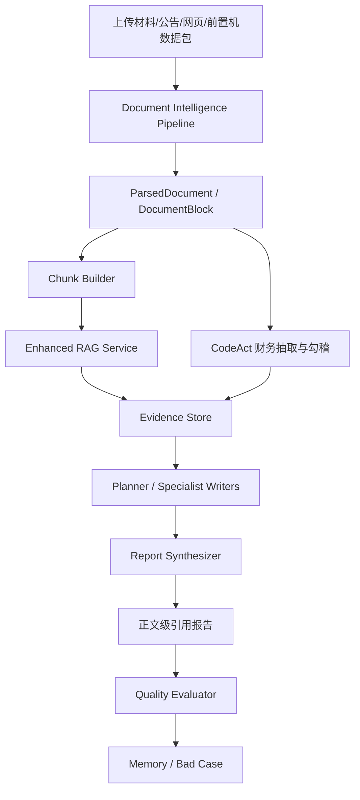

# 21 文档智能解析与生产级 RAG 设计

## 背景

DDG-Agent 已经形成 DeepResearch、Evidence、CodeAct、质量评测和报告装配闭环，但要进一步接近真实金融 AI 写作平台，还需要补齐两个基础能力：

1. 文档智能解析管线：把 PDF、Word、Excel、扫描件、网页和客户前置机数据包转换为结构化、可追溯、可复核的中间数据。
2. 生产级 RAG：把解析后的资料可靠召回、重排、引用，并让报告正文能绑定来源，而不是只把材料粗暴塞进 prompt。

两者的关系是：文档解析决定知识入库上限，RAG 决定知识能否被正确召回并支撑结论。解析错了，切片和检索再好也没有意义；检索错了，报告生成就会变成“看起来专业但证据不稳”的文本。

## 设计目标

- 支持尽调报告、投研分析、法律尽调、研报写作等多场景复用。
- 让上传材料、公开网页、公告 PDF、财务 Excel、客户 T+1 数据包都能进入统一资料层。
- 保留页码、表格、图片、caption、单位、置信度、parser 版本和原文位置。
- 低置信字段进入人工复核队列，不直接支撑强结论。
- RAG 检索结果必须能转成 Evidence，并支持正文级引用。
- 按业务价值和成本选择 parser、OCR、视觉模型、重排模型和检索策略。

## 一、文档智能解析七层 Pipeline

### Layer 1：入口路由

通过扩展名、MIME 类型和 magic bytes 识别文件真实类型，避免扩展名伪造或误传导致解析失败。

输入来源包括：

- 用户上传：审计报告、授信材料、征信报告、合同、银行流水。
- 公共资料：巨潮公告、交易所公告、网页正文、研报摘要。
- 私有化前置机：T+1 工商、司法、财务、行业、舆情数据包。

### Layer 2：Parser 分路决策

不同格式走不同 parser，不追求一个 parser 处理所有资料。

| 文件类型 | 优先策略 | 说明 |
| --- | --- | --- |
| 文本 PDF | PyMuPDF / pdfplumber 快速解析 | 低成本、高速度，适合标准文本 PDF |
| 复杂财报 PDF | MinerU / Docling / OCR 组合 | 保留表格、版面、跨页表和图注 |
| Word | python-docx / LibreOffice 转换 | 保留标题层级和表格 |
| Excel | openpyxl + 财务表专项解析 | 处理多 sheet、多表、公式、单位继承 |
| HTML/网页 | crawl4ai / readability 清洗 | 抽正文、标题、发布时间和来源 |
| 图片/扫描件 | OCR + 版面分析 | 低置信页进入复核 |
| 前置机 JSON/CSV | schema validator | 校验日期、checksum、字段覆盖和来源 |

### Layer 3：统一中间 Schema

所有 parser 输出统一转换为 `ParsedDocument` 和 `DocumentBlock`，下游不直接依赖具体 parser。

```json
{
  "document_id": "doc_001",
  "source": "upload|crawler|front_machine|announcement",
  "file_type": "pdf|docx|xlsx|html|image|json",
  "subject_name": "三安光电股份有限公司",
  "as_of_date": "2026-06-16",
  "blocks": [
    {
      "block_id": "b001",
      "type": "paragraph|table|image|caption|formula|metadata",
      "page": 12,
      "text": "...",
      "table_markdown": "...",
      "confidence": 0.86,
      "bbox": {},
      "metadata": {
        "parser": "mineru",
        "parser_version": "x.y.z",
        "section_title": "资产负债表",
        "unit": "元",
        "statement_scope": "consolidated"
      }
    }
  ],
  "quality": {
    "overall_confidence": 0.82,
    "needs_human_review": true,
    "issues": ["疑似跨页表", "部分页 OCR 置信度低"]
  }
}
```

### Layer 4：多模态 Chunk 切分

切分策略按资料类型区分：

- 段落：按语义边界切分，保留标题层级和前后文。
- 表格：整表切分，重复表头，保留单位、口径、页码。
- 图片：独立成块，并绑定图注、附近段落和原文位置。
- 财务表：按资产负债表、利润表、现金流量表、主营构成等业务表类型切分。
- 前置机数据包：按 record 粒度切分，同时保留 package_id、as_of_date、checksum。

### Layer 5：解析质量验证

解析完成后做完整性和置信度评估。

质量规则：

- 单页有效字符过少，触发 OCR 或人工复核。
- 表格缺少年份列、单位或表头，标记 `needs_human_review`。
- 财务三表不平衡或关键字段缺失，进入 CodeAct 勾稽校验。
- 多来源同一指标差异超过阈值，形成 Evidence Gap。
- 低置信字段不能直接进入强结论，只能进入“核查方向”。

### Layer 6：成本与性能优化

解析成本不能无差别堆模型，应按业务价值分级。

- 快档 parser 优先，失败或低置信再升级慢档 parser。
- 图片只对财报图表、流程图、关键截图调用视觉模型，logo、二维码、装饰图跳过。
- 图片 PHASH 去重，降低重复视觉模型调用。
- OCR、parser、视觉模型调用记录耗时、成本和失败率。
- 私有化部署下支持 CPU OCR 和可选 GPU OCR/视觉模型。

### Layer 7：Fallback 与人工复核

任意环节失败不应直接让任务挂掉。

- parser 失败：切换备用 parser。
- OCR 低置信：进入人工复核队列。
- 财务表无法抽取：报告显示资料缺口，并触发上传/补录任务。
- 网页正文读取失败：保留搜索摘要作为低置信线索。
- 前置机包校验失败：阻断入库并输出数据包修复清单。

## 二、财务资料专项解析

财务分析质量高度依赖上游表格解析。后续应把财务资料解析作为专项能力，而不是散落在财务 writer 中。

关键能力：

- 识别合并报表与母公司报表，避免口径混淆。
- 识别资产负债表、利润表、现金流量表、主营构成、非经常性损益、审计意见和附注。
- 自动继承单位，例如元、万元、亿元。
- 识别年份列和报告期，避免 2025 预测值混入 2024 年报。
- 支持 Excel 多表分散切分，避免同一 sheet 中多个小表互相污染。
- 输出标准财务字段，供 `calculate_financial_ratios` 和 `validate_financial_statements` 调用。

建议输出：

```json
{
  "statement_type": "income_statement",
  "scope": "consolidated",
  "periods": ["2022", "2023", "2024"],
  "unit": "yuan",
  "fields": {
    "revenue": [13222000000, 14053000000, 16106000000],
    "operating_cost": [10865000000, 12597000000, 14189000000],
    "net_profit_parent": [685000000, 367000000, 253000000],
    "deducted_non_recurring_net_profit": [-311000000, -567000000, -815000000]
  },
  "quality": {
    "confidence": 0.91,
    "issues": [],
    "source_blocks": ["b101", "b102"]
  }
}
```

## 三、生产级 RAG 七层架构

### Layer 1：文档摄入

监听上传文件、网页抓取结果、公告源、数据库、API 和前置机目录，形成持续入库机制。

### Layer 2：文档解析

复用 Document Intelligence Pipeline，将资料转换为统一 `ParsedDocument`。

### Layer 3：文档切片

按资料价值选择切片策略：

- 普通制度和新闻：语义切片。
- 尽调报告和年报：父子切片，小块召回，大块生成。
- 高价值规则和授信制度：命题切片，抽成独立事实或规则。
- 表格：整表切片并重复表头。

### Layer 4：索引构建

不只做向量索引，应建设多索引体系。

| 索引 | 适合场景 |
| --- | --- |
| 向量索引 | 语义相近问题、同义表达 |
| BM25/关键词 | 公司名、条款号、金额、日期、专有名词 |
| 元数据索引 | 租户、行业、资料类型、时间、来源可信度 |
| 图谱索引 | 股权、关联方、担保、诉讼关系等跨文档关系 |

Embedding 模型必须在自有数据上评测，不能只看公开榜单。中文金融场景可优先评估 BGE-M3、Jina 中文/多语模型或客户私有化可用 embedding 模型。

### Layer 5：检索优化

用户问题通常不完整，需要 Query Rewrite 和混合检索。

建议能力：

- 多 query 改写。
- Step-back 抽象改写。
- 问题拆分，例如“财务和司法风险”拆成两个证据需求。
- 同义词和行业术语扩展。
- 向量 + BM25 并行检索，再做融合排序。

### Layer 6：重排序

重排序是提升 RAG 质量性价比最高的环节之一。

建议路径：

```text
Bi-Encoder 快速召回 top50
-> Cross-Encoder / Reranker 重排
-> 规则加权：来源可信度、更新时间、章节类型、资料口径
-> 输出 top5/top8 给生成节点
```

### Layer 7：生成与引用验证

生成阶段必须输出引用，并在后处理校验引用是否真实存在。

规则：

- 每个关键结论绑定 `evidence_refs`。
- 引用必须能跳转到原文 block、页码或网页 URL。
- 模型编造的引用在后处理中过滤。
- 低置信 evidence 只能支撑“疑似/需核查”表述。
- 报告页展示正文级引用，而不是只在附录堆 evidence。

## 四、Agentic RAG 和 Graph RAG 的取舍

### Agentic RAG

适合 DeepResearch 场景：Planner 根据证据缺口决定是否二次检索、查哪个知识域、是否调用结构化数据源。

适用条件：

- 高价值任务，例如正式贷前尽调、法律尽调、重大投研报告。
- 需要多轮补证和证据缺口判断。
- 可接受更高调用成本和更长耗时。

不适合所有问答默认启用。轻量知识问答仍用标准 RAG。

### Graph RAG

适合关系密集场景，例如：

- 股权穿透。
- 关联交易。
- 担保链。
- 实控人关系。
- 司法案件和关联方交叉分析。

但图谱构建成本高，应优先用于高价值金融关系场景，不作为通用 RAG 起步方案。

## 五、RAG 评估体系

没有评估集的 RAG 优化都是盲调。建议建设 `rag_eval_set`。

评估样本字段：

```json
{
  "question": "公司2024年扣非净利润是否改善？",
  "reference_answer": "扣非净利润仍为负且亏损扩大/收窄...",
  "relevant_document_ids": ["doc_annual_2024"],
  "relevant_block_ids": ["b_income_2024", "b_non_recurring_2024"],
  "difficulty": "medium",
  "domain": "financial"
}
```

核心指标：

| 指标 | 说明 | 对应环节 |
| --- | --- | --- |
| Context Recall | 相关资料是否被召回 | 检索召回 |
| Context Precision | 召回结果中相关内容占比 | 检索噪声控制 |
| Faithfulness | 回答是否忠实证据 | 生成与引用 |
| Answer Relevance | 回答是否解决用户问题 | 整体体验 |

优化方法：

- 每次只改一个变量，例如切片、embedding、rerank、prompt。
- 用消融实验对比指标变化。
- 区分财务、行业、司法、工商、制度问答不同评测集。
- 把报告质量评测和 RAG 评测打通，分析差评来自召回失败还是生成失败。

## 六、与 DDG-Agent 现有模块的关系



模块定位：

- Document Intelligence Pipeline 是资料入口。
- Enhanced RAG Service 是知识召回和引用服务。
- CodeAct 负责确定性抽取、计算和校验。
- Evidence Store 负责证据化和审计追溯。
- Quality Evaluator 负责发现报告质量问题并反哺 Memory。

## 七、产品和简历价值

这套能力让项目从“调用大模型生成报告”升级为“面向 RAG/Agent 的 AI 写作平台底座”。

适合写进项目简历的表达：

> 参与规划面向 RAG/Agent 的文档智能解析与生产级 RAG 能力，围绕 PDF、Excel、扫描件、网页和客户前置机数据包，设计 Parser 路由、统一中间 Schema、表格整切、置信度校验、混合检索、重排序、正文级引用和人工复核机制，提升知识入库质量、报告生成稳定性和企业级可审计性。

面试中可强调的判断：

- 大上下文不能替代 RAG，企业资料规模和调用成本决定 RAG 仍是主路径。
- 生产级 RAG 的难点不是“向量库能不能查”，而是解析、切片、混合检索、重排、引用、评估和成本治理。
- 文档解析失败会直接污染 Evidence 和报告结论，因此解析质量必须前置可观测、可降级、可复核。
- 对金融 AI 项目，LLM 负责语言和诊断表达，结构化抽取、财务计算、勾稽校验和引用验证应由确定性工具承担。
