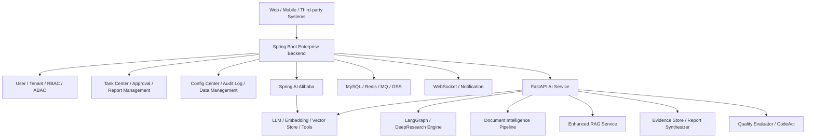

# 22 Spring Boot 企业后台 + FastAPI AI 能力服务架构

## 背景

DDG-Agent 当前采用 React/Vite + FastAPI + LangGraph 的模块化单体架构，适合快速验证 Agent、RAG、文档解析、Evidence 和报告生成等 AI 能力。但如果项目后续演进为面向企业客户的 AI 写作平台，尤其需要重后台能力、多租户权限、审批流、审计日志、运营配置、第三方系统集成和私有化交付时，单纯依靠 FastAPI 承载全部业务后台并不是最优路线。

更合理的方向是采用“双后端分工”：

- Spring Boot / Spring Cloud Alibaba 承接企业级业务后台。
- FastAPI 保留为 AI Agent 能力服务。
- Spring AI Alibaba 作为 Java 侧模型、向量库、工具调用和简单 RAG 的统一接入层。

这不是要把现有 FastAPI 项目推倒重写，而是把它收敛为可被企业后台调用的 AI Service。

## 目标架构



## 服务边界

### Spring Boot 企业后台层

适合承载稳定、强业务、强权限、强集成的企业后台能力。

职责：

- 用户、租户、组织、角色、数据权限。
- 任务中心、报告管理、审批流、人工复核流转。
- 文件管理、资料目录、报告导出、版本管理。
- 模型配置、工具配置、数据源配置、租户额度配置。
- 审计日志、操作留痕、系统监控、告警通知。
- 对外 API、第三方系统集成、移动端适配接口。
- WebSocket 统一推送任务进度、告警、复核通知。

建议技术栈：

- Spring Boot / Spring Cloud Alibaba。
- MySQL 作为主业务库。
- Redis 做缓存、限流、会话、任务状态短缓存。
- MQ 处理长任务、批量解析、报告生成和异步通知。
- MinIO / OSS 存储上传文件、报告附件、原始资料。
- Spring Security / Sa-Token / Shiro 等权限框架按团队习惯选择。

### FastAPI AI 能力服务层

适合承载快速迭代、依赖 Python 生态、模型和数据处理密集的 AI 能力。

职责：

- DeepResearch / LangGraph Agent 编排。
- Sequential Thinking 研究计划和二轮补证。
- Document Intelligence Pipeline 文档解析。
- Enhanced RAG 检索增强、重排序和正文级引用。
- Evidence Store 证据生成、证据质量分级。
- 财务指标计算、三大表勾稽校验、AKShare/巨潮等数据源适配。
- 报告生成、质量评测、离线回归、CodeAct 工具。
- Python OCR、pandas、openpyxl、向量检索、模型实验等生态能力。

FastAPI 服务不负责完整用户体系和企业后台管理，只提供 AI 能力 API。

### Spring AI Alibaba 集成层

Spring AI Alibaba 适合在 Java 业务系统中统一承接模型调用和轻量 AI 能力。

适合承载：

- 通义、DeepSeek、OpenAI 兼容模型等 provider 接入。
- ChatClient、Prompt 模板和基础 Tool Calling。
- 简单知识问答、轻量 RAG、向量库接入。
- Java 业务系统内的 AI 辅助能力，例如摘要、问答、分类、工单辅助。

不建议强行承载：

- 复杂 DeepResearch 多轮研究状态机。
- 大量 Python 数据处理和财务计算。
- 多 parser 文档解析管线。
- 高度实验性的 Agent 编排和模型评测。

这些仍由 FastAPI AI Service 承接。

## 通信方式

### 同步接口：REST / OpenFeign / WebClient

适合短耗时和查询类能力。

```text
Spring Boot -> OpenFeign/WebClient -> FastAPI AI Service
```

典型接口：

| 接口 | 用途 |
| --- | --- |
| `POST /ai/tasks/plan` | 生成研究计划和证据需求 |
| `POST /ai/documents/parse` | 解析单份文档 |
| `POST /ai/rag/retrieve` | 检索知识和证据片段 |
| `POST /ai/reports/generate` | 基于证据生成报告 |
| `POST /ai/reports/evaluate` | 报告质量评测 |
| `GET /ai/tasks/{task_id}` | 查询 AI 任务状态 |

### 异步任务：MQ

适合长耗时、可重试、可排队的 AI 任务。

```text
Spring Boot 发布任务
-> MQ
-> FastAPI Worker 消费
-> 写入结果 / 回调 Spring Boot
```

适用场景：

- 批量文档解析。
- 长报告生成。
- 批量 RAG 入库。
- 离线质量评测。
- 多公司回归测试。

### 实时状态：Redis Stream / MQ + WebSocket

前端不直接连接 FastAPI，统一连接 Spring Boot WebSocket。

```text
FastAPI AI Service 产生执行事件
-> Redis Stream / MQ
-> Spring Boot WebSocket Gateway
-> Web / Mobile Frontend
```

优势：

- 前端只感知企业后台，不暴露 AI 内部服务。
- 权限、租户、订阅关系由 Spring Boot 统一控制。
- AI 服务可以横向扩展，事件统一汇聚。

## 数据模型建议

Spring Boot 业务库建议承载平台主数据和管理数据。

核心表：

| 表 | 说明 |
| --- | --- |
| `sys_user` | 用户 |
| `sys_role` | 角色 |
| `sys_tenant` | 租户 |
| `sys_org` | 组织机构 |
| `ai_task` | AI 任务主表 |
| `ai_task_event` | 任务事件和执行 timeline |
| `ai_document` | 上传文档和资料索引 |
| `ai_report` | 报告主表 |
| `ai_report_version` | 报告版本 |
| `ai_evidence` | 证据摘要和引用信息 |
| `ai_quality_eval` | 质量评测结果 |
| `ai_model_config` | 模型配置 |
| `ai_tool_config` | 工具配置 |
| `ai_datasource_config` | 数据源配置 |
| `audit_log` | 审计日志 |

FastAPI AI Service 可保留 AI 侧中间结果库或文件存储，用于调试、评测和回放，但正式报告、任务状态、租户权限和审计应回写 Spring Boot 主业务库。

## 为什么不是迁移到 Django

不建议为了 Python Web 框架要求把 FastAPI 迁移到 Django。

原因：

- 当前核心链路是 Agent API、异步任务、SSE/事件流、文档解析、RAG 和模型调用，FastAPI 更轻量、更适合 API-first AI 服务。
- Django 的优势在传统业务后台、Admin、ORM、表单和完整应用生态，但这些能力在未来架构中由 Spring Boot 更适合承接。
- 金融/政企 ToB 项目中，企业级后台、权限、审批、审计、第三方集成和私有化交付使用 Spring Boot 更符合客户技术栈和团队协作方式。
- Python 生态优势应保留在 AI 能力服务，不应把企业后台和 AI 编排强行放进同一个 Python 框架。

推荐判断：

```text
不迁 Django
不让 FastAPI 承担全部企业后台
采用 Spring Boot 企业后台 + FastAPI AI Service 的双后端分工
```

## 分阶段演进路线

### 阶段 1：保持 FastAPI 模块化单体

目标是继续打磨 AI 能力本身。

重点：

- Document Intelligence Pipeline。
- Enhanced RAG。
- Evidence Store。
- 报告质量评测。
- 财务字段抽取和勾稽校验。
- LangGraph interrupt/checkpoint/resume。

### 阶段 2：定义 AI Service API Contract

在不重写代码的前提下，先抽象 FastAPI 对外 API。

重点：

- 任务 API。
- 文档解析 API。
- RAG 检索 API。
- 报告生成 API。
- 质量评测 API。
- AI 任务事件 schema。

### 阶段 3：引入 Spring Boot 企业后台

新增 Spring Boot 后台，但不替换 FastAPI AI 能力。

重点：

- 用户租户权限。
- 任务中心。
- 报告管理。
- 文件管理。
- 模型/工具/数据源配置。
- 审计日志。
- WebSocket Gateway。

### 阶段 4：Spring AI Alibaba 集成

Java 侧通过 Spring AI Alibaba 统一接入模型和轻量 AI 能力，FastAPI 继续承接复杂 AI 服务。

重点：

- Java 侧模型 provider 配置。
- 简单摘要、问答、分类能力。
- 向量库接入和轻量 RAG。
- Tool Calling 与 FastAPI AI Service 协同。

### 阶段 5：私有化交付和微服务拆分

当服务边界稳定后，再做 Docker Compose / Kubernetes 和微服务治理。

推荐服务：

- `enterprise-backend`：Spring Boot 企业后台。
- `ai-service`：FastAPI AI 能力服务。
- `frontend`：Web 工作台。
- `mysql`：业务数据库。
- `redis`：缓存、限流、事件流。
- `mq`：异步任务。
- `vector-db`：向量库。
- `object-storage`：文件和报告附件。
- `sequential-thinking-wrapper`：远程 MCP 服务。

## 简历表达

适合偏开发/架构 JD 的表达：

> 参与 AI 写作公共组件平台架构设计，规划 Spring Boot 企业后台 + FastAPI AI 能力服务的分层架构，将用户权限、租户管理、任务中心、报告管理、审计日志和配置管理等企业级后台能力，与 Agent 编排、RAG 检索、文档解析、Evidence 证据链、报告生成和质量评测等 AI 能力解耦。

更具体的项目职责：

- 设计 Spring Boot 与 FastAPI AI Service 的服务边界，业务后台负责任务、权限、租户、报告、审计和配置，AI 服务负责 DeepResearch、RAG、文档解析、报告生成和质量评测。
- 规划 REST / MQ / WebSocket 组合通信方式：同步接口处理任务创建和结果查询，异步队列处理长耗时报告生成，WebSocket 推送 Agent 执行日志和告警。
- 结合 Spring AI Alibaba 规划 Java 侧模型接入层，统一管理模型 provider、Embedding、向量库、Prompt 模板和工具调用能力。
- 参与 MySQL 数据模型设计，规划任务、报告、证据、文档、模型配置、工具配置、数据源配置和审计日志等核心表结构。
- 保留 FastAPI 作为 AI 能力服务，承接 LangGraph Agent 编排、文档解析、RAG 检索、财务指标计算和报告质量评测等 Python 生态优势能力。

面试一句话：

> 我对这个项目的架构判断是，AI 能力和企业级后台要解耦。Spring Boot 更适合承接 ToB 平台的权限、租户、任务、审计和系统集成，FastAPI 更适合承接 Agent、RAG、文档解析和模型实验。Spring AI Alibaba 可以作为 Java 侧统一模型接入和轻量 AI 能力层，复杂 DeepResearch Engine 则保留在 FastAPI AI Service 中，通过 REST、MQ 和 WebSocket 与 Java 后台协同。
