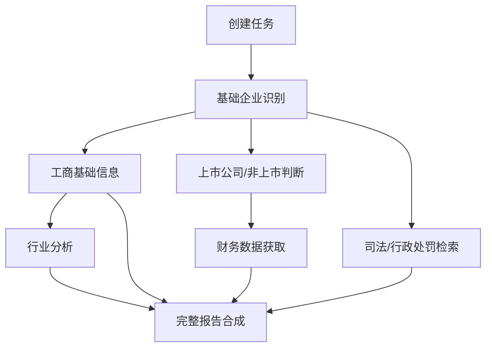

# 08 面试架构答辩手册

本文档面向“把 DDG-Agent 项目拿去面试讲解”的场景，整理面试官大概率会追问的架构问题。重点不是背答案，而是能清楚说明：为什么这样设计、有哪些取舍、如果商业形态变化如何演进。

## 1. SaaS 和私有化两种架构如何设计

### 面试官可能问

这个项目如果做 SaaS 和做私有化，架构有什么区别？为什么当前使用 LangGraph，而不是直接用 Dify？

### 推荐回答

本项目有两种交付形态，架构重点不同。

私有化部署更适合当前的 `FastAPI + LangGraph + 自研数据源网关 + 本地 RAG + Evidence Store`：

- 客户内网通常不能访问公网搜索。
- 工商、司法、行政处罚、征信、发票、流水等数据由客户自购或内部系统提供。
- 对数据出域、权限、审计、日志留存、模型部署和成本控制要求更高。
- LangGraph 更适合做可控编排、节点级状态恢复、内网工具适配和流程审计。

SaaS 形态更适合评估 `Dify + 自研后端扩展层`：

- SaaS 更看重快速配置工作流、多租户知识库、工具调用和运营后台。
- Dify 可以承接 workflow、Prompt 管理、基础 RAG 和工具编排。
- 自研后端仍负责强业务能力：数据源网关、Evidence Store、报告模板、计费、权限和审计。

因此当前选择 LangGraph 不是否定 Dify，而是当前 MVP 主要面向私有化客户的可控交付。若未来转 SaaS，应把 Agent 逻辑、工具和知识库资产迁移为 Dify workflow 和插件能力。

### 架构对比

| 维度 | 私有化版本 | SaaS 版本 |
| --- | --- | --- |
| 编排 | LangGraph/FastAPI | Dify workflow + 自研扩展 |
| 数据源 | 客户内网 API、自购数据、私有知识库 | 公网 API、商业数据、用户上传、平台知识库 |
| 网络 | 多数不能访问公网 | 可访问公网，需统一合规管控 |
| 权限 | 与客户 IAM/LDAP/SSO 集成 | 平台多租户 RBAC/ABAC |
| RAG | 本地向量库 + 客户内部制度 | 平台知识库 + 外挂高级检索 |
| 审计 | 强审计、日志留存在客户环境 | 平台审计、租户级日志 |
| 成本 | 按客户自购接口和本地模型控制 | 按租户、模型、token、API 调用计费 |

### Docker 化和微服务拆分怎么回答

面试官可能继续追问：这个项目后续是否需要 Docker 化？是否一开始就应该拆微服务？

推荐回答：

Docker 化一定要做，但不应该一开始就为了架构复杂度拆成很多服务。当前项目更合理的演进路径是：

```text
MVP 单体 -> 模块化单体 -> Docker Compose 私有化交付 -> 服务化拆分 -> 多场景 Agent 平台
```

原因是 Agent 项目的难点首先不是部署，而是报告质量、证据可信度、工具稳定性和人机协同流程。如果这些输入输出还不稳定，过早拆服务只会增加联调和排障成本。

当 Plan、Evidence、Tool Router、RAG、AI Writing、Task Orchestrator 的接口稳定后，再逐步拆成服务：

- `planner-service`：研究计划生成、证据需求、HITL 节点。
- `tool-gateway-service`：工商、司法、财报、公告、搜索、客户内网数据源。
- `evidence-service`：证据模型、来源、置信度、正文级引用。
- `knowledge-service`：知识库入库、检索、重排和知识域隔离。
- `writing-service`：贷前、法律、投研、竞品等报告装配。
- `orchestrator-service`：任务状态、checkpoint、resume、并发、重试和降级。

Docker Compose 的价值是先固化私有化交付环境：frontend、backend、PostgreSQL/SQLite、Redis、向量库和可选浏览器运行时。等客户部署、演示和回归评测稳定后，再考虑 Kubernetes 和微服务治理。

一句话总结：

> 先把 DeepResearch Agent 做成可评测、可观测、可导出、可部署的模块化单体，再 Docker Compose 交付，最后按复用边界拆服务，扩展到贷前尽调、法律尽调、投研分析和竞品分析等多场景。

### 如果项目变成重后台，为什么考虑 Spring Boot + FastAPI

面试官可能问：如果这个项目要做成真正的企业级 AI 写作平台，后端技术栈会怎么演进？为什么不是把 FastAPI 改成 Django？

推荐回答：

我会采用 Spring Boot 企业后台 + FastAPI AI 能力服务的双后端分工，而不是把 FastAPI 迁移到 Django。

原因是这两类服务解决的问题不同：

| 服务 | 更适合承载 | 原因 |
| --- | --- | --- |
| Spring Boot / Spring Cloud Alibaba | 用户、租户、权限、任务中心、审批流、报告管理、审计、配置、WebSocket、第三方系统集成 | ToB 企业后台生态成熟，银行/政企客户接受度高，适合 MySQL、Redis、MQ、权限和系统集成 |
| FastAPI AI Service | LangGraph Agent、RAG、文档解析、Evidence、报告生成、质量评测、财务计算 | Python 生态适合模型实验、数据处理、OCR、pandas、openpyxl、AKShare 和快速 AI 能力迭代 |
| Spring AI Alibaba | Java 侧模型接入、Prompt、Embedding、向量库、轻量 RAG、Tool Calling | 让 Java 业务后台也能标准化接入模型和简单 AI 能力 |

架构上，前端和第三方系统统一访问 Spring Boot；Spring Boot 负责权限、任务和报告管理；复杂 AI 能力通过 REST、MQ 和 WebSocket 事件调用 FastAPI AI Service。FastAPI 产生 Agent 执行事件后，可以通过 Redis Stream 或 MQ 交给 Spring Boot WebSocket Gateway，再统一推送给前端。

一句话总结：

> Spring Boot 负责企业级业务后台，FastAPI 负责复杂 AI 能力，Spring AI Alibaba 负责 Java 侧模型接入。这样既符合 ToB 系统工程习惯，也保留 Python 在 AI Agent 和数据处理上的效率。

可写进简历的表达：

- 规划 Spring Boot 企业后台 + FastAPI AI 能力服务的分层架构，将用户权限、租户管理、任务中心、报告管理、审计日志和配置管理等企业级后台能力，与 Agent 编排、RAG 检索、文档解析、Evidence 证据链、报告生成和质量评测等 AI 能力解耦。
- 设计 REST / MQ / WebSocket 组合通信方式：同步接口处理任务创建和结果查询，异步队列处理长耗时报告生成，WebSocket 推送 Agent 执行日志和告警。
- 结合 Spring AI Alibaba 规划 Java 侧模型接入层，统一管理模型 provider、Embedding、向量库、Prompt 模板和工具调用能力。

## 1.1 为什么下一步不是先容器化或完整 LangGraph 迁移

### 面试官可能问

项目现在已经有 DeepResearch、Sequential Thinking 和 Tool Router，下一步为什么不直接做全服务容器化或完整 LangGraph 迁移？

### 推荐回答

我会把下一步优先级放在 Agent Capability Layer，而不是立刻容器化或完整 LangGraph 迁移。

原因是三者解决的问题不同：

| 方向 | 解决问题 | 当前优先级判断 |
| --- | --- | --- |
| Agent Capability Layer | Agent 是否懂业务、能否调用方法论、能否沉淀经验、RAG 是否准确 | 当前最优先 |
| LangGraph 原生迁移 | checkpoint、interrupt、resume、节点状态机 | 等能力节点输入输出稳定后做 |
| Docker/服务容器化 | 部署、交付、环境一致性、私有化打包 | 等模块边界稳定后做 |

当前系统已经能跑通尽调闭环，但要让它更像专业 Agent 产品，关键不是先把流程装进 LangGraph，也不是先拆 Docker，而是让 Planner 和专项节点具备三类能力：

- Runtime Skill：按任务动态加载 deep-research、贷前尽调、财务分析、行业分析等方法论。
- Memory：沉淀用户偏好、历史 bad case、人工复核结论和同一公司的历史分析。
- Enhanced RAG：支持查询改写、混合召回、重排、知识域隔离和 evidence-aware 引用。

因此我的演进顺序是：

```text
Agent Capability Layer v1
-> LangGraph interrupt/checkpoint/resume 原生迁移
-> Docker Compose 私有化交付
-> 服务化拆分
```

一句话总结：

> LangGraph 让 Agent 流程更可靠，Docker 让系统更好交付，但 Skill、Memory 和 Enhanced RAG 决定 Agent 是否真正具备专业能力。因此我会先补能力层，再迁编排和交付形态。

### 可写进简历的表达

- 规划 Agent Capability Layer 演进路线，设计 Runtime Skill Registry、Memory Service 和 Enhanced RAG Service，将领域方法论、历史经验和知识检索统一注入 Planner 与专项分析节点。
- 在 LangGraph 原生迁移前先稳定节点输入输出契约，避免将未成熟的业务能力过早固化到编排框架中。
- 设计 SaaS/Dify 与私有化/LangGraph 两种形态下的能力层复用方案，兼顾快速配置、内网部署、数据隔离和审计追溯。

## 1.2 Agent Capability Layer 怎么设计

### 面试官可能问

你说要做 Memory、Skill 和 RAG 增强，具体怎么落地？这和普通 Prompt 工程有什么区别？

### 推荐回答

我把这层抽象为 Agent Capability Layer，目标是让 Agent 的专业能力可配置、可记忆、可检索、可复用，而不是每个节点靠一段长 Prompt 临场发挥。

架构上分四块：

| 模块 | 职责 | 示例 |
| --- | --- | --- |
| Runtime Skill Registry | 管理任务方法论、证据 checklist、输出规范和质量规则 | `deep_research`、`loan_due_diligence`、`financial_analysis` |
| Memory Service | 沉淀用户偏好、报告 bad case、人工复核和企业历史 | “不要展示内部工具名”“士兰微行业分类修正” |
| Enhanced RAG Service | 做查询改写、混合召回、重排、知识域隔离和证据引用 | 财务任务优先召回 CPA 规则和异常信号 |
| Capability Context Builder | 把 Skill、Memory、RAG、CodeAct 和 Evidence 组装成节点上下文 | Planner、财务 writer、行业 writer 分别消费不同上下文 |

和普通 Prompt 工程的区别在于：

- Skill 是结构化方法论资产，可以版本化、测试和复用。
- Memory 是跨任务经验，不依赖单次会话上下文。
- Enhanced RAG 提供可追溯知识证据，而不是把资料直接塞进 Prompt。
- Context Builder 负责预算裁剪和冲突合并，避免 Prompt 无限膨胀。

### Memory 怎么回答

Memory 不只是聊天记忆，而是尽调工作台的组织经验沉淀。

可沉淀内容：

- 用户偏好：报告语气、工具名脱敏、是否展示过程信息。
- 项目经验：行业识别错例、数据源优先级、报告 bad case。
- 企业历史：同一主体历史任务、跨源数据差异、人工复核结论。
- 质量反馈：报告质量评测低分项、用户修改意见、人工最终结论。

实现上先抽象 `MemoryService`，不强绑定 mem0。PoC/SaaS 可评估 mem0，私有化可以替换为 PostgreSQL、向量库或客户内网知识平台。

### Skill 怎么回答

Skill 是专业工作流手册，不是外部数据源。Planner 生成计划前读取 Skill，专项节点生成报告前读取 Skill。

示例：

- 贷前尽调 Skill 定义报告章节、资料完整度和授信动作。
- 财务 Skill 定义 CPA 利润现金流桥、扣非净利润、折旧摊销、资产减值和偿债核查。
- 行业 Skill 定义行业生命周期、竞争格局、KPI、政策和授信关注点。

这样 Planner 输出的不是泛泛的“分析财务风险”，而是：

```text
章节 -> 证据需求 -> 工具路线 -> 成功标准 -> 数据边界 -> 人工确认点
```

### Enhanced RAG 怎么回答

普通 RAG 的问题是召回不稳定、知识域混杂、不能区分证据强弱。金融尽调需要更强控制：

- Query Rewrite：把用户问题改写成专业检索 query。
- Hybrid Retrieval：关键词 + 向量，避免专业术语、精确数字、条款号和公司名漏召回。
- Rerank：先用 Bi-Encoder 快速召回，再用 Cross-Encoder 或规则重排选出高相关证据。
- Rule Rerank：按领域、标签、来源、更新时间、资料口径和任务相关性加权。
- Evidence-aware：每个知识片段带 source_id，可进入正文引用。
- Domain Isolation：财务、行业、授信制度、案例复盘、用户记忆分域隔离。
- RAG Eval：用 Context Recall、Context Precision、Faithfulness、Answer Relevance 评估优化效果。

一句话总结：

> Dify 或普通向量库能解决基础知识问答，但金融尽调报告需要可审计、可分域、可重排、可引用、可评估的增强 RAG。

### 文档解析和生产级 RAG 怎么回答

面试官可能问：你做 AI 写作平台或 Agent 项目，为什么一直强调文档解析和 RAG？现在模型上下文很长，直接把材料塞进去不行吗？

推荐回答：

大上下文不能替代生产级 RAG。企业资料规模远超模型上下文窗口，而且每次都携带大量资料会带来高成本和低稳定性。更重要的是，AI 写作平台要面对 PDF、Excel、扫描件、网页、公告、客户前置机数据包等异构资料，如果上游解析丢表格、丢单位、丢页码，后面再强的模型也只能基于错误输入生成错误报告。

我会把这块拆成两层基础设施：

1. Document Intelligence Pipeline：负责文件识别、Parser 路由、统一中间 Schema、表格整切、图片与 caption 绑定、OCR 置信度校验、低置信人工复核。
2. Production RAG：负责语义切片、父子切片、向量 + BM25 混合检索、查询改写、重排序、正文级引用和 RAG 评估集。

在金融尽调场景里，财务表格尤其关键。系统要识别合并报表和母公司报表、单位是元还是万元、年份列是否错位、三大表是否完整、巨潮/AKShare/东方财富数据是否一致。低置信或跨源冲突的数据不能直接写成结论，而应进入 Evidence Gap 或人工复核。

一句话总结：

> AI 写作平台的核心不是“让模型多写点”，而是先把资料解析成可信 block，再通过可评估的 RAG 找到正确证据，最后让模型基于证据写作。

### 可写进简历的表达

- 规划面向 RAG/Agent 的文档智能解析与生产级 RAG 能力，围绕 PDF、Excel、扫描件、网页和客户前置机数据包，设计 Parser 路由、统一中间 Schema、表格整切、置信度校验、混合检索、重排序、正文级引用和人工复核机制。
- 针对金融 AI 写作场景，设计向量 + BM25 混合召回、Query Rewrite、Rerank、Evidence-aware 引用和 RAG 评估指标，提升知识入库质量、检索准确性和报告可审计性。
- 将文档解析、RAG 检索、Evidence Store、质量评测和人工复核串成闭环，降低模型幻觉和资料解析错误对报告结论的影响。

## 2. 多租户和权限管理如何设计

### 面试官可能问

如果这个项目做 SaaS，多租户如何隔离？如果做私有化，权限如何接客户系统？

### 推荐设计

多租户应分为四层隔离：

1. 身份隔离：tenant_id、user_id、role、department、data_scope。
2. 数据隔离：任务、报告、证据、上传文件、知识库文档都带 tenant_id。
3. 知识库隔离：每个租户独立 namespace/collection，公共知识库只读共享。
4. 工具权限隔离：不同租户可配置不同数据源、模型、调用额度和审批策略。

### 权限模型

建议采用 RBAC + ABAC 混合：

- RBAC 管角色：客户经理、审查员、管理员、审计员。
- ABAC 管数据范围：机构、部门、客户归属、报告密级、项目状态。

示例权限：

| 角色 | 权限 |
| --- | --- |
| 客户经理 | 创建任务、查看本人客户报告、上传材料 |
| 授信审查员 | 查看待审查报告、补充审查意见、查看证据链 |
| 管理员 | 配置模型、工具、知识库、租户额度 |
| 审计员 | 只读查看日志、证据来源、模型调用记录 |

### 私有化集成

私有化部署通常不自建完整身份系统，而是接客户已有体系：

- LDAP/AD/SSO。
- 内部统一认证网关。
- 数据权限由客户组织架构和客户归属关系决定。
- 操作日志写入客户审计系统。

### 私有化环境不能使用公网搜索工具怎么办

面试官可能问：你的 Agent 依赖搜索、MCP 和公开数据源，但银行私有化环境不能访问外网，这个系统怎么落地？

推荐回答：

私有化生产环境不能假设 Agent 可以直接调用公网搜索服务。更稳妥的交付形态是 T+1 数据前置机：客户或数据供应商每天把昨天的公开搜索结果、自购工商司法数据、公告舆情、上市公司财务和行业资讯推送到客户内网前置机，Agent 通过内网 MCP/Tools 拉取标准化数据包。

架构如下：

```text
外部搜索/商业数据/客户自购数据
-> T+1 推送任务
-> 前置机 raw/standardized/index 三层目录
-> 内网 Data Gateway 或 MCP Server
-> Agent Tool Router
-> Evidence Store
-> 报告正文级引用
```

这个方案的关键点：

- Agent 不直接出网，满足客户网络安全和审计要求。
- 高成本工商、司法、公告、研报接口由前置机批处理和缓存，降低实时调用成本。
- 数据包保留 `as_of_date`、`source_type`、`raw_refs`、`checksum`，满足审计追溯。
- Tool Router 屏蔽数据源差异，同一套业务 Agent 在 SaaS/PoC 中可走公网搜索，在私有化中走前置机数据包。
- 报告必须明确 T+1 数据边界；审批当天重大事项仍需人工补充、例外实时查询或审批前复核。

一句话总结：

> 私有化不是把公网搜索工具搬进内网，而是把外部数据采集前置为客户侧可审计的数据补给链，Agent 只消费标准化、可追溯、可授权的数据包。

## 3. Token 限流和成本控制如何设计

### 面试官可能问

LLM 调用成本和限流怎么控制？如果多人同时跑完整尽调怎么办？

### 推荐设计

需要做四级控制：

1. 用户级：单用户每分钟/每天 token 上限。
2. 租户级：租户总 token 预算、并发任务数、月度额度。
3. 模型级：不同模型的 QPS、TPM、RPM 限制。
4. 工具级：工商、司法、财报等高成本 API 的调用次数和缓存策略。

### 技术实现

```text
Request -> API Gateway -> Rate Limiter -> Task Queue -> LLM Gateway -> Provider
                                      -> Tool Gateway -> External Data API
```

关键机制：

- Redis 令牌桶控制 QPS/RPM/TPM。
- 任务队列控制完整尽调并发数。
- LLM Gateway 统一计算 prompt tokens、completion tokens、费用和延迟。
- 对限流错误做指数退避，但不能无限重试。
- 高成本工具调用前做缓存命中和必要性判断。
- 报告生成失败时分级降级：小模型、规则模板、等待重试、人工提示。

### 当前项目已有体现

- `run_node_with_rate_limit_retry()` 对上游限流做退避重试。
- 单 Agent 避免启动 CrewAI，减少 token 浪费。
- 财务/行业 writer 优先使用快速备用模型。
- LLM 不通过质量闸门时 fallback，不反复烧 token。

## 4. 模型选型如何回答

### 面试官可能问

这个项目为什么要用大模型？所有任务都需要大模型吗？如何选择模型？

### 推荐回答

不是所有任务都应该用大模型。模型选择按任务拆分：

| 任务 | 推荐能力 | 原因 |
| --- | --- | --- |
| 企业名/意图解析 | 规则 + 小模型兜底 | 低成本、低延迟，不能阻塞首页 |
| 行业分类裁判 | 小模型/快速模型 | 语义判断强于规则，但输出短 |
| 财务指标计算 | 代码 | 数字必须确定，不能交给 LLM |
| 财务风险诊断 | 中等模型 + RAG | 需要专业表达和勾稽逻辑 |
| 行业诊断 | 中等模型 + RAG | 需要行业框架、核查动作和假设 |
| 完整报告润色 | 大模型可选 | 长文本综合能力强，但需质量闸门 |
| 工商/司法数据抽取 | 小模型 + 结构化抽取 | 可用规则和轻量模型完成 |

模型选型原则：

- 低延迟入口不用大模型。
- 数值计算不用模型。
- 专业诊断用 RAG + 中等模型。
- 长文本综合才考虑大模型。
- 私有化客户优先考虑本地/专有云模型。
- SaaS 可做多 provider 路由，按成本、延迟、质量动态选择。

## 5. 并发设计如何回答

### 面试官可能问

完整尽调四个 Agent 能不能并发？为什么当前顺序执行？

### 推荐回答

理论上可以并发，但需要区分依赖关系。

可并发：

- 工商基础信息。
- 司法公开搜索。
- 上市公司财报抓取。
- 行业知识库检索。

建议串行或半串行：

- 行业分析依赖工商经营范围和上市公司主营信息，最好先拿基础上下文。
- 完整报告依赖四个专项结果。
- 财务诊断需要财务数据抽取完成后再调用 LLM。
- 高成本数据源需要先判断是否必要，避免并发浪费。

当前 MVP 顺序执行的原因：

- 更容易稳定打通链路。
- Timeline 更好展示。
- 便于定位 Agent 失败点。
- 外部搜索和 LLM provider 不稳定，先保证可控。

未来演进：



并发实现建议：

- 使用任务队列，例如 Celery/RQ/Arq。
- 每个 Agent 有独立超时、重试和 fallback。
- 使用 DAG 依赖管理。
- 支持 partial result，某个 Agent 失败不阻塞整份预尽调报告。
- 高成本接口使用优先级队列和预算判断。

## 6. 网关设计如何回答

### 面试官可能问

工商、司法、财务、搜索、RAG、模型这么多外部能力，如何统一管理？

### 推荐设计

需要三个网关。

### API Gateway

负责入口治理：

- 鉴权。
- 租户识别。
- 请求限流。
- 幂等控制。
- 任务创建。
- 审计日志。

### LLM Gateway

负责模型调用治理：

- provider 路由。
- 模型选择。
- token 预算。
- prompt 版本管理。
- 失败重试和降级。
- 响应质量检查。
- 成本统计。

### Data Source Gateway

负责业务数据源治理：

- 工商 API。
- 司法 API。
- 行政处罚 API。
- 巨潮/交易所/财报 API。
- 搜索工具。
- 客户内网数据中台。

Data Source Gateway 必须支持：

- 数据源优先级。
- 缓存。
- 成本统计。
- 字段标准化。
- 来源可靠性评级。
- 权限校验。
- 失败降级。

示例：

```text
BusinessAgent -> DataSourceGateway.query_business_registry(company)
              -> tenant datasource config
              -> cache hit?
              -> internal API / paid API / search fallback
              -> normalize fields
              -> Evidence Store
```

## 7. Dify 知识库 RAG 能力有限如何解决

### 面试官可能问

Dify 自带知识库 RAG 能力有限，如果检索不准、权限隔离不够、证据追踪不够怎么办？

### 推荐回答

Dify 可以承担 workflow 和基础知识库，但复杂金融尽调不能完全依赖 Dify 原生 RAG。解决方案是“Dify 编排 + 外挂高级 RAG 服务”。

### Dify 原生 RAG 的常见局限

- 检索策略相对通用，难以做领域规则触发。
- 对表格、制度、案例、财务指标阈值的结构化理解有限。
- 多租户知识权限和证据追踪需要额外增强。
- 难以表达“命中规则 ID、证据 ID、置信度、人工复核状态”。
- 对复杂 rerank、hybrid search、query rewrite、metadata filter 的控制有限。

### 解决方案

外挂自研 RAG Service：

- Hybrid Search：向量检索 + BM25/关键词 + metadata filter。
- Query Rewrite：按 Agent 类型生成检索 query。
- Rerank：使用 reranker 或规则打分。
- Domain Filter：工商、财务、司法、行业、授信政策分域检索。
- Evidence Binding：每条命中转为 Evidence Store 证据。
- Tenant Namespace：租户级 collection/namespace 隔离。
- ACL Filter：按用户权限过滤知识。

Dify 调用方式：

```text
Dify Workflow -> HTTP Tool: /rag/retrieve
              -> RAG Service
              -> Evidence Store
              -> Return snippets + evidence_ids + confidence
```

这样 Dify 负责流程编排，自研 RAG 负责金融尽调所需的专业检索和证据追踪。

## 8. 私有化数据源成本如何控制

### 面试官可能问

客户自购工商、司法、行政处罚接口一般按次收费，如何避免成本失控？

### 推荐设计

成本控制分为调用前、调用中、调用后三层。

调用前：

- 根据任务类型判断是否需要调用。
- 公开预尽调只调用轻量接口，正式审批才调用全量接口。
- 对同一企业设置缓存 TTL。
- 对低价值任务使用搜索或已有缓存。

调用中：

- Data Source Gateway 记录每次调用的 cost_code。
- 支持字段级接口，先查摘要，再按需查详情。
- 设置租户、部门、用户级预算。

调用后：

- 证据复用，同一企业多次尽调优先复用有效期内证据。
- 成本报表按租户/用户/企业/接口统计。
- 对异常调用做告警。

## 9. 数据安全和审计如何回答

### 面试官可能问

银行场景数据敏感，如何保证安全？

### 推荐回答

安全设计至少包括：

- 数据不出域：私有化部署时模型、RAG、日志、文件均在客户环境。
- 凭证管理：API key 不入库明文，不进文档，使用密钥管理服务。
- 权限控制：租户、机构、角色、客户归属四层校验。
- 审计日志：记录谁在什么时候查看/生成/导出报告。
- 模型调用日志：记录 provider、model、token、prompt 版本、但敏感内容脱敏。
- 文件安全：上传材料加密存储，病毒扫描，访问签名 URL。
- 数据脱敏：报告导出和调试日志中隐藏身份证、手机号、银行账号等。

## 10. 如何讲这个项目的亮点

面试时可以把亮点总结为七句话：

1. 我没有把它做成单纯的 ChatGPT 包装，而是拆成工商、财务、司法、行业四个可独立测试的 Agent。
2. 我把完整尽调做成双模式：上市/上传财报走财报增强，非上市缺财报走公开资料预尽调，避免编造数据。
3. 我把资料入口抽象为 Document Intelligence Pipeline，解决 PDF、Excel、扫描件和网页材料解析质量不稳定的问题。
4. 我把 LLM 放在适合的位置：指标由代码算，诊断由 LLM 写，RAG 注入领域知识，质量闸门负责兜底。
5. 我设计了 Evidence Store，让每个结论能追踪来源、置信度和人工复核状态。
6. 我区分了私有化和 SaaS 架构：私有化重可控和内网数据源，SaaS 可评估 Dify，但核心证据、权限、RAG 和成本治理仍需要自研增强。
7. 如果项目进入企业级重后台阶段，我会采用 Spring Boot 承接权限、租户、任务、报告和审计，FastAPI 保留为 AI Service，并通过 Spring AI Alibaba 接入 Java 侧模型能力。

## 11. CodeAct 如何使用且保证安全

### 面试官可能问

项目里有很多 Python 脚本，是否可以让 Agent 通过 CodeAct 自己写代码、跑代码？

### 推荐回答

我的设计不会直接开放任意代码执行，因为金融和银行私有化场景对安全、审计和数据边界非常敏感。更稳妥的方式是先做 Registered CodeAct：把已经验证过的 Python 脚本注册成白名单工具，由 Planner 或 Tool Router 调用。

例如：

- 报告质量评测工具：生成报告后自动输出评分、P0/P1/P2 问题和修复建议。
- 财务指标计算工具：基于三大表稳定计算毛利率、净利率、资产负债率、现金流覆盖等指标。
- 三大表勾稽校验工具：检查资产负债表平衡、现金流与利润匹配、异常科目波动。
- 私有化 T+1 数据包校验工具：检查客户前置机推送的数据包 schema、日期、checksum 和证据覆盖。

治理规则：

- 只执行 registry 中登记的白名单工具。
- 入参和出参都是 JSON schema。
- 设置 timeout、输出大小限制和错误隔离。
- 前端只展示“内部校验工具”“质量评测工具”等业务化名称，不暴露脚本和工具链。
- 任意 LLM 生成代码执行默认关闭，只有在容器沙箱、只读挂载、禁网、资源限制和审计机制成熟后再评估。

一句话总结：LLM 负责规划和解释，CodeAct 负责确定性计算和校验，Evidence Store 负责证据化和可追溯。

## 12. 面试回答中的风险意识

不要把项目说成已经完全生产可用。更成熟的回答是：

- 当前是 MVP，已经打通核心链路。
- 当前最大不足是权威数据源和生产级权限/计费/审计尚未完全实现。
- 已经通过架构预留解决方向：Data Source Gateway、LLM Gateway、Evidence Store、RAG Service、多租户隔离。
- 后续根据私有化或 SaaS 方向选择不同演进路线。
