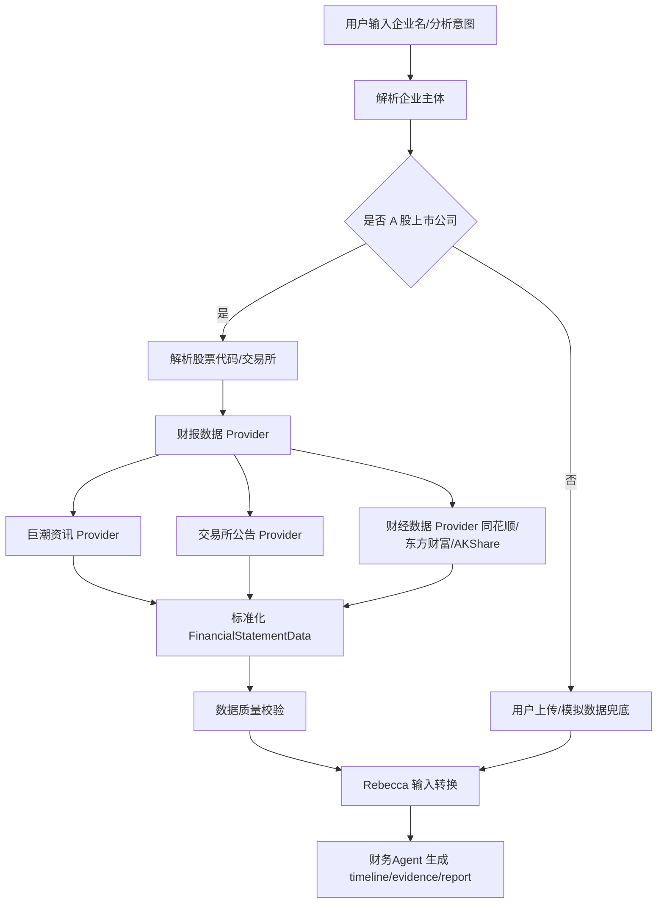

# A 股上市公司财务数据接入方案

## 背景

当前 `财务Agent` 使用 `search_financial_data` 返回模拟财务数据，适合演示流程，但不满足对 A 股上市公司的真实尽调要求。对于“深圳市欣旺达能源科技有限公司 / 欣旺达”等上市公司或上市主体相关企业，系统应优先从公开披露渠道获取近三年财务报表数据，再进入 Rebecca 财务分析和报告生成链路。

## 目标

1. 识别企业是否为 A 股上市公司或上市主体关联名称，并解析股票代码、交易所、证券简称。
2. 从公开数据源获取近三年年报或财务报表数据，包括资产负债表、利润表、现金流量表。
3. 将不同来源的数据规范化为统一 `FinancialStatementData` 结构。
4. 将真实财务数据接入现有 `run_financial_agent` 和 Rebecca 分析链路。
5. 保留模拟数据作为开发兜底，但在 UI/evidence 中明确标注数据来源和可信度。

## 现有接入点

- `backend/app/agents/sub_agents/financial_agent.py`
  当前财务子 Agent 入口，调用 `search_financial_data` 后构造 Rebecca 输入。
- `backend/app/agents/tools/search_tool.py`
  当前模拟财务数据工具。
- `backend/app/agents/tools/enterprise_tool.py`
  已有企业类型识别工具雏形，但上市公司列表是硬编码模拟。
- `backend/app/agents/tools/listed_company_tool.py`
  已有上市公司财务数据工具雏形，但返回模拟数据。
- `backend/app/engines/rebecca/analyzers.py`
  Rebecca 分析器入口，需要 `income_statement`、`balance_sheet`、`cash_flow` 三类 DataFrame。

## 推荐方案

采用“上市公司解析 + 多数据源适配 + 统一标准化 + Rebecca 分析”的分层架构。



## 数据源策略

### 优先级 1：结构化财经数据接口

建议 MVP 优先使用成熟开源数据包作为结构化入口，例如 AKShare 的 A 股财务报表接口。原因是字段结构更稳定、开发成本低、方便快速验证业务链路。

适用内容：
- 股票代码 / 证券简称查询
- 三大报表主要科目
- 年报/季报财务指标

优点：落地快，少做网页解析。

风险：依赖第三方包对上游接口的维护；字段名可能变化。

### 优先级 2：巨潮资讯网公告源

巨潮资讯是 A 股信息披露核心公开来源。适合作为“可追溯证据源”，尤其用于下载年报 PDF、公告标题、披露日期、公告链接。

适用内容：
- 年报公告检索
- PDF 下载链接
- 披露日期、公告标题、公告 ID
- 证据文档引用

优点：权威、可审计。

风险：PDF 表格解析成本高；接口/反爬策略可能变化。

### 优先级 3：同花顺 / 东方财富网页或接口

适合作为补充数据源或交叉校验，不建议作为唯一主数据源。

适用内容：
- 快速财务摘要
- 主要财务指标
- 同行业对比字段

优点：信息展示友好、覆盖广。

风险：页面结构和接口可能变化，反爬不确定；需要严格遵守网站条款。

## 核心模块设计

### 1. 上市公司识别服务

新增模块：`backend/app/services/listed_company_resolver.py`

职责：
- 输入企业名或用户原始问题。
- 识别证券简称、公司全称、股票代码、交易所。
- 处理别名，例如“欣旺达”“深圳市欣旺达电子股份有限公司”。
- 返回 `ListedCompanyIdentity`。

建议数据结构：

```python
class ListedCompanyIdentity(BaseModel):
    is_listed: bool
    company_name: str | None
    security_name: str | None
    stock_code: str | None
    exchange: str | None  # SZSE / SSE / BSE
    match_confidence: float
    match_source: str
```

MVP 可通过股票基础信息列表匹配：证券简称、公司全称、拼音简称、统一社会信用代码。后续再接工商关联关系，用于判断“子公司 vs 上市主体”。

### 2. 财务数据 Provider 抽象

新增目录：`backend/app/data_providers/financial/`

建议文件：
- `base.py`
- `akshare_provider.py`
- `cninfo_provider.py`
- `eastmoney_provider.py`
- `normalizer.py`
- `models.py`

Provider 接口：

```python
class FinancialDataProvider(Protocol):
    name: str

    async def fetch_annual_statements(
        self,
        identity: ListedCompanyIdentity,
        years: list[int],
    ) -> FinancialStatementData:
        ...
```

统一数据结构：

```python
class FinancialStatementData(BaseModel):
    identity: ListedCompanyIdentity
    years: list[int]
    balance_sheet: dict[str, dict[str, float | None]]
    income_statement: dict[str, dict[str, float | None]]
    cash_flow: dict[str, dict[str, float | None]]
    source_documents: list[SourceDocument]
    data_quality: DataQualityReport

class SourceDocument(BaseModel):
    source: str
    title: str
    url: str | None = None
    publish_date: str | None = None
    report_year: int | None = None

class DataQualityReport(BaseModel):
    completeness_score: float
    missing_fields: list[str]
    warnings: list[str]
```

### 3. 字段标准化

不同来源的字段命名不一致，必须有一层映射。建议维护标准字段集合：

利润表：
- `revenue` / 营业收入
- `operating_cost` / 营业成本
- `gross_profit` / 毛利润，可由收入 - 成本计算
- `selling_expense`
- `admin_expense`
- `rd_expense`
- `finance_expense`
- `operating_profit`
- `total_profit`
- `net_profit`

资产负债表：
- `cash_and_equivalents`
- `accounts_receivable`
- `inventory`
- `current_assets_total`
- `fixed_assets`
- `intangible_assets`
- `non_current_assets_total`
- `total_assets`
- `short_term_borrowings`
- `accounts_payable`
- `current_liabilities_total`
- `long_term_borrowings`
- `non_current_liabilities_total`
- `total_liabilities`
- `total_equity`

现金流量表：
- `cash_received_from_sales`
- `operating_cash_inflow_total`
- `cash_paid_for_goods`
- `operating_cash_outflow_total`
- `net_operating_cash_flow`
- `net_investing_cash_flow`
- `net_financing_cash_flow`
- `net_increase_in_cash`

### 4. 财务 Agent 改造

改造 `run_financial_agent`：

1. 调用上市公司识别服务。
2. 若是 A 股上市公司：调用 `fetch_listed_company_financial` 新实现。
3. 若不是上市公司：走用户上传数据；开发环境才允许模拟数据兜底。
4. 将 `FinancialStatementData` 转成 Rebecca 所需 DataFrame。
5. timeline/evidence 中输出数据源：
   - 股票代码
   - 数据来源
   - 年报/财报年份
   - 是否真实公开披露数据
   - 缺失字段和质量提示

### 5. 工具/function calling/MCP 定位

推荐分三层：

1. Python service/provider：负责真实数据获取、字段映射、缓存、质量校验。
2. CrewAI Tool/function calling：只暴露高层能力，例如 `fetch_listed_company_financial(enterprise_name)`。
3. MCP 服务：适合后续把“公开财报搜索/下载/解析”做成可复用外部服务，供多个 Agent 或项目调用。

MVP 不建议一开始就做独立 MCP。先在后端 Provider 内实现，等接口稳定后再抽成 MCP。

## 缓存和性能

财报数据变化频率低，应做缓存。

建议：
- 缓存 key：`stock_code + years + provider`
- 缓存目录：`backend/db/financial_cache/`
- 缓存格式：JSON
- TTL：年报数据 7 天或更长；公告 PDF 元数据 1 天
- 缓存命中时仍保留 source_documents

## 降级策略

1. 结构化 Provider 成功：直接分析。
2. 结构化 Provider 部分缺失：尝试第二 Provider 补字段。
3. Provider 全部失败：返回“无法获取公开财报数据”，提示用户上传。
4. 仅开发环境允许模拟数据兜底，并在 evidence 标记 `source=模拟数据`。

不要在生产尽调中静默使用模拟数据。

## 安全与合规

- 仅抓取公开披露信息，不绕过登录、验证码、付费墙。
- 遵守目标网站 robots、服务条款和访问频率限制。
- 对外部请求设置 timeout、重试上限、User-Agent、速率限制。
- 保留数据来源链接，支持审计追溯。
- 不把财报 PDF 全文长期缓存到不受控目录；如缓存，记录来源和时间。

## 分阶段实施

### Phase 1：MVP 真实结构化财报数据

目标：欣旺达这类 A 股上市公司财务 Agent 不再使用模拟数据。

范围：
- 新增上市公司识别服务。
- 新增 AKShare/结构化 Provider。
- 获取近三年三大报表主要科目。
- 标准化为 Rebecca 输入。
- evidence 显示真实来源和年份。

验收：
- 输入“分析欣旺达财务风险”，识别股票代码。
- 返回近三年真实营业收入、净利润、总资产、总负债、经营现金流。
- 不出现模拟数据值 `8.2亿` 这类固定样例。
- 失败时明确提示数据源失败或需上传，不静默模拟。

### Phase 2：巨潮公告证据链

目标：报告可追溯到年报公告。

范围：
- 接入巨潮公告搜索。
- 获取近三年年报标题、披露日期、PDF URL。
- 将公告源写入 evidence_docs。
- 可选：PDF 表格解析作为结构化数据校验。

### Phase 3：多源交叉校验

目标：提升数据可靠性。

范围：
- 东方财富/同花顺作为补充源。
- 同一字段多源比对。
- 数据差异超过阈值时给出 warning。

### Phase 4：MCP 化

目标：将公开财报搜索能力抽成可复用服务。

范围：
- MCP tool：`resolve_listed_company`、`search_annual_reports`、`fetch_financial_statements`。
- 后端 Agent 通过 MCP 调用数据能力。

## 测试方案

单元测试：
- 企业名匹配：欣旺达、深圳市欣旺达电子股份有限公司、欣旺达能源科技有限公司。
- 字段标准化：中文字段映射到标准字段。
- 缺失字段处理：缺字段不崩溃，产生 warning。

集成测试：
- 给定股票代码，拉取近三年报表并生成 `FinancialStatementData`。
- `run_financial_agent` 使用真实 Provider，生成 timeline/evidence/report。

端到端测试：
- 前端输入“分析一下欣旺达的财务风险”。
- 执行页展示真实数据源。
- 报告页展示真实风险评分和授信建议。

## 推荐落地顺序

1. 先实现 Provider 抽象和 AKShare/结构化数据源。
2. 改 `run_financial_agent`：A 股上市公司走真实 Provider，非上市走上传/兜底。
3. 再补巨潮公告证据链。
4. 最后考虑同花顺/东方财富补充和 MCP 化。

