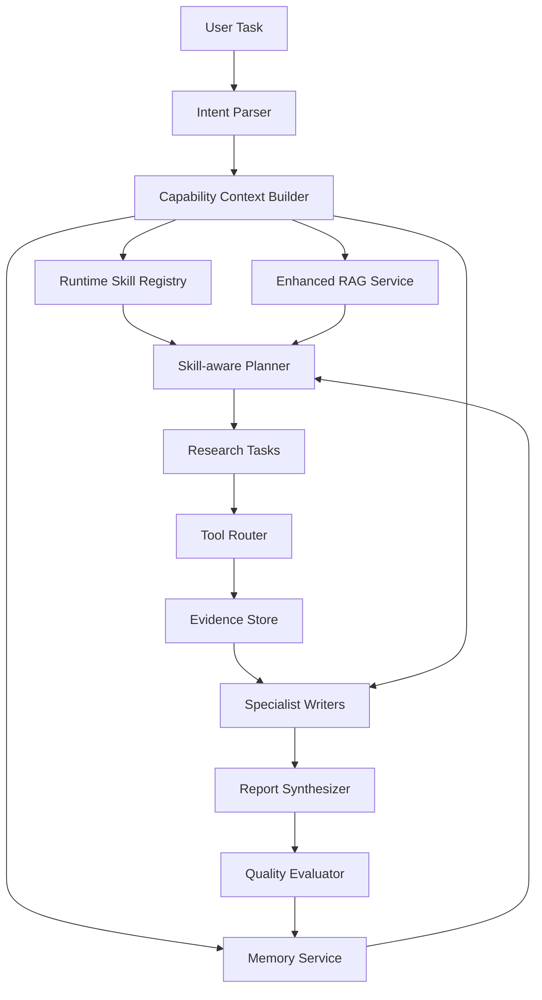

# 20 Agent Capability Layer v1 产品迭代方案

## 1. 背景

DDG-Agent 当前已经完成了贷前尽调 Agent 的核心闭环：Plan-Execute 研究流程、Sequential Thinking 思考链、Tool Router、Evidence Store、CodeAct 财务校验、RAG 知识注入、报告质量评测和报告页展示。

但从产品成熟度看，当前系统仍偏“工具链编排型 Agent”：每次任务主要依赖当前输入、当前工具和当前 Prompt。要进一步接近专业 Agent 产品，需要补齐三类能力底座：

1. **记忆管理**：系统应记住用户偏好、历史 bad case、同一公司的过往报告、人工复核结论和质量评测反馈。
2. **Skill 调用机制**：Planner 和专项节点应按任务类型动态读取领域方法论，而不是把 deep-research、贷前尽调、财务分析、行业分析规则硬编码在 Prompt 中。
3. **RAG 检索增强**：知识库不应只是“向量搜几段文本”，而要支持知识域隔离、查询改写、混合召回、重排、证据引用和质量评估。

因此下一阶段建议先建设 **Agent Capability Layer v1**，再做完整 LangGraph 原生迁移和全服务容器化。

## 2. 产品目标

Agent Capability Layer v1 的目标是把 DDG-Agent 从“单次任务执行器”升级为“可持续学习、可动态加载方法论、可增强检索的尽调工作台”。

核心目标：

- Planner 生成计划前，能读取任务相关 Skill、用户偏好、历史案例和知识库上下文。
- 财务、行业、司法、工商等专项节点执行前，能动态注入各自的领域方法论和质量要求。
- 报告生成后，质量评测、用户修改、人工复核意见能沉淀为可召回经验。
- 同一套能力层可被贷前尽调、法律尽调、投研分析、竞品分析等多场景复用。

## 3. 能力分层

推荐将 Agent 能力层拆成四个模块：

```text
Agent Runtime
  -> Runtime Skill Registry
  -> Memory Service
  -> Enhanced RAG Service
  -> Capability Context Builder
  -> Planner / Tool Router / Specialist Writers
```

### 3.1 Runtime Skill Registry

定位：管理任务方法论、报告框架、证据 checklist、质量规则和节点提示词模板。

输入：

- `backend/data/knowledge_base/skills/*/SKILL.md`
- `references/*.json`
- 任务类型、报告模式、行业分类、客户场景

输出：

- `selected_skills`
- `skill_instructions`
- `evidence_blueprint`
- `quality_rules`
- `node_prompt_context`

首批 Skill：

| Skill | 作用 |
| --- | --- |
| `deep_research` | 定义 Plan-Execute、证据需求、二轮补证和 claim-evidence 研究流程 |
| `loan_due_diligence` | 定义贷前尽调报告结构、资料完整度、授信动作和数据边界 |
| `financial_analysis` | 定义财务勾稽、CPA 利润现金流桥、异常信号和核查动作 |
| `industry_analysis` | 后续新增，定义行业生命周期、竞争格局、KPI 和授信关注点 |
| `legal_compliance` | 后续新增，定义司法、处罚、失信、监管问询和重大舆情核查框架 |

### 3.2 Memory Service

定位：沉淀跨任务经验，不让系统每次从零开始。

建议先抽象接口，不强绑定 mem0：

```text
MemoryService
  write(memory_type, subject, content, metadata)
  search(query, memory_scope, filters)
  summarize(subject, memory_type)
```

可写入的记忆：

| 类型 | 示例 | 用途 |
| --- | --- | --- |
| 用户偏好 | “不要展示内部工具名”“报告要像专业分析师” | 控制前端展示和报告语气 |
| 项目经验 | “半导体公司不能误识别为贸易/进出口” | 修正行业分类和 Planner 偏差 |
| 报告 bad case | “财务分析不能写成指标堆砌” | 作为质量闸门和 few-shot 反例 |
| 公司历史 | 同一主体历史报告、证据差异、人工复核意见 | 支持复盘和滚动尽调 |
| 人工复核结论 | 财务跨源差异以巨潮年报为准 | 反哺数据源优先级和信任评分 |

mem0 的定位：

- SaaS/PoC 阶段可以评估 mem0 作为快速记忆组件。
- 私有化项目应保留 MemoryService 抽象，底层可替换为 PostgreSQL、向量库、客户知识平台或内网记忆服务。
- 记忆必须带 `tenant_id`、`user_id`、`subject_id`、`source_task_id`、`confidence` 和 `expires_at`，避免跨租户泄露和陈旧经验污染。

### 3.3 Enhanced RAG Service

定位：把内部知识、政策制度、案例复盘和领域规则变成可控上下文，而不是简单向量检索。

v1 增强点：

1. **Query Rewrite**：根据任务类型改写检索问题，例如财务任务改写为“应收、现金流、扣非、短债、审计核查”。
2. **Hybrid Retrieval**：关键词检索 + 向量检索，避免专业术语被 embedding 漏召回。
3. **Rule Rerank**：按领域、标题、标签、source_type、最近更新时间和任务相关性重排。
4. **Evidence-aware RAG**：每个知识片段带 `source_id`，可进入正文级引用或质量评测。
5. **Domain Isolation**：区分 `financial`、`industry`、`credit_policy`、`case_study`、`legal`、`user_memory`、`company_history`。
6. **Low-confidence Handling**：低置信知识只能作为核查方向，不直接支撑结论。

与 Dify RAG 的关系：

- Dify 适合 SaaS 快速搭建 workflow 和基础知识库。
- 复杂尽调场景需要自研 Enhanced RAG 承接混合召回、重排、证据引用、知识域隔离和质量评估。
- SaaS 版本可以采用 Dify workflow + 外挂 Enhanced RAG Service；私有化版本可直接部署本地 Enhanced RAG。

### 3.4 Capability Context Builder

定位：把 Skill、Memory、RAG 和任务状态组装成节点可用上下文。

节点注入方式：

| 节点 | 注入内容 |
| --- | --- |
| Planner | deep_research、loan_due_diligence、历史计划、用户偏好、资料完整度 blueprint |
| 财务节点 | financial_analysis、CPA 规则、财务 bad case、行业财务阈值、CodeAct 结果 |
| 行业节点 | industry_analysis、行业 KPI、主营构成、行业案例、政策知识 |
| 司法节点 | legal_compliance、处罚/执行/诉讼 checklist、权威源优先级 |
| Synthesizer | 报告模板、用户展示偏好、证据质量规则、质量评测结果 |
| Quality Evaluator | Rubric、历史 bad case、用户修改意见、同类公司回归样例 |

## 4. 推荐技术架构



## 5. 分阶段实施计划

### M1：Skill-aware Planner

目标：让 Planner 不再只依赖固定 prompt，而是加载任务相关 Skill 和 evidence blueprint。

交付：

- `RuntimeSkillRegistry`
- `select_skills(intent, report_mode, industry)`
- Planner prompt 注入 `skill_context`
- `loan_due_diligence` blueprint 驱动章节任务
- 前端执行页展示“已加载方法论：贷前尽调 / 财务分析 / DeepResearch”

验收：

- 输入同一公司，不同任务类型能加载不同 Skill。
- Planner 输出任务包含章节、证据需求、工具路线和数据边界。
- Skill 加载失败时回退默认计划，不阻塞任务。

### M2：Specialist Skill Injection

目标：财务、行业、司法、工商专项节点生成前动态注入领域 Skill。

交付：

- 财务节点注入 CPA 财务诊断规则。
- 行业节点注入行业生命周期、竞争格局、KPI 规则。
- 司法节点注入权威源优先级和字段抽取规则。
- Synthesizer 根据 `skill_output_contract` 装配章节。

验收：

- 财务章节稳定输出“收入利润、资产负债、盈利质量、偿债异常”四段。
- 行业章节稳定输出“行业定位、周期判断、竞争格局、授信关注点”。
- 报告正文不展示 Skill 原文，只展示业务结论。

### M2.5：L1 Enterprise Hardening（企业级底座）

目标：满足银行私有化 L1 交付对安全、持久化、可观测、限流的要求，使系统从 PoC 升级为可交付产品。

交付：

- JWT 登录认证：`/api/v1/auth/login`、`/refresh`、`/me`；前端登录页、auth store、路由守卫、token 拦截器。
- 用户与任务数据隔离：PostgreSQL + SQLAlchemy 2.0 async + Alembic 迁移。
- 任务持久化与恢复：服务重启后自动恢复 `gathering/analyzing/report_ready/waiting_human` 状态的任务。
- API 限流：`slowapi` 按路由 + IP 限流，超限返回 429。
- 全链路可观测：Langfuse LLM 追踪、Prometheus `/metrics`、Grafana 看板、结构化 JSON 日志（带 request/user/task/session ID）。
- 清理 Agent 死代码与悬空引用：`legal_agent.py`、`business_agent.py` 废弃 fallback，`crawl4ai_reader_tool.py` 引用。
- 报告导出：PDF / DOCX / Markdown 三格式，前端导出按钮接线。

验收：

- 未登录访问 `/api/v1/tasks` 返回 401。
- `alembic upgrade head` 成功，任务数据按用户隔离。
- 服务重启后进行中任务可恢复。
- `/metrics` 输出任务状态、LLM 延迟、工具成功率。
- 前端报告页可下载 PDF/DOCX/MD。

### M3：MemoryService v1

目标：沉淀用户偏好、报告 bad case 和人工复核结论。

交付：

- `MemoryService` 抽象接口。
- SQLite/PostgreSQL 版最小实现。
- 用户偏好写入与读取。
- 报告质量评测低分项写入 bad case。
- 人工复核结论写入公司历史。

验收：

- 用户指出“不要展示内部工具名”后，后续报告页默认脱敏工具名。
- 财务 bad case 可进入质量评测和 prompt 反例。
- 同一公司重复分析时能提示历史报告和历史人工复核事项。

### M4：Enhanced RAG v1

目标：提升知识召回质量和可引用性。

交付：

- Query Rewrite。
- Keyword + Vector hybrid retrieval。
- Rule-based rerank。
- domain namespace 和 source_id。
- RAG 结果质量评分。

验收：

- 财务任务优先召回财务异常和 CPA 规则。
- 行业任务优先召回对应子赛道 KPI。
- RAG 低置信结果不会直接支撑强结论。

## 6. 与 LangGraph 迁移的关系

Agent Capability Layer v1 应先于完整 LangGraph 原生迁移。

原因：

- LangGraph 解决的是流程编排、checkpoint、interrupt 和 resume。
- Capability Layer 解决的是 Planner 和专项节点“懂不懂业务、记不记经验、检索准不准”。
- 如果先迁 LangGraph，节点内部能力仍然薄，后续还要重构节点输入输出。

推荐顺序：

```text
Agent Capability Layer v1
-> 节点输入输出稳定
-> LangGraph interrupt/checkpoint/resume 原生化
-> Docker Compose 私有化交付
-> 服务化拆分
```

## 7. 与容器化的关系

容器化仍然重要，但不是下一步最优先。

当前阶段应先稳定能力接口：

- Skill Registry 接口。
- MemoryService 接口。
- EnhancedRAGService 接口。
- Capability Context Builder 输入输出。

这些接口稳定后，再把它们纳入 Docker Compose：

```text
backend
frontend
postgres
redis
vector-db
memory-service(optional)
sequential-thinking-wrapper
front-machine-data-gateway(optional)
```

## 8. 面试表达要点

如果面试官追问“项目后续怎么演进”，可以这样回答：

> 当前项目不是简单调用大模型生成报告，而是在建设一个金融尽调 Agent Workbench。第一阶段我先打通 Plan-Execute、Evidence、CodeAct 和报告质量评测；下一阶段我会补 Agent Capability Layer，把方法论 Skill、记忆管理和增强 RAG 做成统一上下文服务。这样 Planner 不再临场拼 Prompt，而是按贷前尽调、财务审计、行业分析等专业 Skill 生成计划；系统也能记住用户偏好、历史 bad case 和人工复核结论，形成持续迭代能力。

简历可提炼为：

- 设计 Agent Capability Layer 演进方案，规划 Runtime Skill Registry、Memory Service 与 Enhanced RAG Service，将贷前尽调方法论、用户偏好、历史 bad case 和知识库检索统一注入 Planner 与专项分析节点。
- 通过 Skill-aware Planner 设计，将研究任务从“问题拆解”升级为“章节-证据需求-工具路线-质量规则”的结构化计划，提升尽调报告的可审计性和专业稳定性。
- 预留 mem0/本地数据库可替换记忆接口和 Dify 外挂 Enhanced RAG 方案，兼容 SaaS 与私有化两种交付形态。

## 9. 开放风险

| 风险 | 影响 | 缓解方式 |
| --- | --- | --- |
| 记忆污染 | 错误经验反复影响报告 | 记忆加 confidence、source_task_id、人工确认状态和过期时间 |
| Skill 冲突 | 多个 Skill 对同一章节要求不一致 | Skill Registry 增加优先级、适用场景和冲突合并规则 |
| RAG 幻觉引用 | 低质量知识支撑强结论 | RAG 结果分级，低置信只作核查方向 |
| 私有化适配 | mem0 或外部服务无法部署 | 保留 MemoryService 抽象，底层可替换 |
| Prompt 过长 | 注入 Skill/Memory/RAG 后 token 增加 | Context Builder 做摘要、去重、预算裁剪 |
