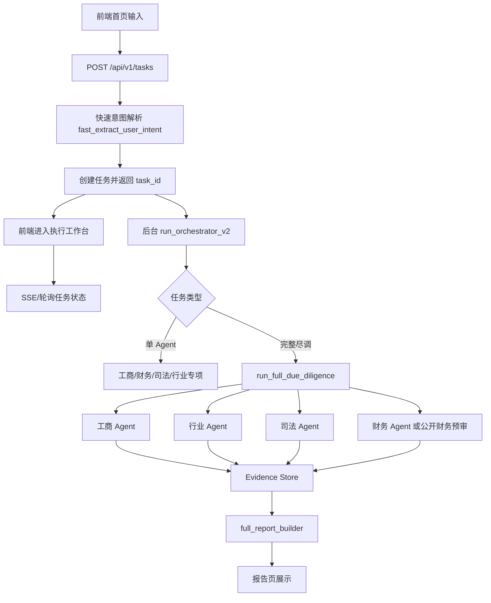

# 02 技术架构与链路方案

## 总体架构

项目采用 React/Vite 前端 + FastAPI 后端 + LangGraph/CrewAI/单 Agent 混合编排。

需要特别说明：当前选择 LangGraph 作为核心编排底座，主要是为了适配私有化项目客户的部署约束，而不是因为 SaaS 形态一定要采用 LangGraph。私有化环境通常不能直接访问外网搜索，但客户往往已自购或可采购工商、司法、行政处罚、征信、发票、流水等内网/专线数据源。LangGraph/FastAPI 自研后端更便于做数据源适配、成本控制、权限隔离、审计留痕和本地化运维。

如果未来项目以 SaaS 服务形态交付，则更可能采用 Dify 这类平台实现 Agent 编排、知识库、工具调用和工作流运营，以降低研发和运维成本。也就是说，本项目当前架构优先服务私有化交付；SaaS 版本应另行评估 Dify 化或平台化重构。



## 前端模块

主要文件：

- `src/pages/AgentWorkbench/AgentWorkbench.tsx`
- `src/pages/AgentWorkbench/ExecutionWorkspace.tsx`
- `src/pages/Report/index.tsx`
- `src/services/agentApi.ts`
- `vite.config.ts`

前端职责：

- 创建任务。
- 展示创建任务进度和失败提示。
- 订阅/拉取执行状态。
- 展示 timeline、plan、evidence、report。
- 报告页适配单 Agent 报告和完整尽调报告。

重要改动：

- Vite proxy 目标从 `localhost:8000` 调整为 `127.0.0.1:8000`，减少本地解析和代理不稳定问题。
- 创建任务失败时通过 `getErrorMessage(response)` 展示后端错误。
- 执行页修复闪屏问题，避免状态更新导致组件持续重绘。
- 报告页新增财务文本来源提示，显示 LLM 或 fallback、耗时、provider、告警。

## 后端任务 API

主要文件：

- `backend/app/api/tasks.py`

核心接口：

| 接口 | 用途 |
| --- | --- |
| `POST /api/v1/tasks` | 创建尽调任务 |
| `GET /api/v1/tasks/{task_id}` | 获取任务状态 |
| `GET /api/v1/tasks/{task_id}/events` | SSE 推送任务状态 |
| `POST /api/v1/tasks/{task_id}/resume-financial` | 上传财报后恢复财务/完整尽调 |

设计要点：

- 创建任务接口只做快速解析和入队，不阻塞执行。
- 后台执行通过 `schedule_task_background()` 延迟启动，确保响应先返回前端。
- 任务状态目前存储在内存 `tasks` 字典中，生产环境应迁移到数据库或 Redis。
- `append_timeline()` 统一追加过程节点，并通知 SSE 订阅者。

## 编排层

主要文件：

- `backend/app/agents/orchestrator_v2.py`

当前编排策略：

- 单 Agent 任务走轻量路径，避免为了明确意图启动 CrewAI。
- 完整尽调走 `run_full_due_diligence_sync()` 或异步 runner。
- 对 LiteLLM/CrewAI 限流错误加入退避重试。
- 非上市财务单 Agent 若未上传数据，进入等待上传状态。

关键决策：

- 创建任务阶段不再依赖 LLM，避免首页卡住。
- 完整尽调不强依赖 CrewAI，优先保证确定性单 Agent 结果。
- CrewAI 综合审查默认不覆盖报告正文，只作为建议性能力，避免自由生成污染报告。

## 完整尽调 runner

主要文件：

- `backend/app/agents/crew/full_due_diligence_runner.py`

完整尽调顺序：

1. 判断报告模式：上市公司/上传财报为财报增强，否则公开资料预尽调。
2. 若识别上市公司，采集上市公司公开资料包。
3. 运行工商 Agent。
4. 运行行业 Agent。
5. 运行司法 Agent。
6. 运行财务 Agent 或公开财务预审。
7. 构建完整尽调报告。
8. 可选调用 CrewAI 综合审查。

设计原因：

- 顺序执行比并发更容易调试和展示 timeline。
- 单 Agent 能独立验证，完整尽调只负责组合。
- 非上市未上传财报时，先完成其他三项，财务进入公开资料预审或等待上传。

## DeepResearch Engine 演进方向

当前完整尽调 runner 是固定四 Agent 顺序编排。下一阶段将新增 Sequential Thinking 驱动的 DeepResearch Engine，把固定流程升级为研究状态机：

```text
尽调目标
-> 研究计划
-> 研究任务
-> 证据需求
-> 工具调用
-> Evidence Store
-> Claim 生成
-> Gap 识别
-> 报告合成
```

该引擎不替代现有单 Agent，而是把工商、财务、司法、行业、RAG、Bocha 搜索和用户上传材料包装为研究工具。每条结论都必须绑定证据，公开搜索只作为线索，权威数据源和上传材料用于提升证据置信度。

详细方案见：

- [09 DeepResearch Engine 产品设计](./09-deepresearch-engine-product-design.md)
- [10 DeepResearch Engine 技术设计](./10-deepresearch-engine-technical-design.md)
- [11 DeepResearch Engine 数据与测试方案](./11-deepresearch-engine-data-and-test-plan.md)
- [12 DeepResearch Engine 实施计划](./12-deepresearch-engine-implementation-plan.md)

## RAG 全链路

主要文件：

- `backend/app/rag/knowledge_ingestion.py`
- `backend/app/rag/knowledge_retrieval_service.py`
- `backend/scripts/ingest_knowledge_base.py`
- `backend/knowledge_base/**`

知识库内容包括：

- 财务异常信号规则。
- 行业尽调逻辑。
- 工商审查指南。
- 司法风险审查指南。
- 授信决策和贷后管理参考。
- 同业银行政策参考。
- 尽调报告模板和案例。

检索策略：

- 优先向 Chroma 向量库检索。
- 向量检索失败时，回退本地 Markdown 关键词检索。
- 返回结果可转为 Evidence Store 证据项。

设计原因：

- 开发环境 embedding 或 Chroma 不稳定时，系统仍可生成报告。
- Agent 不直接读全部知识库，而是通过 domain query 获取相关片段。
- RAG 结果必须带 source、confidence、retrieval_mode，便于报告展示。

## Evidence Store

主要文件：

- `backend/app/agents/evidence/evidence_store.py`
- `backend/app/agents/evidence/__init__.py`

Evidence Store 的作用：

- 统一工商、财务、司法、行业 Agent 输出证据结构。
- 给证据加上来源类型、置信度、可信等级、是否需要人工复核。
- 报告页展示证据来源和风险判断依据。

典型字段：

```json
{
  "id": "...",
  "label": "知识库命中",
  "value": "命中知识库：财务异常信号规则",
  "source": "backend/knowledge_base/...",
  "source_type": "internal_knowledge_base",
  "confidence": 0.78,
  "trust_level": "medium",
  "requires_manual_review": false
}
```

## LLM 使用策略

当前项目中的 LLM 不承担“凭空分析所有内容”的职责，而是在以下环节使用：

- 行业分类候选裁判。
- 财务诊断式文本生成。
- 行业诊断式文本生成。
- 可选 CrewAI 综合审查。

重要约束：

- 数值指标先由代码抽取和计算。
- LLM 只基于已提供数据和 RAG 知识写诊断文本。
- 输出必须是结构化 JSON。
- 质量闸门检测禁用表达、未授权数字、缺失字段和数据边界。
- LLM 失败或质量不通过时使用专业 fallback。

## 外部工具和 MCP

当前外部工具包括：

- Bocha Web Search 中文公开搜索。
- Tavily 搜索。
- Exa MCP 搜索和页面抓取。
- DuckDuckGo MCP 搜索。
- 上市公司公开资料工具。
- 本地 RAG 工具。

测试结论：

- DuckDuckGo MCP 多次出现 `Failed to get the VQD`，应降低优先级，只作为末级兜底。
- Bocha Web Search 实测对中文企业、公告、司法线索和行业资料搜索更稳定，适合作为 SaaS/PoC 场景下的公开搜索主通道。
- Exa/Tavily 更适合作为公开资料搜索主路径。
- 工商和司法权威数据源仍应优先接正式 API 或可稳定访问的数据通道。

## 私有化与 SaaS 架构分叉

### 私有化部署形态

私有化客户一般有以下特点：

- 无法或不允许直接访问公网搜索引擎。
- 对数据出域、模型调用、日志审计和权限控制要求更高。
- 工商、司法、行政处罚、征信等数据通常由客户自购或通过内网系统提供。
- 外部数据调用存在成本，需要做缓存、限流、字段级复用和按需查询。

因此私有化版本应采用以下策略：

- LangGraph/FastAPI 作为可控编排层。
- 搜索工具作为可插拔工具，不作为核心依赖。
- 工商、司法、行政处罚数据源通过客户内网 API 或数据中台适配。
- RAG 知识库部署在客户内网，接入内部授信制度、行业准入政策、评级模型和历史案例。
- Evidence Store 记录每一次数据调用来源、成本、命中字段和人工复核状态。
- 对高成本数据源做调用前置判断，例如只有当报告需要正式审批级证据时才调用完整接口。

### SaaS 服务形态

如果项目未来提供 SaaS 服务，需求重心会变化：

- 更关注快速搭建工作流、多租户知识库、工具管理和运营配置。
- 外部搜索和公开数据 API 可作为常规能力。
- 客户不一定提供内网数据源，更多依赖公开资料、商业 API 和用户上传材料。
- 平台化运维、版本发布、工作流可视化编辑会更重要。

因此 SaaS 版本更适合评估 Dify 或类似平台：

- Dify 负责 Agent workflow、知识库、工具调用、Prompt 管理和运营配置。
- 自研后端保留在数据源适配、报告模板、Evidence Store、权限计费等关键模块。
- 当前 LangGraph 中沉淀的 Agent 逻辑应抽象成工具能力和提示词资产，便于迁移到 Dify workflow。

### 架构原则

无论私有化还是 SaaS，都应保持以下边界：

- 数据获取能力与分析写作能力解耦。
- 证据结构与报告结构解耦。
- LLM provider 与业务流程解耦。
- RAG 知识库内容与编排框架解耦。
- 不把公网搜索作为正式授信证据的唯一来源。

## 配置和凭证原则

项目中涉及 LLM、Embedding、Tavily、Exa、MCP 等配置。文档和代码不应写入真实 key/token。

推荐方式：

- 通过 `backend/.env` 配置。
- `.env.example` 只保留变量名，不保留真实值。
- 文档只说明变量用途，不记录用户提供过的密钥。
