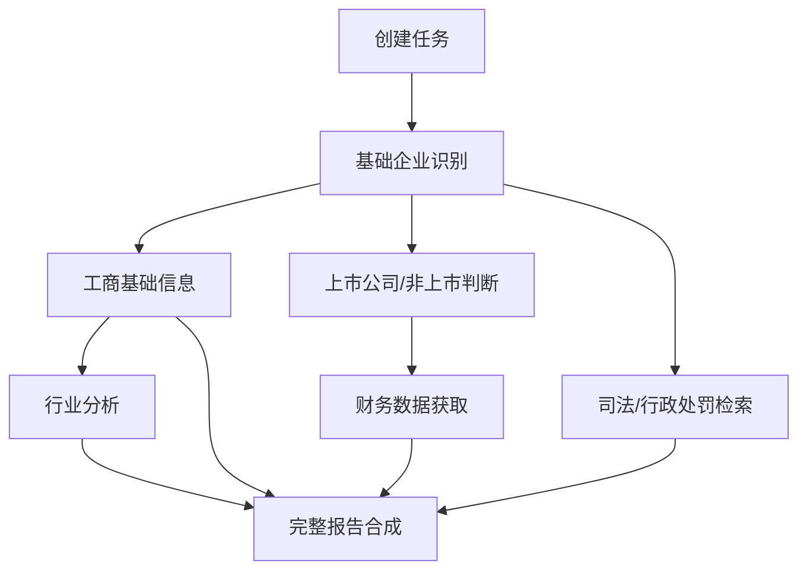

# 08 面试架构答辩手册

本文档面向“把 DDG-Agent 项目拿去面试讲解”的场景，整理面试官大概率会追问的架构问题。重点不是背答案，而是能清楚说明：为什么这样设计、有哪些取舍、如果商业形态变化如何演进。

## 1. SaaS 和私有化两种架构如何设计

### 面试官可能问

这个项目如果做 SaaS 和做私有化，架构有什么区别？为什么当前使用 LangGraph，而不是直接用 Dify？

### 推荐回答

本项目有两种交付形态，架构重点不同。

私有化部署更适合当前的 `FastAPI + LangGraph + 自研数据源网关 + 本地 RAG + Evidence Store`：

- 客户内网通常不能访问公网搜索。
- 工商、司法、行政处罚、征信、发票、流水等数据由客户自购或内部系统提供。
- 对数据出域、权限、审计、日志留存、模型部署和成本控制要求更高。
- LangGraph 更适合做可控编排、节点级状态恢复、内网工具适配和流程审计。

SaaS 形态更适合评估 `Dify + 自研后端扩展层`：

- SaaS 更看重快速配置工作流、多租户知识库、工具调用和运营后台。
- Dify 可以承接 workflow、Prompt 管理、基础 RAG 和工具编排。
- 自研后端仍负责强业务能力：数据源网关、Evidence Store、报告模板、计费、权限和审计。

因此当前选择 LangGraph 不是否定 Dify，而是当前 MVP 主要面向私有化客户的可控交付。若未来转 SaaS，应把 Agent 逻辑、工具和知识库资产迁移为 Dify workflow 和插件能力。

### 架构对比

| 维度 | 私有化版本 | SaaS 版本 |
| --- | --- | --- |
| 编排 | LangGraph/FastAPI | Dify workflow + 自研扩展 |
| 数据源 | 客户内网 API、自购数据、私有知识库 | 公网 API、商业数据、用户上传、平台知识库 |
| 网络 | 多数不能访问公网 | 可访问公网，需统一合规管控 |
| 权限 | 与客户 IAM/LDAP/SSO 集成 | 平台多租户 RBAC/ABAC |
| RAG | 本地向量库 + 客户内部制度 | 平台知识库 + 外挂高级检索 |
| 审计 | 强审计、日志留存在客户环境 | 平台审计、租户级日志 |
| 成本 | 按客户自购接口和本地模型控制 | 按租户、模型、token、API 调用计费 |

## 2. 多租户和权限管理如何设计

### 面试官可能问

如果这个项目做 SaaS，多租户如何隔离？如果做私有化，权限如何接客户系统？

### 推荐设计

多租户应分为四层隔离：

1. 身份隔离：tenant_id、user_id、role、department、data_scope。
2. 数据隔离：任务、报告、证据、上传文件、知识库文档都带 tenant_id。
3. 知识库隔离：每个租户独立 namespace/collection，公共知识库只读共享。
4. 工具权限隔离：不同租户可配置不同数据源、模型、调用额度和审批策略。

### 权限模型

建议采用 RBAC + ABAC 混合：

- RBAC 管角色：客户经理、审查员、管理员、审计员。
- ABAC 管数据范围：机构、部门、客户归属、报告密级、项目状态。

示例权限：

| 角色 | 权限 |
| --- | --- |
| 客户经理 | 创建任务、查看本人客户报告、上传材料 |
| 授信审查员 | 查看待审查报告、补充审查意见、查看证据链 |
| 管理员 | 配置模型、工具、知识库、租户额度 |
| 审计员 | 只读查看日志、证据来源、模型调用记录 |

### 私有化集成

私有化部署通常不自建完整身份系统，而是接客户已有体系：

- LDAP/AD/SSO。
- 内部统一认证网关。
- 数据权限由客户组织架构和客户归属关系决定。
- 操作日志写入客户审计系统。

## 3. Token 限流和成本控制如何设计

### 面试官可能问

LLM 调用成本和限流怎么控制？如果多人同时跑完整尽调怎么办？

### 推荐设计

需要做四级控制：

1. 用户级：单用户每分钟/每天 token 上限。
2. 租户级：租户总 token 预算、并发任务数、月度额度。
3. 模型级：不同模型的 QPS、TPM、RPM 限制。
4. 工具级：工商、司法、财报等高成本 API 的调用次数和缓存策略。

### 技术实现

```text
Request -> API Gateway -> Rate Limiter -> Task Queue -> LLM Gateway -> Provider
                                      -> Tool Gateway -> External Data API
```

关键机制：

- Redis 令牌桶控制 QPS/RPM/TPM。
- 任务队列控制完整尽调并发数。
- LLM Gateway 统一计算 prompt tokens、completion tokens、费用和延迟。
- 对限流错误做指数退避，但不能无限重试。
- 高成本工具调用前做缓存命中和必要性判断。
- 报告生成失败时分级降级：小模型、规则模板、等待重试、人工提示。

### 当前项目已有体现

- `run_node_with_rate_limit_retry()` 对上游限流做退避重试。
- 单 Agent 避免启动 CrewAI，减少 token 浪费。
- 财务/行业 writer 优先使用快速备用模型。
- LLM 不通过质量闸门时 fallback，不反复烧 token。

## 4. 模型选型如何回答

### 面试官可能问

这个项目为什么要用大模型？所有任务都需要大模型吗？如何选择模型？

### 推荐回答

不是所有任务都应该用大模型。模型选择按任务拆分：

| 任务 | 推荐能力 | 原因 |
| --- | --- | --- |
| 企业名/意图解析 | 规则 + 小模型兜底 | 低成本、低延迟，不能阻塞首页 |
| 行业分类裁判 | 小模型/快速模型 | 语义判断强于规则，但输出短 |
| 财务指标计算 | 代码 | 数字必须确定，不能交给 LLM |
| 财务风险诊断 | 中等模型 + RAG | 需要专业表达和勾稽逻辑 |
| 行业诊断 | 中等模型 + RAG | 需要行业框架、核查动作和假设 |
| 完整报告润色 | 大模型可选 | 长文本综合能力强，但需质量闸门 |
| 工商/司法数据抽取 | 小模型 + 结构化抽取 | 可用规则和轻量模型完成 |

模型选型原则：

- 低延迟入口不用大模型。
- 数值计算不用模型。
- 专业诊断用 RAG + 中等模型。
- 长文本综合才考虑大模型。
- 私有化客户优先考虑本地/专有云模型。
- SaaS 可做多 provider 路由，按成本、延迟、质量动态选择。

## 5. 并发设计如何回答

### 面试官可能问

完整尽调四个 Agent 能不能并发？为什么当前顺序执行？

### 推荐回答

理论上可以并发，但需要区分依赖关系。

可并发：

- 工商基础信息。
- 司法公开搜索。
- 上市公司财报抓取。
- 行业知识库检索。

建议串行或半串行：

- 行业分析依赖工商经营范围和上市公司主营信息，最好先拿基础上下文。
- 完整报告依赖四个专项结果。
- 财务诊断需要财务数据抽取完成后再调用 LLM。
- 高成本数据源需要先判断是否必要，避免并发浪费。

当前 MVP 顺序执行的原因：

- 更容易稳定打通链路。
- Timeline 更好展示。
- 便于定位 Agent 失败点。
- 外部搜索和 LLM provider 不稳定，先保证可控。

未来演进：



并发实现建议：

- 使用任务队列，例如 Celery/RQ/Arq。
- 每个 Agent 有独立超时、重试和 fallback。
- 使用 DAG 依赖管理。
- 支持 partial result，某个 Agent 失败不阻塞整份预尽调报告。
- 高成本接口使用优先级队列和预算判断。

## 6. 网关设计如何回答

### 面试官可能问

工商、司法、财务、搜索、RAG、模型这么多外部能力，如何统一管理？

### 推荐设计

需要三个网关。

### API Gateway

负责入口治理：

- 鉴权。
- 租户识别。
- 请求限流。
- 幂等控制。
- 任务创建。
- 审计日志。

### LLM Gateway

负责模型调用治理：

- provider 路由。
- 模型选择。
- token 预算。
- prompt 版本管理。
- 失败重试和降级。
- 响应质量检查。
- 成本统计。

### Data Source Gateway

负责业务数据源治理：

- 工商 API。
- 司法 API。
- 行政处罚 API。
- 巨潮/交易所/财报 API。
- 搜索工具。
- 客户内网数据中台。

Data Source Gateway 必须支持：

- 数据源优先级。
- 缓存。
- 成本统计。
- 字段标准化。
- 来源可靠性评级。
- 权限校验。
- 失败降级。

示例：

```text
BusinessAgent -> DataSourceGateway.query_business_registry(company)
              -> tenant datasource config
              -> cache hit?
              -> internal API / paid API / search fallback
              -> normalize fields
              -> Evidence Store
```

## 7. Dify 知识库 RAG 能力有限如何解决

### 面试官可能问

Dify 自带知识库 RAG 能力有限，如果检索不准、权限隔离不够、证据追踪不够怎么办？

### 推荐回答

Dify 可以承担 workflow 和基础知识库，但复杂金融尽调不能完全依赖 Dify 原生 RAG。解决方案是“Dify 编排 + 外挂高级 RAG 服务”。

### Dify 原生 RAG 的常见局限

- 检索策略相对通用，难以做领域规则触发。
- 对表格、制度、案例、财务指标阈值的结构化理解有限。
- 多租户知识权限和证据追踪需要额外增强。
- 难以表达“命中规则 ID、证据 ID、置信度、人工复核状态”。
- 对复杂 rerank、hybrid search、query rewrite、metadata filter 的控制有限。

### 解决方案

外挂自研 RAG Service：

- Hybrid Search：向量检索 + BM25/关键词 + metadata filter。
- Query Rewrite：按 Agent 类型生成检索 query。
- Rerank：使用 reranker 或规则打分。
- Domain Filter：工商、财务、司法、行业、授信政策分域检索。
- Evidence Binding：每条命中转为 Evidence Store 证据。
- Tenant Namespace：租户级 collection/namespace 隔离。
- ACL Filter：按用户权限过滤知识。

Dify 调用方式：

```text
Dify Workflow -> HTTP Tool: /rag/retrieve
              -> RAG Service
              -> Evidence Store
              -> Return snippets + evidence_ids + confidence
```

这样 Dify 负责流程编排，自研 RAG 负责金融尽调所需的专业检索和证据追踪。

## 8. 私有化数据源成本如何控制

### 面试官可能问

客户自购工商、司法、行政处罚接口一般按次收费，如何避免成本失控？

### 推荐设计

成本控制分为调用前、调用中、调用后三层。

调用前：

- 根据任务类型判断是否需要调用。
- 公开预尽调只调用轻量接口，正式审批才调用全量接口。
- 对同一企业设置缓存 TTL。
- 对低价值任务使用搜索或已有缓存。

调用中：

- Data Source Gateway 记录每次调用的 cost_code。
- 支持字段级接口，先查摘要，再按需查详情。
- 设置租户、部门、用户级预算。

调用后：

- 证据复用，同一企业多次尽调优先复用有效期内证据。
- 成本报表按租户/用户/企业/接口统计。
- 对异常调用做告警。

## 9. 数据安全和审计如何回答

### 面试官可能问

银行场景数据敏感，如何保证安全？

### 推荐回答

安全设计至少包括：

- 数据不出域：私有化部署时模型、RAG、日志、文件均在客户环境。
- 凭证管理：API key 不入库明文，不进文档，使用密钥管理服务。
- 权限控制：租户、机构、角色、客户归属四层校验。
- 审计日志：记录谁在什么时候查看/生成/导出报告。
- 模型调用日志：记录 provider、model、token、prompt 版本、但敏感内容脱敏。
- 文件安全：上传材料加密存储，病毒扫描，访问签名 URL。
- 数据脱敏：报告导出和调试日志中隐藏身份证、手机号、银行账号等。

## 10. 如何讲这个项目的亮点

面试时可以把亮点总结为五句话：

1. 我没有把它做成单纯的 ChatGPT 包装，而是拆成工商、财务、司法、行业四个可独立测试的 Agent。
2. 我把完整尽调做成双模式：上市/上传财报走财报增强，非上市缺财报走公开资料预尽调，避免编造数据。
3. 我把 LLM 放在适合的位置：指标由代码算，诊断由 LLM 写，RAG 注入领域知识，质量闸门负责兜底。
4. 我设计了 Evidence Store，让每个结论能追踪来源、置信度和人工复核状态。
5. 我区分了私有化和 SaaS 架构：私有化重可控和内网数据源，SaaS 可评估 Dify，但核心证据、权限、RAG 和成本治理仍需要自研增强。

## 11. 面试回答中的风险意识

不要把项目说成已经完全生产可用。更成熟的回答是：

- 当前是 MVP，已经打通核心链路。
- 当前最大不足是权威数据源和生产级权限/计费/审计尚未完全实现。
- 已经通过架构预留解决方向：Data Source Gateway、LLM Gateway、Evidence Store、RAG Service、多租户隔离。
- 后续根据私有化或 SaaS 方向选择不同演进路线。

