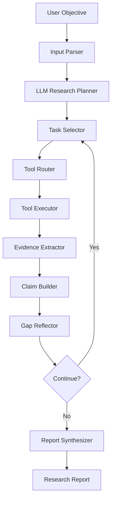

# 10 Sequential Thinking 金融尽调 DeepResearch Engine 技术设计

## 技术目标

DeepResearch Engine 的技术目标是把当前固定完整尽调流程改造成可规划、可循环、可证据化的研究状态机。

它不是替代现有 Agent，而是把现有能力包装为研究工具：

- 工商 Agent -> Business Research Tool。
- 财务 Agent -> Financial Research Tool。
- 司法 Agent -> Legal Research Tool。
- 行业 Agent -> Industry Research Tool。
- RAG -> Knowledge Research Tool。
- Bocha -> Web Search Perception Tool。
- 用户上传文件 -> File Evidence Tool。

## 目标架构



## LangGraph 节点设计

| 节点 | 职责 | 是否调用 LLM |
| --- | --- | --- |
| `parse_input` | 标准化企业名、任务目标、报告模式 | 可选 |
| `create_research_plan` | 生成研究任务和证据需求 | 是，LLM Planner；失败时规则 fallback |
| `select_next_task` | 选择下一个 pending task | 否 |
| `route_tools` | 根据任务类型选择工具 | 否/轻量 LLM 可选 |
| `execute_tool` | 调用 Bocha/RAG/单 Agent/数据源 | 否 |
| `extract_evidence` | 归一化工具输出到 Evidence Store | 否 |
| `build_claims` | 基于证据生成 Claim | 可选 LLM + 规则 |
| `reflect_gaps` | 判断缺口和是否继续 | 可先规则，后接 Sequential Thinking MCP |
| `synthesize_report` | 输出 research_report | 可选 LLM + 模板 |

## LLM Planner 节点设计

Plan-Execute 架构中的 `create_research_plan` 由 LLM 负责，而不是固定规则列表。它的职责是把“用户想尽调某企业”转成可执行、可审计、可路由的研究任务。

输入：

- `enterprise_name`：标准化后的企业名称。
- `objective`：研究目标，例如完整贷前尽调、财务专项、行业专项。
- `default_tasks`：规则版基础任务，作为 LLM 规划参考和 fallback 模板。
- `available_tools`：当前可用工具，如 Bocha、RAG、上市公司公开资料、工商、司法、上传文件。
- `deployment_constraints`：SaaS/私有化、公网搜索是否可用、是否已有客户自购数据源。

输出必须是 JSON：

```json
{
  "plan_summary": "本次尽调优先确认主体、财务、司法、行业和授信边界。",
  "planning_assumptions": ["企业可能为上市公司", "公开资料仅作线索"],
  "tasks": [
    {
      "id": "rt_financial_annual_report",
      "question": "近三年年报中的收入、利润、现金流和偿债能力是否支持授信？",
      "purpose": "验证盈利质量、还款来源和短期偿债压力。",
      "category": "financial",
      "priority": 3,
      "required_evidence": ["近三年年报", "利润表", "资产负债表", "现金流量表"],
      "tool_hints": ["listed_company", "bocha_search", "rag"],
      "success_criteria": ["至少获得两年财务数据", "所有核心判断绑定证据"]
    }
  ],
  "data_boundary": "公开资料仅作为预尽调线索，授信前需权威数据源和客户材料复核。"
}
```

强约束：

- 只输出 JSON，不输出推理过程。
- 每个任务必须包含 `question`、`purpose`、`category`、`required_evidence`、`tool_hints`。
- 禁止生成“分析风险”“了解情况”这类不可执行任务。
- 任务必须能被现有工具路由，未知工具不得编造。
- 上市公司优先规划年报、公告、交易所、行业研报线索；非上市公司优先规划上传财报、工商、司法、行政处罚、客户原始材料。
- 所有公开搜索任务必须标注数据边界和人工复核要求。

降级策略：

- LLM 无 key、超时、返回非 JSON、任务校验失败时，自动回退 `create_default_research_plan()`。
- 回退原因写入 `timeline` 和 `errors`，但不得阻塞任务创建。
- Sequential Thinking MCP 可用时只记录计划检查点，不替代 LLM Planner。

## Sequential Thinking MCP 接入方案

使用 `langchain_mcp_adapters` 将 Sequential Thinking MCP 工具转换为 LangChain Tool。

建议封装在：

```text
backend/app/agents/research_engine/mcp_tools.py
```

示例：

```python
from langchain_mcp_adapters.client import MultiServerMCPClient

async def load_sequential_thinking_tools():
    client = MultiServerMCPClient({
        "sequential-thinking": {
            "command": "npx",
            "args": ["-y", "@modelcontextprotocol/server-sequential-thinking"],
            "transport": "stdio",
        }
    })
    return await client.get_tools()
```

当前实现状态：已接入为可选增强层，入口为 `backend/app/agents/research_engine/mcp_tools.py`。

第一阶段不强依赖 MCP 可用性：

- MCP 可用时用于规划和反思。
- MCP 不可用时使用规则 planner 和规则 reflector。

实现边界：Sequential Thinking MCP 本身不是规划 LLM，也不直接生成专项尽调结论。当前只用于记录研究计划检查点和证据缺口检查点，结构化 `ResearchTask`、`Claim`、`Gap` 仍由项目内规则和后续 LLM/RAG 节点生成。这样可以避免把 MCP 当成大模型使用，也便于私有化部署环境中按需开启。

配置项：

```text
ENABLE_SEQUENTIAL_THINKING=false
SEQUENTIAL_THINKING_MCP_COMMAND=npx
SEQUENTIAL_THINKING_MCP_ARGS="-y @modelcontextprotocol/server-sequential-thinking"
SEQUENTIAL_THINKING_MCP_TIMEOUT_SECONDS=20
```

## 感知工具层

### Bocha Web Search Provider

当前已实现：

```text
backend/app/agents/tools/bocha_search_tool.py
```

定位：中文公开网页搜索主通道。

适合：

- 上市公司公告线索。
- 司法/行政处罚新闻线索。
- 行业资料和研报摘要。
- 工商公开摘要。

不适合：

- 替代权威工商接口。
- 替代裁判文书/执行公开源。
- 替代结构化财报数据源。

### Data Source Gateway 演进

后续应新增统一网关：

```text
backend/app/agents/data_sources/
├── gateway.py
├── providers/
│   ├── bocha.py
│   ├── tavily.py
│   ├── exa.py
│   ├── registry.py
│   ├── legal.py
│   └── announcements.py
```

第一阶段先不移动现有工具，Research Engine 直接通过 tool adapter 调用。

## 状态设计

ResearchState 应包含：

- `objective`：研究目标。
- `enterprise_name`：企业名。
- `report_mode`：公开预尽调/财报增强。
- `tasks`：研究任务列表。
- `current_task_id`。
- `evidence`：证据列表。
- `claims`：结论声明。
- `gaps`：证据缺口。
- `timeline`：执行过程。
- `iteration`：循环次数。
- `budget`：最大任务数、最大工具调用数、超时。
- `report`：最终 research_report。

## 工具路由策略

| 研究任务类型 | 优先工具 |
| --- | --- |
| 主体识别 | 上市公司工具、工商工具、Bocha |
| 工商治理 | 工商 Agent、权威工商 API、Bocha |
| 财务趋势 | 财务 Agent、上传文件、上市公司财报工具 |
| 司法合规 | 司法 Agent、权威司法 API、Bocha |
| 行业经营 | 行业 Agent、RAG、Bocha |
| 授信政策 | RAG |

## Claim 生成策略

第一阶段先用规则生成基础 Claim：

- 每个完成任务至少生成 1 条 Claim。
- Claim 绑定该任务产生的 evidence_ids。
- Claim 置信度取证据平均 confidence，并按来源类型调整。
- 低可信来源自动标记 `requires_manual_review=true`。

第二阶段再引入 LLM 生成更自然的 Claim 文本，但必须保留 evidence_ids。

## Gap 识别策略

第一阶段规则：

- 没有 evidence -> 高优先级 gap。
- 证据均为低可信公开搜索 -> 需权威源复核 gap。
- 财务任务没有三大表/公开财报 -> 需上传财报 gap。
- 司法任务未命中法院/信用中国/公告源 -> 需人工司法核验 gap。
- 行业任务缺少主营构成/同业对标 -> 需补充行业资料 gap。

第二阶段引入 Sequential Thinking MCP 做动态反思和 follow-up task。

## 与现有完整尽调的关系

短期不替换 `run_full_due_diligence`。

新增入口：

```text
run_deep_research_due_diligence(enterprise_name, objective)
```

后续可以在完整尽调里提供两种模式：

- `classic_agent_pipeline`：现有固定四 Agent。
- `deepresearch_engine`：研究计划驱动。
